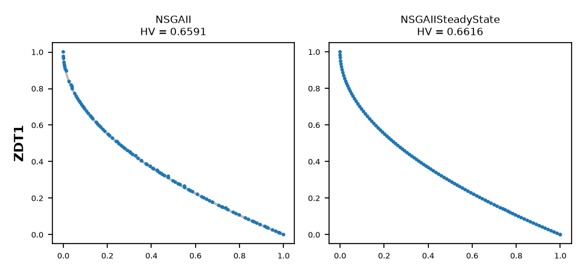
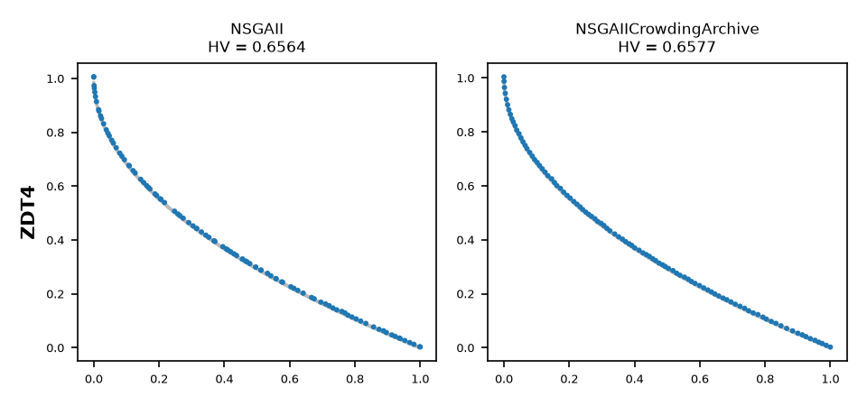
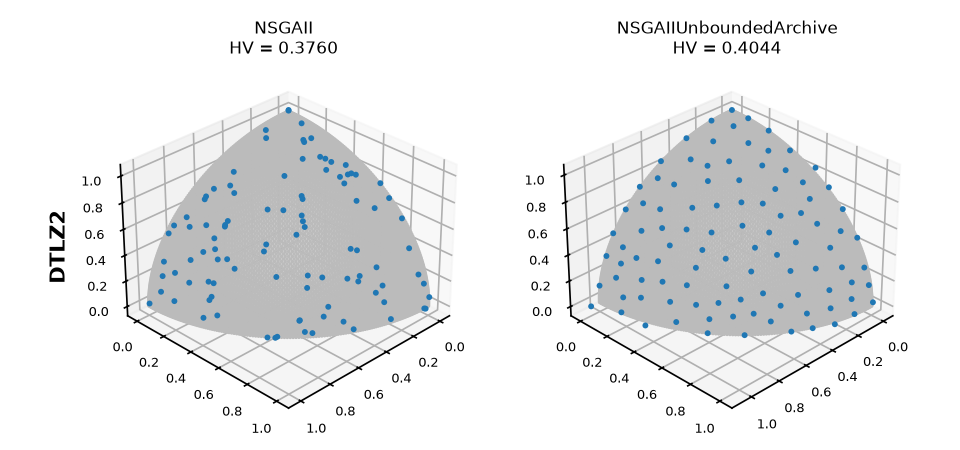

.. _nsgaii_guide:

NSGA-II
=======

:Encodings: Double, Binary, Permutation
:Parameter space: ``NSGAIIDouble.yaml`` (34 parameters, 5 top-level); ``NSGAIIBinary.yaml`` and
   ``NSGAIIPermutation.yaml`` for the other encodings
:Default configuration: ``NSGAIIDoubleDefault.txt`` (none for the Binary and Permutation encodings)
:Code: `NSGAIIGuide <https://github.com/jMetal/Evolver/blob/develop/src/main/java/org/uma/evolver/example/algorithms/NSGAIIGuide.java>`_
:Time: about 1 minute (the comparison takes about 57 seconds)
:Timings measured on: Apple M5 Pro (18 cores, 16 of them used), 64 GB of RAM, macOS 26.6.2,
   Java 21.0.12 (Oracle JDK), Evolver 2.2-SNAPSHOT, jMetal 7.6

In short: **NSGA-II** converges well on bi- and three-objective problems, but the solutions it
returns are unevenly spread, with gaps and clusters along the front. The cause is how it truncates
the last front it keeps, and changing one parameter fixes it: the **steady-state** version (one
offspring per generation) and an **external archive** pruned with the crowding distance give
evenly spread bi-objective fronts, and an **unbounded archive** does so with three objectives,
where the crowding distance no longer helps. All of them cost more time per evaluation.

Idea and origin
---------------

NSGA-II (`Deb et al., IEEE TEVC 2002 <https://doi.org/10.1109/4235.996017>`_) is the most widely
used multi-objective evolutionary algorithm. Each generation, with a population of N solutions, it:

#. **selects** parents by binary tournament, comparing first the *rank* (the nondominated front a
   solution belongs to) and, between solutions of the same rank, the *crowding distance*;
#. **creates** N offspring with crossover and mutation, and evaluates them;
#. **merges** the population and the offspring (2N solutions) and sorts them into nondominated
   fronts;
#. **fills** the new population with whole fronts, best first, until the next front does not fit;
#. **truncates** that last front by crowding distance (the perimeter of the box formed by each
   solution's two neighbours in every objective), keeping the most isolated solutions.

Step 5 computes the crowding distance **once** and removes all the surplus solutions at a time.
When a solution is removed, its neighbours become more isolated than their computed distance says,
but the distances are not updated. So neighbouring solutions can be removed together, which leaves
gaps, and others are kept close together. With few objectives, recomputing the distance after each
removal is enough to get a much more regular front. That is what the two variants below do, each in
its own way.

Variants in Evolver
-------------------

NSGA-II has no named variants in Evolver: its behaviour changes through the components of its
parameter space. This guide studies three changes to the default configuration, one parameter each:

.. list-table::
   :header-rows: 1
   :widths: 30 70

   * - Change
     - Effect
   * - ``offspringPopulationSize`` = 1
     - **Steady-state NSGA-II** (Durillo et al., EMO 2009): one offspring per generation, so step
       5 removes a single solution from N + 1. The crowding distance is recomputed after every
       evaluation.
   * - ``algorithmResult`` = ``externalArchive``, ``archiveType`` = ``crowdingDistanceArchive``
     - The search is unchanged, but every evaluated solution is also offered to an archive of N
       nondominated solutions, which is the result. When the archive overflows, it removes the
       solution with the smallest crowding distance, **one at a time**.
   * - ``algorithmResult`` = ``externalArchive``, ``archiveType`` = ``unboundedArchive``
     - The archive keeps every nondominated solution found. At the end it returns N of them, chosen
       with jMetal's distance-based subset selection: the crowding distance archive with two
       objectives and, with more, a greedy selection of the solution farthest from those already
       chosen, in the normalized objective space.

With an external archive, ``populationSizeWithArchive`` sets the size of the population during the
search, and the population size given to the constructor sets the size of the archive. This guide
uses 100 for both, so the archive variants run the same search as the standard version and differ
only in which solutions they return.

The implementation is jMetal's component-based ``EvolutionaryAlgorithm``, assembled by Evolver's
``BaseNSGAII``. The replacement is ``RankingAndDensityEstimatorReplacement`` with the ``ONE_SHOT``
removal policy of step 5.

Parameter space
---------------

``NSGAIIDouble.yaml`` has 34 parameters, 5 of them top-level. As in every space of Evolver (see
:doc:`../tutorials/parameter_spaces`), a top-level parameter is always active; a *conditional*
sub-parameter is active only when its parent takes a given value (``sbxDistributionIndex`` only
with ``crossover`` = ``SBX``); and a *global* sub-parameter is active whatever value its parent
takes (``crossoverProbability`` for any crossover). A configuration gives a value to every active
parameter, and only to those.

The ranking (nondominated sorting) and the density estimator (crowding distance) are not
parameters: they are what makes the algorithm NSGA-II. The space is also the base of several other
algorithms of Evolver, which share its operators.

algorithmResult
~~~~~~~~~~~~~~~

What the algorithm returns: its final population, or an external archive fed with every evaluated
solution (see `Variants in Evolver`_).

.. list-table::
   :header-rows: 1
   :widths: 30 25 45

   * - Value and sub-parameters
     - Range
     - Meaning
   * - ``population``
     -
     - the final population (standard NSGA-II)
   * - ``externalArchive``
     -
     - an archive whose size is the population size given to the constructor
   * - ↳ ``populationSizeWithArchive``
     - integer, [10, 200]
     - size of the population during the search
   * - ↳ ``archiveType``
     - ``crowdingDistanceArchive``, ``unboundedArchive``, ``spatialSpreadDeviationArchive``,
       ``knnDistanceArchive``, ``angleArchive``
     - how the archive decides which nondominated solutions to keep when it is full: crowding
       distance, no limit (subset selection at the end), spatial spread deviation, distance to the
       k-th nearest neighbour, or angle between solutions
   * - ↳↳ ``knnDistanceArchiveK``
     - integer, [1, 10]
     - k, with ``knnDistanceArchive``

createInitialSolutions
~~~~~~~~~~~~~~~~~~~~~~

How the initial population is created: ``default`` (uniformly at random), ``latinHypercubeSampling``,
``scatterSearch``, ``sobol`` (a quasi-random sequence), ``cauchy`` or ``oppositionBased``. None has
sub-parameters.

offspringPopulationSize
~~~~~~~~~~~~~~~~~~~~~~~

The number of offspring per generation: 1, 5, 10, 20, 50, 100, 200 or 400. With 1 the algorithm is
the steady-state NSGA-II; with N (100 here), the standard one. It is categorical and not an integer
range so that 1, whose behaviour is qualitatively different, is as likely as any other value when
the space is sampled; in an integer range [1, 400] it would almost never be chosen.

variation
~~~~~~~~~

Its only value, ``crossoverAndMutationVariation``, applies a crossover and then a mutation to create
each offspring. The two operators have global sub-parameters:

.. list-table::
   :header-rows: 1
   :widths: 30 25 45

   * - Parameter
     - Range
     - Meaning
   * - ``crossoverProbability``
     - double, [0, 1]
     - probability of applying the crossover to a pair of parents
   * - ``crossoverRepairStrategy``
     - ``random``, ``round``, ``bounds``
     - what to do with a variable that falls out of its bounds after the crossover: a random value
       within the bounds, the opposite bound, or the nearest bound
   * - ``mutationProbabilityFactor``
     - double, [0, 2]
     - the mutation probability per variable is this factor divided by the number of variables
       (1.0 gives the usual 1/n)
   * - ``mutationRepairStrategy``
     - ``random``, ``round``, ``bounds``
     - as ``crossoverRepairStrategy``, after the mutation

The ten crossovers, with their conditional sub-parameters:

.. list-table::
   :header-rows: 1
   :widths: 25 35 40

   * - ``crossover``
     - Sub-parameters (range)
     - Operator
   * - ``SBX``
     - ``sbxDistributionIndex`` [5, 400]
     - simulated binary crossover; a larger index creates children closer to the parents
   * - ``blxAlpha``
     - ``blxAlphaCrossoverAlpha`` [0, 1]
     - blend crossover: children sampled in the parents' interval extended by alpha
   * - ``blxAlphaBeta``
     - ``blxAlphaBetaCrossoverAlpha`` [0, 1], ``blxAlphaBetaCrossoverBeta`` [0, 1]
     - blend crossover with different extensions on each side
   * - ``wholeArithmetic``
     -
     - weighted average of the parents, with one random weight for all the variables
   * - ``arithmetic``
     -
     - weighted average of the parents, with a different random weight for each variable
   * - ``laplace``
     - ``laplaceCrossoverScale`` [0.1, 0.5]
     - children spread around the parents following a Laplace distribution
   * - ``fuzzyRecombination``
     - ``fuzzyRecombinationCrossoverAlpha`` [0.0001, 1]
     - children placed between the parents, at a random distance proportional to alpha times the
       distance between them
   * - ``PCX``
     - ``pcxCrossoverZeta`` [0, 1], ``pcxCrossoverEta`` [0, 1]
     - parent-centric crossover (three parents)
   * - ``UNDC``
     - ``undcCrossoverZeta`` [0.1, 1], ``undcCrossoverEta`` [0.1, 0.5]
     - unimodal normal distribution crossover (three parents)
   * - ``SDX``
     - ``sdxCrossoverF`` [0, 1]
     - synthetic differences crossover: combines differences of the parents scaled by F, in the
       style of differential evolution; the crossover probability applies to each variable

The six mutations:

.. list-table::
   :header-rows: 1
   :widths: 25 35 40

   * - ``mutation``
     - Sub-parameters (range)
     - Operator
   * - ``uniform``
     - ``uniformMutationPerturbation`` [0, 1]
     - adds a uniform random value in [-p/2, p/2], p being the perturbation
   * - ``polynomial``
     - ``polynomialMutationDistributionIndex`` [5, 400]
     - polynomial mutation; a larger index makes smaller changes
   * - ``linkedPolynomial``
     - ``linkedPolynomialMutationDistributionIndex`` [5, 400]
     - polynomial mutation with the same random draw for all the mutated variables
   * - ``nonUniform``
     - ``nonUniformMutationPerturbation`` [0, 1]
     - a perturbation that shrinks as the run advances
   * - ``levyFlight``
     - ``levyFlightMutationBeta`` [1.0001, 2], ``levyFlightMutationStepSize`` [0.01, 1]
     - steps drawn from a Lévy distribution: mostly small, occasionally very large
   * - ``powerLaw``
     - ``powerLawMutationDelta`` [0.1, 10]
     - steps drawn from a power-law distribution

selection
~~~~~~~~~

How parents are selected. The preference is always the rank and then the crowding distance:

.. list-table::
   :header-rows: 1
   :widths: 30 25 45

   * - Value and sub-parameters
     - Range
     - Meaning
   * - ``tournament``
     -
     - the best of k solutions taken at random (the standard choice, with k = 2)
   * - ↳ ``selectionTournamentSize``
     - integer, [2, 10]
     - k
   * - ``random``
     -
     - parents taken at random, without preference
   * - ``boltzmann``
     -
     - probability of selection decreasing exponentially with the solution's position in the
       ranking
   * - ↳ ``boltzmannTemperature``
     - double, [0.1, 100]
     - a higher temperature makes the selection more uniform
   * - ``ranking``
     -
     - probability of selection decreasing linearly with the solution's position in the ranking
   * - ``stochasticUniversalSampling``
     -
     - the same probabilities as ``ranking``, sampled with evenly spaced pointers on a single spin,
       which reduces the variance of the selection

Other encodings
---------------

NSGA-II is one of the algorithms of Evolver that support the three encodings, each with its own
class, parameter space and parameter factory:

.. list-table::
   :header-rows: 1
   :widths: 16 22 24 38

   * - Encoding
     - Class
     - Parameter space
     - Parameter factory
   * - Double
     - ``DoubleNSGAII``
     - ``NSGAIIDouble.yaml`` (34 parameters)
     - ``DoubleParameterFactory``
   * - Binary
     - ``BinaryNSGAII``
     - ``NSGAIIBinary.yaml`` (12 parameters)
     - ``BinaryParameterFactory``
   * - Permutation
     - ``PermutationNSGAII``
     - ``NSGAIIPermutation.yaml`` (12 parameters)
     - ``PermutationParameterFactory``

The three spaces have the same five top-level parameters, so a configuration has the same structure
in all of them, and the algorithm is the same: only the operators that depend on the encoding
change. The binary and permutation spaces are smaller:

- ``algorithmResult``: only ``crowdingDistanceArchive`` and ``unboundedArchive`` as archives;
- ``createInitialSolutions``: only ``default``;
- ``offspringPopulationSize``: 1, **2**, 5, 10, 20, 50, 100, 200 or 400;
- ``variation``: in the binary space, the crossovers ``HUX``, ``uniform`` and ``singlePoint`` and
  the mutation ``bitFlip``, with ``crossoverProbability`` and ``mutationProbabilityFactor`` (divided
  by the total number of bits); in the permutation space, the crossovers ``PMX``, ``OXD`` and
  ``CX`` and the mutations ``swap``, ``insert``, ``scramble``, ``inversion``, ``simpleInversion``
  and ``displacement``, with ``crossoverProbability`` and a plain ``mutationProbability`` in [0, 1].
  There are no repair strategies, since binary and permutation solutions are always valid;
- ``selection``: only ``tournament`` and ``random``.

There are no default configuration files for these encodings, so the configuration is written
explicitly. For example, for OneZeroMax
(``example.baselevel.standard.NSGAIIOneZeroMaxExample`` runs the steady-state version of this
configuration):

.. code-block:: java

   String[] parameters =
       ("--algorithmResult population --createInitialSolutions default"
               + " --variation crossoverAndMutationVariation --offspringPopulationSize 100"
               + " --crossover singlePoint --crossoverProbability 0.9"
               + " --mutation bitFlip --mutationProbabilityFactor 1.0"
               + " --selection tournament --selectionTournamentSize 2")
           .split("\\s+");

   var nsgaII =
       new BinaryNSGAII(
           new OneZeroMax(),
           100,
           25000,
           new YAMLParameterSpace("NSGAIIBinary.yaml", new BinaryParameterFactory()));
   nsgaII.parse(parameters);

   EvolutionaryAlgorithm<BinarySolution> algorithm = nsgaII.build();
   algorithm.run();
   List<BinarySolution> front = algorithm.result();

Step 6 of :doc:`../tutorials/base_level_algorithms` runs this case, and
``example.baselevel.tuned.NSGAIIBiObjectiveTSPExample`` runs ``PermutationNSGAII`` on the
bi-objective TSP instance KroAB100. The experiment of this guide uses the Double encoding only.

Default configuration
---------------------

``NSGAIIDoubleDefault.txt`` is the standard NSGA-II: it returns the population, with 100 offspring
per generation, SBX crossover (probability 0.9, distribution index 20), polynomial mutation
(probability 1/n, distribution index 20) and binary tournament selection.

.. literalinclude:: ../../src/main/resources/defaultConfigurations/NSGAIIDoubleDefault.txt
   :language: none
   :caption: NSGAIIDoubleDefault.txt

Running it
----------

From Java, reading the default configuration:

.. literalinclude:: ../../src/main/java/org/uma/evolver/example/algorithms/NSGAIIGuide.java
   :language: java
   :start-after: // [step-1-start]
   :end-before: // [step-1-end]
   :dedent: 4

The variants are the same configuration with one parameter changed:

.. literalinclude:: ../../src/main/java/org/uma/evolver/example/algorithms/NSGAIIGuide.java
   :language: java
   :start-after: // [step-2-start]
   :end-before: // [step-2-end]
   :dedent: 4

From the command line, with the bundled request ``nsgaii-zdt1-request.yaml`` (see
:doc:`../utilities/cli_tools`):

.. code-block:: bash

   java -cp target/Evolver-*-jar-with-dependencies.jar \
       org.uma.evolver.cli.solving.SolveRunnerMain nsgaii-zdt1-request.yaml

The experiment
--------------

``NSGAIIGuide`` runs the standard NSGA-II and the three variants on three problems, each pairing one
variant with the case it is meant for:

.. list-table::
   :header-rows: 1
   :widths: 15 25 60

   * - Problem
     - Front
     - Why it is here
   * - ZDT1
     - convex, 2 objectives
     - an easy problem, where the spread of the solutions is the only difference left: the
       steady-state version
   * - ZDT4
     - convex, 2 objectives, with many local fronts (multimodal)
     - a harder problem for convergence: the crowding distance archive
   * - DTLZ2
     - spherical, 3 objectives
     - the crowding distance is a poor estimator of density with three objectives: the unbounded
       archive

Each configuration runs 15 times on each problem, with a population of 100 and 25,000 evaluations.
Besides IGD+ and the hypervolume, the study computes the **generalized spread** (GSPREAD in jMetal,
lower is better), which measures how evenly the solutions are spread along the front, including
its extremes:

.. literalinclude:: ../../src/main/java/org/uma/evolver/example/algorithms/NSGAIIGuide.java
   :language: java
   :start-after: // [step-3-start]
   :end-before: // [step-3-end]
   :dedent: 4

Median over the 15 runs (interquartile range in parentheses). The best value of each problem is in
bold; ``=`` marks no significant difference from the best (Wilcoxon rank-sum test, 0.05), and every
other value is significantly worse.

Generalized spread (lower is better):

.. list-table::
   :header-rows: 1
   :widths: 12 22 22 22 22

   * - Problem
     - NSGA-II
     - Steady-state
     - Crowding archive
     - Unbounded archive
   * - ZDT1
     - 0.3950 (0.0705)
     - **0.0733** (0.0223)
     - 0.0842 (0.0111) =
     - 0.1044 (0.0178)
   * - ZDT4
     - 0.3976 (0.0478)
     - **0.1184** (0.0431)
     - 0.1256 (0.0180) =
     - 0.1444 (0.0322) =
   * - DTLZ2
     - 0.5033 (0.0330)
     - 0.4933 (0.0726)
     - 0.4082 (0.0334)
     - **0.0899** (0.0179)

IGD+ (lower is better):

.. list-table::
   :header-rows: 1
   :widths: 12 22 22 22 22

   * - Problem
     - NSGA-II
     - Steady-state
     - Crowding archive
     - Unbounded archive
   * - ZDT1
     - 0.0039 (0.0003)
     - **0.0027** (0.0001)
     - 0.0032 (0.0001)
     - 0.0034 (0.0002)
   * - ZDT4
     - 0.0055 (0.0016) =
     - 0.0076 (0.0028) =
     - **0.0048** (0.0025)
     - 0.0064 (0.0027) =
   * - DTLZ2
     - 0.0364 (0.0021)
     - 0.0334 (0.0014)
     - 0.0352 (0.0023)
     - **0.0284** (0.0007)

The hypervolume names the same best configuration as IGD+ on every problem, with the same ties on
ZDT4. The fronts with the median hypervolume of the standard version and of the variant studied on
each problem:

   ZDT1: NSGA-II (left) and steady-state NSGA-II (right). Reference front in gray.

   ZDT4: NSGA-II (left) and NSGA-II with a crowding distance archive (right).

   DTLZ2: NSGA-II (left) and NSGA-II with an unbounded archive (right).

Where it works well
-------------------

- **Convergence on two and three objectives.** The standard NSGA-II gets close to the front of the
  three problems in every run, including the multimodal ZDT4 (its worst IGD+ there is 0.027), and on ZDT4
  its IGD+ and hypervolume are not significantly different from the best ones.
- **Even fronts on two objectives, with one parameter changed.** On ZDT1 the steady-state version
  divides the generalized spread by more than five (0.395 to 0.073) and returns a regularly spaced
  front (first figure). It is also significantly better in IGD+, hypervolume and additive epsilon,
  since the gaps of the standard front are also lost hypervolume. The crowding distance archive
  gets almost the same spread (no significant difference on ZDT1 and ZDT4) without changing the
  search, and on ZDT4 it has the best IGD+ and hypervolume (the differences there are not
  significant).
- **Even fronts on three objectives, with the unbounded archive.** On DTLZ2 it is the best of the
  four in every indicator: generalized spread 0.090 against 0.503, hypervolume 0.404 against
  0.376. It covers the whole surface regularly, while the standard version leaves gaps and clusters
  (third figure).

Where it works poorly
---------------------

- **The spread of the standard version.** The fronts of the standard NSGA-II have gaps and clusters
  on every problem (generalized spread around 0.4 to 0.5), which is the cost of truncating each
  front by crowding distance in one shot.
- **The crowding distance with three objectives.** On DTLZ2 the steady-state version and the
  crowding distance archive barely improve the spread (0.493 and 0.408): the crowding distance,
  which sums the distances along each objective separately, does not measure well how crowded a
  surface is. A density estimator for many objectives is needed, as in the unbounded archive's
  selection.
- **Running time.** Measured with one thread, one run of 25,000 evaluations (best of four runs),
  the standard NSGA-II takes 0.18 s on ZDT1 and 0.16 s on DTLZ2. The steady-state version takes
  about 6 and 10 times longer, since it ranks the population after every evaluation. The crowding
  distance archive adds little (1.3 and 2.5 times), and the unbounded archive is 5 and 36 times
  slower (5.9 s on DTLZ2): it grows during the run, every new solution is compared with all the
  solutions in it, and the final selection of its 100 solutions computes distances to all of them.
  These costs only matter when the problem is cheap to
  evaluate.
- **Parallel evaluation.** The steady-state version produces one solution per generation, so it
  cannot evaluate a population in parallel. When the evaluations are expensive and run in parallel,
  an external archive, which keeps the generational search, is the way to improve the spread.

Tuning notes
------------

- ``offspringPopulationSize`` and ``algorithmResult`` (with ``archiveType``) decide the spread of
  the result, and their best values depend on the number of objectives: steady-state or a
  crowding distance archive with two, an unbounded archive with three or more.
- The archive variants keep the search of the standard version, so they can be combined with any
  other choice of the space. ``populationSizeWithArchive`` decouples the size of the population from
  the size of the result, so both can be tuned separately.
- The choice of operators (crossover, mutation and their distribution indexes) affects convergence
  rather than spread; to tune them for a set of problems, see
  :doc:`../tutorials/meta_optimization_workflow`.

References
----------

- K. Deb, A. Pratap, S. Agarwal and T. Meyarivan. A fast and elitist multiobjective genetic
  algorithm: NSGA-II. IEEE Transactions on Evolutionary Computation, 6(2):182-197, 2002.
  `doi:10.1109/4235.996017 <https://doi.org/10.1109/4235.996017>`_
- J. J. Durillo, A. J. Nebro, F. Luna and E. Alba. On the effect of the steady-state selection
  scheme in multi-objective genetic algorithms. Evolutionary Multi-Criterion Optimization (EMO
  2009), LNCS 5467, pp. 183-197, Springer, 2009.
- A. Zhou, Y. Jin, Q. Zhang, B. Sendhoff and E. Tsang. Combining model-based and genetics-based
  offspring generation for multi-objective optimization using a convergence criterion. IEEE
  Congress on Evolutionary Computation, pp. 3234-3241, 2006 (the generalized spread).
