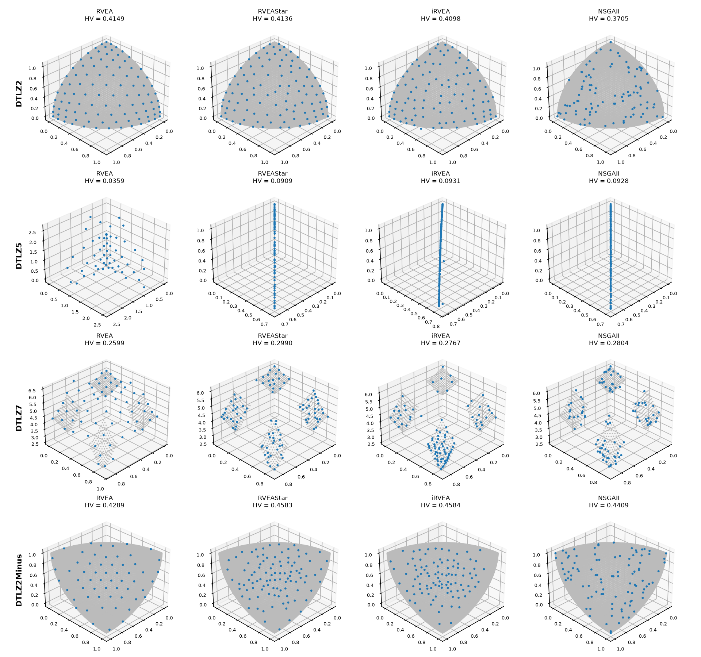
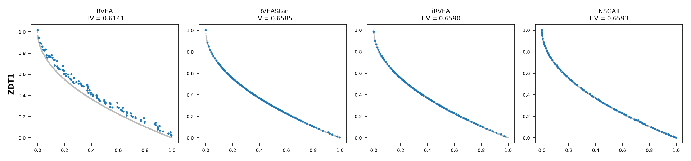

.. _rvea_guide:

RVEA, RVEA* and iRVEA
=====================

:Encodings: Double
:Parameter space: ``RVEADouble.yaml`` (36 parameters, 6 top-level)
:Default configurations: ``RVEADoubleDefault.txt``, ``RVEAStarDoubleDefault.txt``,
   ``IRVEADoubleDefault.txt``
:Code: `RVEAGuide <https://github.com/jMetal/Evolver/blob/develop/src/main/java/org/uma/evolver/example/algorithms/RVEAGuide.java>`_
:Time: about 2 minutes (the comparison takes about 70 seconds)
:Timings measured on: Apple M5 Pro (18 cores, 16 of them used), 64 GB of RAM, macOS 26.6.2,
   Java 21.0.12 (Oracle JDK), Evolver 2.2-SNAPSHOT, jMetal 7.6

In short: **RVEA** spreads its solutions evenly on regular fronts and keeps doing so with many
objectives, where NSGA-II fails; it does poorly on fronts that do not cover the whole simplex
(degenerate, disconnected or inverted fronts) and, surprisingly, on the bi-objective ZDT1.
**RVEA*** and **iRVEA** fix most of those cases at a small cost on regular fronts.

Idea and origin
---------------

RVEA (`Cheng et al., IEEE TEVC 2016 <https://doi.org/10.1109/TEVC.2016.2519378>`_) is a
decomposition-based algorithm designed for many-objective problems. Instead of ranking solutions by
Pareto dominance, which stops discriminating once almost every solution is nondominated, it divides
the objective space into angular niches, one per **reference vector**, and keeps one survivor per
occupied niche. Every generation it:

#. **translates** the objective vectors so that the ideal point (the componentwise minimum of the
   current solutions) is at the origin;
#. **associates** each solution with the reference vector closest to it in angle;
#. **scores** the solutions of each niche with the *angle-penalized distance* (APD):

   .. code-block:: text

      APD(f, v, t) = ||f|| * (1 + M * (t / T)^alpha * angle(f, v) / gamma(v))

   where ``||f||`` is the distance to the ideal point (convergence), ``angle(f, v)`` how far the
   solution is from the centre of its niche (diversity), ``gamma(v)`` the angle from ``v`` to its
   closest neighbour, ``M`` the number of objectives, and ``t / T`` the fraction of the run elapsed.
   Early in the run the score is plain convergence; ``alpha`` sets how quickly the diversity term
   takes over;
#. **selects** the best solution of each occupied niche. Empty niches contribute nothing, so the
   population can shrink below the number of reference vectors;
#. every ``fr * T`` generations, **rescales** the reference vectors to the ranges of the current
   objectives, so that badly scaled objectives are still covered evenly.

A fixed set of vectors spread over the whole simplex is RVEA's strength on regular fronts and its
weakness on the others: when the front covers only part of the simplex, many vectors have no
solution and many niches stay empty.

Variants in Evolver
-------------------

The ``replacement`` parameter selects the variant, with the names and values of jMetal's
``AutoRVEA``:

.. list-table::
   :header-rows: 1
   :widths: 15 85

   * - Value
     - Variant
   * - ``rvea``
     - RVEA as described above.
   * - ``rveaStar``
     - RVEA* (Section VI of the RVEA paper): a second set of reference vectors, whose inactive
       vectors are regenerated at random, meant for irregular fronts. Survivors are the
       nondominated candidates, selected with APD over both sets (up to 2N during the run, N at the
       end).
   * - ``iRVEA``
     - iRVEA (`Liu et al., CEC 2019 <https://doi.org/10.1109/CEC.2019.8790214>`_): replaces at most
       one inactive adaptive vector per generation with a direction of the least covered region,
       protects the regions of the front already found, and in the last part of the run
       (``lateStageFraction``) complements APD with dominance (the strengthened dominance relation
       above six objectives) and an epsilon-indicator selection.

The implementation is jMetal's (``jmetal-component``); its
`documentation of the RVEA variants <https://github.com/jMetal/jMetal/blob/main/docs/rvea-variants.rst>`_
explains the three algorithms in more detail, with a worked example of APD and the choices made
where the papers leave details open.

Parameter space
---------------

Besides the operators shared with the other algorithms (initialization, crossover, mutation,
external archive), ``RVEADouble.yaml`` has:

- ``replacement``: ``rvea``, ``rveaStar`` or ``iRVEA``, with ``alpha`` (in [0.5, 10]) and ``fr``
  (in [0.01, 1]) for all of them, and ``numberOfSubregions`` (in [10, 100]),
  ``lateStageFraction`` (in [0.5, 1]) and ``epsilonKappa`` (in [0.01, 0.2]) for iRVEA;
- ``selection``: ``random`` (RVEA's) or ``tournament``;
- ``offspringPopulationSize``: 10, 20, 50, 100, 150 or 200. Below 10 the running time grows
  without better results, and above 200 the results degrade.

The **population size is the number of reference vectors**. ``DoubleRVEA`` takes them as a list,
or, like MOEA/D, reads them for each problem from a directory of weight vector files named after
the number of objectives and the population size (``resources/weightVectors/W3D_100.dat``, …).

Default configurations
----------------------

The three files of ``defaultConfigurations`` share the operators of jMetal's standard RVEA: SBX
crossover (probability 0.9, distribution index 20), polynomial mutation (probability 1/n,
distribution index 20), random selection, ``alpha`` = 2, ``fr`` = 0.1 and 100 offspring per
generation. The RVEA paper uses SBX with probability 1.0 and distribution index 30.
``IRVEADoubleDefault.txt`` adds iRVEA's defaults: 40 subregions, ``lateStageFraction`` = 0.8 and
``epsilonKappa`` = 0.05.

.. literalinclude:: ../../src/main/resources/defaultConfigurations/IRVEADoubleDefault.txt
   :language: none
   :caption: IRVEADoubleDefault.txt

Running it
----------

From Java, reading the default configuration and the reference vectors of
``resources/weightVectors/W3D_100.dat``:

.. literalinclude:: ../../src/main/java/org/uma/evolver/example/algorithms/RVEAGuide.java
   :language: java
   :start-after: // [step-1-start]
   :end-before: // [step-1-end]
   :dedent: 4

From the command line, with the bundled request ``rvea-dtlz2-request.yaml`` (see
:doc:`../utilities/cli_tools`):

.. code-block:: bash

   java -cp target/Evolver-*-jar-with-dependencies.jar \
       org.uma.evolver.cli.solving.SolveRunnerMain rvea-dtlz2-request.yaml

The experiment
--------------

``RVEAGuide`` compares the three variants, each with its default configuration, with NSGA-II (its
default configuration too) on six problems chosen for the kind of front they have. Each algorithm
runs 15 times on each problem, with a population of 100 and 25,000 evaluations (50,000 with six
objectives):

.. list-table::
   :header-rows: 1
   :widths: 25 30 45

   * - Problem
     - Front
     - Why it is here
   * - DTLZ2
     - regular, 3 objectives
     - the case RVEA is built for
   * - DTLZ2 (6 objectives)
     - regular, many objectives
     - RVEA's design target, where dominance-based algorithms struggle
   * - DTLZ5
     - degenerate (a curve in 3D)
     - most reference vectors meet no solution
   * - DTLZ7
     - disconnected (four regions)
     - empty niches between the regions
   * - DTLZ2Minus
     - inverted
     - the front does not fill the simplex the vectors are spread over
   * - ZDT1
     - convex, 2 objectives
     - a simple bi-objective reference

.. literalinclude:: ../../src/main/java/org/uma/evolver/example/algorithms/RVEAGuide.java
   :language: java
   :start-after: // [step-2-start]
   :end-before: // [step-2-end]
   :dedent: 4

Median IGD+ over the 15 runs (interquartile range in parentheses; lower is better). The best value
of each problem is in bold; ``=`` marks no significant difference from the best (Wilcoxon rank-sum
test, 0.05), and every other value is significantly worse:

.. list-table::
   :header-rows: 1
   :widths: 20 20 20 20 20

   * - Problem
     - RVEA
     - RVEA*
     - iRVEA
     - NSGA-II
   * - DTLZ2
     - **0.0223** (0.0002)
     - 0.0236 (0.0006)
     - 0.0249 (0.0014)
     - 0.0373 (0.0024)
   * - DTLZ2 (6 obj.)
     - **0.1040** (0.0001)
     - 0.1188 (0.0017)
     - 0.1323 (0.0068)
     - 0.8609 (0.1052)
   * - DTLZ5
     - 0.0690 (0.0264)
     - 0.0050 (0.0022)
     - **0.0030** (0.0002)
     - 0.0037 (0.0002)
   * - DTLZ7
     - 0.0479 (0.0089)
     - **0.0243** (0.0014)
     - 0.0343 (0.0036)
     - 0.0352 (0.0044)
   * - DTLZ2Minus
     - 0.0433 (0.0019)
     - **0.0303** (0.0008)
     - 0.0323 (0.0015)
     - 0.0352 (0.0014)
   * - ZDT1
     - 0.0319 (0.0059)
     - 0.0039 (0.0002) =
     - **0.0037** (0.0004)
     - 0.0038 (0.0003) =

The hypervolume agrees with IGD+ on the first four problems; on DTLZ2Minus, RVEA* and iRVEA, and on
ZDT1, RVEA*, iRVEA and NSGA-II, are practically tied (hypervolume differences below 0.001). The
fronts with the median hypervolume of each algorithm:

   Fronts with the median HV on the three-objective problems (reference front in gray).

   Fronts with the median HV on ZDT1.

Where it works well
-------------------

- **Regular fronts, and above all many objectives.** RVEA is the best of the four on DTLZ2 with
  three and with six objectives, with a very small spread between runs, and places its solutions
  evenly on the front (first row of the figure). With six objectives the gap to NSGA-II is the
  largest of the study: NSGA-II's median hypervolume is 0.003, against 0.716 for RVEA, since Pareto
  dominance barely discriminates between solutions there. RVEA* and iRVEA are close behind RVEA on
  these problems.
- **Irregular fronts, with the variants.** RVEA* is the best on the disconnected (DTLZ7) and the
  inverted (DTLZ2Minus) fronts, and iRVEA on the degenerate one (DTLZ5), where it also beats
  NSGA-II. Note that on DTLZ7, the kind of front iRVEA was proposed for, RVEA* does better with
  these settings, and iRVEA places most of its solutions in one of the four regions.

Where it works poorly
---------------------

- **Fronts that do not fill the simplex, with plain RVEA.** On DTLZ5, DTLZ7 and DTLZ2Minus many
  reference vectors meet no solution: RVEA ends with a median of 57, 65 and 58 solutions instead
  of 100, and on DTLZ5 it does not even reach the curve (its IGD+ is 14 times RVEA*'s, and varies
  widely between runs). This is the case RVEA* and iRVEA were designed for, and both fix it.
- **ZDT1.** On this simple bi-objective problem RVEA has not converged after 25,000 evaluations
  (IGD+ 0.032, eight times the others'), although it keeps 100 solutions; RVEA*, iRVEA and NSGA-II
  reach the front. A likely cause is that the variants add dominance to APD in their selection,
  while plain RVEA relies on APD alone.
- **The variants on regular fronts.** RVEA* and iRVEA are slightly but significantly worse than
  RVEA on DTLZ2, and iRVEA's spread between runs is larger with six objectives.

Tuning notes
------------

- ``replacement`` matters most: none of the three variants is best everywhere. When the shape of
  the front is unknown, RVEA* was the most robust in this study; on regular fronts with many
  objectives, RVEA.
- ``alpha`` and ``fr`` trade convergence for spread and control how often the vectors adapt; the
  defaults (2 and 0.1) come from the RVEA paper.
- The population size is fixed by the reference vectors, so it is not tuned; the offspring
  population size is.
- To tune RVEA for a set of problems, see :doc:`../tutorials/meta_optimization_workflow`. Training
  sets may mix problems with different numbers of objectives, since the vectors of each problem
  are read from its own file; the bundled request ``rvea-zdt1-dtlz2-request.yaml`` does so.

References
----------

- R. Cheng, Y. Jin, M. Olhofer and B. Sendhoff. A reference vector guided evolutionary algorithm
  for many-objective optimization. IEEE Transactions on Evolutionary Computation, 20(5):773-791,
  2016. `doi:10.1109/TEVC.2016.2519378 <https://doi.org/10.1109/TEVC.2016.2519378>`_
- Q. Liu, Y. Jin, M. Heiderich and T. Rodemann. Adaptation of reference vectors for evolutionary
  many-objective optimization of problems with irregular Pareto fronts. IEEE Congress on
  Evolutionary Computation, 2019.
  `doi:10.1109/CEC.2019.8790214 <https://doi.org/10.1109/CEC.2019.8790214>`_
- N. Rodríguez Uribe. RVEA, RVEA*, and iRVEA. jMetal documentation, 2026.
