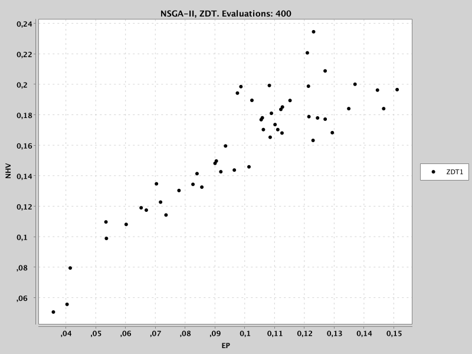

.. _meta-optimization-approach:

Meta-Optimization Approach
==========================

Evolver automates the process of finding optimal configurations for multi-objective metaheuristics through meta-optimization, which treats the algorithm configuration task itself as a multi-objective optimization problem.

Components
----------
The approach is based on the following components:

- **Base-Level Metaheuristic**: This is the multi-objective optimization algorithm we want to configure, such as NSGA-II, MOEA/D, or MOPSO. The meta-optimization process will automatically adjust its parameters to achieve the best performance.

- **Meta-Optimizer**: The algorithm that searches for optimal configurations of the base-level metaheuristic. Evolver uses standard multi-objective algorithms (like NSGA-II or MOEA/D) at this level to explore the space of possible configurations. 

- **Parameter Space**: Defines all possible configurations of the base-level metaheuristic. This includes:
    - Numerical parameters (e.g., population size, mutation rate)
    - Categorical parameters (e.g., selection operator type)
    - Conditional parameters that depend on other parameters' values (e.g., the distribution index of the SBX operator)

- **Training Set**: A collection of optimization problems used to evaluate configurations. The meta-optimizer seeks configurations that perform well across all problems in this set.

- **Quality Indicators**: Metrics that assess the performance of a configuration from the fronts obtained by running the base-level metaheuristic with that configuration on the training set. Common indicators include NHV, EP, IGD, and IGD+.

- **Meta-Optimization Problem**: Problem that the meta-optimizer solves to find the best configuration of the base-level metaheuristic. 

How It Works
------------
The goal of a meta-optimization process is, given a base-level multi-objective metaheuristic and a training set of optimization problems, to find the best configuration of the base-level metaheuristic to efficiently solve the training set. The first steps are, then, to define these two components.

Base-Level Metaheuristic Selection and Configuration
~~~~~~~~~~~~~~~~~~~~~~~~~~~~~~~~~~~~~~~~~~~~~~~~~~

The base-level metaheuristic is characterized by a parameter space, i.e, a set of parameters that can be adjusted to improve its performance. The next code snippet shows how to configure a base-level NSGA-II algorithm for solving continuous optimization problems:

.. code-block:: java

   String yamlParameterSpaceFile = "NSGAIIDouble.yaml" ;
   var parameterSpace = new YAMLParameterSpace(yamlParameterSpaceFile, new DoubleParameterFactory());
   
   int populationSize = 100;
   var baseAlgorithm = new DoubleNSGAII(populationSize, parameterSpace);
    
In this example, ``NSGAIIDouble.yaml`` is a YAML file that defines the parameter space of the NSGA-II algorithm for solving continuous optimization problems. The file is contained in the resources folder of the Evolver project. You are free to modify this file to refine the parameter space of the NSGA-II algorithm.

After creating the parameter space, the *DoubleNSGAII* class is used to configure the base-level metaheuristic. It takes as parameters the population size and the parameter space. 

Training Set Definition
~~~~~~~~~~~~~~~~~~~~~~~
The training set is simply a collection of optimization problems that must be accompanied by files containing the reference front of each problem. This is a requirement as most of quality indicators need reference fronts to compute their values. 

The next code snippet shows how to define a training set assuming that we are interested in finding a configuration of NSGA-II for solving the ZDT benchmark problem family:

.. code-block:: java

   List<Problem<DoubleSolution>> trainingSet =
      List.of(new ZDT1(), new ZDT2(), new ZDT3(), new ZDT4(), new ZDT6());

   List<String> referenceFrontFileNames =
          List.of("resources/referenceFronts/ZDT1.csv",
                  "resources/referenceFronts/ZDT2.csv",
                  "resources/referenceFronts/ZDT3.csv",
                  "resources/referenceFronts/ZDT4.csv",
                  "resources/referenceFronts/ZDT6.csv") ;

Quality Indicators Selection
~~~~~~~~~~~~~~~~~~~~~~~~~~~~

Quality indicators are metrics that assess the performance of a configuration from the fronts obtained by running the base-level metaheuristic with that configuration on the training set. As Evolver is based on jMetal, which assumess that all objective functions of optimizations problems have to be minimized, care must be taken when selecting quality indicators such as HV, which is a maximization indicator. If we are interested in the HV, the normalized HV or NHV can be used instead. 

The next code snippet shows how to select the EP and NHV indicators, so the resulting meta-optimization problem will have two objectives:

.. code-block:: java

   var qualityIndicators = List.of(new Epsilon(), new NormalizedHypervolume());

Suggestions for selecting quality indicators can be found in :doc:`objective_functions`.

Meta-Optimization Problem Definition
~~~~~~~~~~~~~~~~~~~~~~~~~~~~~~~~~~~~
Besides the base-level metaheuristic, the training set and the quality indicators, to define the meta-optimization problem two additional parameters are needed: the evaluation strategy and the number of independent runs per configuration. 

The evaluation strategy defines the stopping condition of the base-level metaheuristic in terms of the maximum number of evaluations. The default strategy is to fix the evaluations giving a list of evalutions per problem. In the example we are using, the list for the ZDT problems could be:

.. code-block:: java

   var maximumNumberOfEvaluations = List.of(10000, 10000, 10000, 15000, 10000) ;
   var evaluationBudgetStrategy = new FixedEvaluationsStrategy(maximumNumberOfEvaluations) ;

Each value in the list corresponds to the corresponding problem in the training set. In this example, we are assuming that the ZDT4 problem is more computationally expensive to solve than the other four instances, so we set a higher value for the maximum number of evaluations of the base-level metaheuristic. Note that this is just a suggestion; we could just use the same
value for all the problems.

The number of independent runs per configuration defines the number of times the base-level metaheuristic is run for each configuration (see :doc:`evaluation` for more details). The default strategy is to run the base-level metaheuristic once for each configuration:

.. code-block:: java

   int numberOfIndependentRuns = 1 ;

The meta-optimization problem is then defined as follows:

.. code-block:: java

   MetaOptimizationProblem<DoubleSolution> metaOptimizationProblem =
      new MetaOptimizationProblem<>(
            baseAlgorithm,
            trainingSet,
            referenceFrontFileNames,
            indicators,
            evaluationBudgetStrategy,
            numberOfIndependentRuns);

Note that the meta-optimization problem class includes a generic type to indicate the type of solutions of the problems of the training set. As we are using continuous optimization problems in our example, we include the ``DoubleSolution``class.

Meta-Optimizer Selection, Configuration and Execution
~~~~~~~~~~~~~~~~~~~~~~~~~~~~~~~~~~~~~~~~~~~~~~~~~~~~

The meta-optimizer is the algorithm that will be used to find the best configuration of the base-level metaheuristic. Any metaheuristic included in jMetal able of solving continuous optimization problems can be used as a meta-optimizer but, as evaluating each solution can be very time consuming (as it requires running the base-level metaheuristic on the training set), it is recommended to use a parallel metaheuristic.

To simplify the process, Evolver provides a builder some meta-optimizers, such as NSGA-II and SMPSO. The next code snippet shows how to use NSGA-II as meta-optimizer:

.. code-block:: java

    int maxEvaluations = 2000;
    int numberOfCores = 8;

    EvolutionaryAlgorithm<DoubleSolution> nsgaii = 
        new MetaNSGAIIBuilder(metaOptimizationProblem, parameterSpace)
            .setMaxEvaluations(maxEvaluations)
            .setNumberOfCores(numberOfCores)
            .build();
   
Before running the meta-optimizer, we need to indicate where to store the results. This can be done create an instance of the ``OutputResults`` class:

.. code-block:: java

    String algorithmName = "NSGA-II" ;
    String problemName = "ZDT" ;
    var outputResults =
        new OutputResults(
            algorithmName,
            metaOptimizationProblem,
            problemName,
            indicators,
            "RESULTS/NSGAII/" + problemName);

This class is then passed an observer that is registered to the meta-optimizer:

.. code-block:: java
   writeFrequency = 1
   var writeExecutionDataToFilesObserver =
        new WriteExecutionDataToFilesObserver(writeFrequency, outputResults);    
        
   nsgaii.observable().register(writeExecutionDataToFilesObserver);

The ``WriteExecutionDataToFilesObserver`` class is a jMetal observer that writes the execution data to files. It takes as parameters the write frequency and the previously defined output results object. The write frequency is the number of evaluations between two consecutive writes to files. 

Additionally, a useful observer is the ``FrontPlotObserver`` class, which plots the front of the meta-optimization problem at regular intervals:

.. code-block:: java

    int plotUpdateFrequency = 1;
    var frontChartObserver =
        new FrontPlotObserver<DoubleSolution>(
            "NSGA-II, " + "ZDT",
            indicators.get(0).name(),
            indicators.get(1).name(),
            trainingSet.get(0).name(),
            plotUpdateFrequency);

    nsgaii.observable().register(frontChartObserver);

The meta-optimizer is then run as follows:

.. code-block:: java

   nsgaii.run();

The following figure shows a plot of the population of the meta-optimizer after 400 function evaluations:

Output Results
~~~~~~~~~~~~~~

During the execution of the meta-optimizer, outfile files are written in the results directory. These files include:

- ``FUN.NSGA-II.ZDT.EP.NHV.XX.csv``: contain the values of the EP and NHV indicators for the non-dominited solutions of the population of the optimizer after XX evaluations.
- ``VAR.NSGA-II.ZDT.EP.NHV.XX.txt``: contain the configurations corresponding to the non-dominited solutions of the population of the optimizer after XX evaluations.

As the stopping condition of the meta-optimizer is set to 2000 function evaluations, the file  and ``VAR.NSGA-II.ZDT.EP.NHV.2000.txt`` will contain the non-dominited solutions of the population, which corresponds to the best configurations found during the search. 

