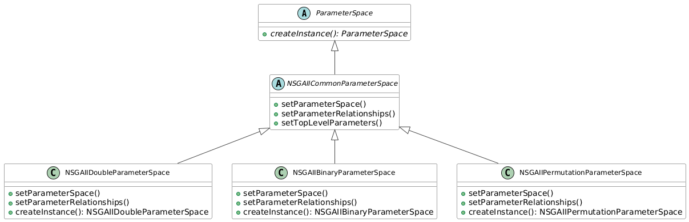

.. _parameter-spaces:

Parameter Spaces
================

Parameter spaces in Evolver define the whole set of parameters that can be configured in an automatic way for base-level metaheuristics. Parameters can be categorical, such as the crossover operator in evolutionary algorithms, or numerical, such as the mutation probability (double parameter) or the offspring population size (integer parameter). 

This section describes the structure of a parameter space and how they can be defined in YAML files. At the end of this section, we will show an alternartive way to define parameter spaces programatically.

Parameters in Evolver
---------------------
A parameter is defined by:
- A unique name
- A type (integer, double, categorical)
- A definition of valid values
- Relationships with other parameters (conditional parameters and global sub-parameters)

By convention, the name of a parameter should be self-explanatory and defined in camel case such as, for example, ``offspringPopulationSize`` or ``mutationProbability``.

Numeric parameter types (integer and double) define a range of valid values using the ``range`` attribute, which is an inclusive range:

.. code-block:: yaml

  neighborhoodSize:
    type: integer
    range: [5, 50]  # Inclusive range

  laplaceCrossoverScale:
    type: double
    range: [0.1, 1.5] # Inclusive range

Categorical parameters define a set of valid values using the ``values`` attribute, and can be defined in two ways:

.. code-block:: yaml

    createInitialSolutions:
      type: categorical
      values:
        default: {}
        latinHypercubeSampling: {}
        scatterSearch: {}

    offspringPopulationSize:
      type: categorical
      values: [1, 2, 5, 10, 20, 50, 100, 200, 400]

The first option is useful when the parameter can have conditional parameters. If this is not the case, the second option is more compact and concise.

Conditional Parameters
~~~~~~~~~~~~~~~~~~~~~~

In the parameter space, a parameter can have conditional parameters. Conditional parameters are parameters that only apply when a parent categorical parameter has a specific value. 

Let's consider the following example to illustrate this concept:

.. code-block:: yaml

  algorithmResult:
    type: categorical
    values: 
      population: {}
      externalArchive:
        conditionalParameters:
          populationSizeWithArchive:
            type: integer
            range: [10, 200]
          archiveType:
            type: categorical
            values:
              crowdingDistanceArchive: {}
              unboundedArchive: {}

The ``algorithmResult`` parameter is a categorical parameter that can take two values: ``population`` or ``externalArchive``. If the value is ``population``, then the ``populationSizeWithArchive`` parameter is not considered. If the value is ``externalArchive``, then the ``populationSizeWithArchive`` and ``archiveType`` parameters are considered. The ``archiveType`` parameter is a categorical parameter that can take two values: ``crowdingDistanceArchive`` or ``unboundedArchive``.

Global Sub-Parameters
~~~~~~~~~~~~~~~~~~~~~

Besides conditional parameters, a categorical parameter can have also global sub-parameters. Global sub-parameters are parameters that always apply, regardless of other parameter values. Let's take a look to the next example:

.. code-block:: yaml

    crossover:
      type: categorical
      globalSubParameters:
        crossoverProbability:
          type: double
          range: [0.0, 1.0]
        crossoverRepairStrategy:
          type: categorical
          values: [random, round, bounds]
      values:
        SBX:
          conditionalParameters:
            sbxDistributionIndex:
              type: double
              range: [5.0, 400.0]
          conditionalParameters:
        blxAlphaCrossoverAlpha:
              type: double
              range: [0.0, 1.0]
        wholeArithmetic: {}

The ``crossover`` parameter is a categorical parameter that can take three values: ``SBX``, ``blxAlpha``, or ``wholeArithmetic``. In contrast to conditional parameters, global sub-parameters always applies. In the example, any crossover has a ``crossoverProbability`` and ``crossoverRepairStrategy`` parameter. We can see that the ``SBX``and ``blxAlpha`` crossovers have a ``sbxDistributionIndex`` and ``blxAlphaCrossoverAlpha`` parameter, respectively, while the ``wholeArithmetic`` crossover does not have these parameters.   

First-Level Parameters in a Parameter Space
~~~~~~~~~~~~~~~~~~~~~~~~~~~~~~~~~~~~~~~~~~~~
The first-level parameters in a parameter space are the root nodes of a hierarchy, and they do not have parents. The rest of parameters of the parameter space are children of these first-level parameters, which can be either conditional or global sub-parameters.

If we take a look to the `parameter space for NSGA-II for double problems <https://github.com/jMetal/Evolver/blob/main/src/main/resources/parameterSpaces/NSGAIIDouble.yaml>`_, we can observe that the number of first-level parameters is five:

- algorithmResult
- createInitialSolutions
- offspringPopulationSize
- variation
- selection

However, the first-level parameters of the `base-level MOEA/D parameter space <https://github.com/jMetal/Evolver/blob/main/src/main/resources/parameterSpaces/MOEADouble.yaml>`_ are eight:

- neighborhoodSize
- maximumNumberOfReplacedSolutions
- aggregationFunction
- algorithmResult
- createInitialSolutions
- subProblemIdGenerator
- variation
- selection

For more examples, see the `parameterSpaces <https://github.com/jMetal/Evolver/tree/main/src/main/resources/parameterSpaces>`_ directory in the source code.

Implementation Details
----------------------

The parameter space functionality in Evolver is implemented through the abstract ``ParameterSpace`` class, which provides a framework for managing algorithm parameters in a hierarchical structure. This class is a key component in Evolver's configuration system.

Here's the basic structure of the ``ParameterSpace`` class with its key method signatures:

.. code-block:: java

   public abstract class ParameterSpace {
       // Contains all parameters in the parameter space, stored by parameter name
       // This includes both top-level and nested parameters
       protected final Map<String, Parameter<?>> parameterSpace;
       
       // Contains only the top-level parameters that serve as entry points
       // These parameters are also included in the parameterSpace map
       protected final List<Parameter<?>> topLevelParameters;
   
       public ParameterSpace() { ... }
       
       public void put(Parameter<?> parameter) { ... }
       
       public Parameter<?> get(String parameterName) { ... }
       
       public Map<String, Parameter<?>> parameters() { ... }
       
       public List<Parameter<?>> topLevelParameters() { ... }
       
       public void addTopLevelParameter(Parameter<?> parameter) { ... }
       
       public abstract ParameterSpace createInstance();
   }

Key Features
~~~~~~~~~~~~~

- **Parameter Storage**: Maintains a map of parameters for easy access by name
- **Hierarchical Structure**: Supports top-level parameters that serve as entry points for configurations
- **Type Safety**: Uses Java generics to ensure type safety for parameter values
- **Immutable Views**: Provides unmodifiable views of parameters and top-level parameter lists

Core Components
~~~~~~~~~~~~~~~

1. **Parameter Storage**
   - Uses a ``Map<String, Parameter<?>>`` to store all parameters by name
   - Contains both top-level and nested parameters in a flattened structure
   - Provides type-safe access to any parameter through the ``get()`` method
   - Maintains a one-to-one mapping between parameter names and parameter objects

2. **Top-Level Parameters**
   - Maintains an ordered list of top-level parameters via ``topLevelParameters``
   - These parameters serve as the main entry points for algorithm configuration
   - Each top-level parameter is also included in the main ``parameterSpace`` map
   - Can be accessed via the ``topLevelParameters()`` method

3. **Parameter Management**
   - ``put(Parameter<?> parameter)``: Adds a parameter to the parameter space
   - ``get(String parameterName)``: Retrieves a parameter by name
   - ``parameters()``: Returns an unmodifiable view of all parameters

4. **Abstract Factory Method**
   - ``createInstance()``: Abstract method that subclasses must implement to create and configure the parameter space

Usage Example
~~~~~~~~~~~~~

.. code-block:: java

   // Create a parameter space instance
   ParameterSpace parameterSpace = new MyAlgorithmParameterSpace();
   
   // Access a specific parameter
   Parameter<?> populationSize = parameterSpace.get("populationSize");
   
   // Get all top-level parameters
   List<Parameter<?>> mainParameters = parameterSpace.topLevelParameters();

Defining Parameter Spaces Programmatically: NSGA-II Case Study
---------------------------------------------------------------
While YAML files provide a declarative way to define parameter spaces, you can also define them programmatically by extending the ``ParameterSpace`` class. This approach offers more flexibility and type safety. Here's how to implement a programmatic parameter space:

1. **Class Structure**: Create a subclass of ``ParameterSpace``
2. **Parameter Definition**: Define all parameters in the constructor
3. **Parameter Relationships**: Set up conditional parameters and global sub-parameters
4. **Top-level Parameters**: Register parameters using ``addTopLevelParameter()``
5. **Instance Creation**: Implement the ``createInstance()`` method for the factory pattern

The following sections demonstrate how to define parameter spaces for different implementations of NSGA-II, specifically optimized for double, binary, and permutation problems. The implementation is organized in the ``org.uma.evolver.algorithm.base.nsgaii.parameterspace`` package. The UML class diagram below shows the inheritance structure of the parameter space classes for NSGA-II:

   
   NSGA-II Parameter Space Class Hierarchy

The idea is that the ``NSGAIICommonParameterSpace`` abstract class defines the common parameters a generic NSGA-II algorithm for any encoding, while the concrete classes define the specific parameters for each flavour of NSGA-II.
This is a code snippet of the ``NSGAIICommonParameterSpace`` class:

.. code-block:: java

   public abstract class NSGAIICommonParameterSpace extends ParameterSpace {

    // Algorithm result options
    public static final String ALGORITHM_RESULT = "algorithmResult";
    public static final String POPULATION = "population";
    public static final String EXTERNAL_ARCHIVE = "externalArchive";
    public static final String ARCHIVE_TYPE = "archiveType";
    public static final String POPULATION_SIZE_WITH_ARCHIVE = "populationSizeWithArchive";

    // Algorithm result options
    public static final String ALGORITHM_RESULT = "algorithmResult";
    public static final String POPULATION = "population";
    public static final String EXTERNAL_ARCHIVE = "externalArchive";
    public static final String ARCHIVE_TYPE = "archiveType";
    public static final String POPULATION_SIZE_WITH_ARCHIVE = "populationSizeWithArchive";

    ...
  
    protected void setParameterSpace() {
      put(new CategoricalParameter(ALGORITHM_RESULT, List.of(POPULATION, EXTERNAL_ARCHIVE)));
      put(new IntegerParameter(POPULATION_SIZE_WITH_ARCHIVE, 10, 200));
    
      ...
    }
   
    protected void setParameterRelationships() {
      // AlgorithmResult dependencies
      get(ALGORITHM_RESULT)
          .addConditionalParameter(EXTERNAL_ARCHIVE, get(POPULATION_SIZE_WITH_ARCHIVE))
          .addConditionalParameter(EXTERNAL_ARCHIVE, get(ARCHIVE_TYPE));

      ...
    }

    protected void setTopLevelParameters() {
      topLevelParameters.add(parameterSpace.get(ALGORITHM_RESULT));
      topLevelParameters.add(parameterSpace.get(CREATE_INITIAL_SOLUTIONS));
      topLevelParameters.add(parameterSpace.get(OFFSPRING_POPULATION_SIZE));
      topLevelParameters.add(parameterSpace.get(VARIATION));
      topLevelParameters.add(parameterSpace.get(SELECTION));
  }

As the diagram shows three are three concrete implementations that inherit from 
NSGAIICommonParameterSpace: NSGAIIDoubleParameterSpace, NSGAIIBinaryParameterSpace, and NSGAIIPermutationParameterSpace. These concrete classes implement the parameter space for NSGA-II when working with double, binary, and permutation-encoded solutions respectively. Each concrete class overrides the createInstance() method to return a new instance of its specific type, ensuring proper polymorphic behavior. The inheritance structure demonstrates a clean separation of concerns, where common parameter management logic is centralized in the abstract base classes while allowing for specific parameter configurations in the concrete implementations.

We include here a code snippet of the NSGAIIDoubleParameterSpace class:

.. code-block:: java

  public class NSGAIIDoubleParameterSpace extends NSGAIICommonParameterSpace<DoubleSolution> {
    public NSGAIIDoubleParameterSpace() {
      super();
      setParameterSpace();
      setParameterRelationships();
      setTopLevelParameters();
    }

    @Override
    public NSGAIIDoubleParameterSpace createInstance() {
      return new NSGAIIDoubleParameterSpace();
    }

    // Initial solutions creation
    public static final String DEFAULT = "default";
    public static final String LATIN_HYPERCUBE_SAMPLING = "latinHypercubeSampling";
    public static final String SCATTER_SEARCH = "scatterSearch";

    // Crossover
    public static final String CROSSOVER_PROBABILITY = "crossoverProbability";
    public static final String CROSSOVER_REPAIR_STRATEGY = "crossoverRepairStrategy";

    // Crossover strategies
    public static final String SBX = "SBX";
    public static final String PCX = "PCX";
    public static final String BLX_ALPHA = "blxAlpha";
  
    ...

    // Mutation
    public static final String MUTATION_PROBABILITY_FACTOR = "mutationProbabilityFactor";
    public static final String MUTATION_REPAIR_STRATEGY = "mutationRepairStrategy";

    // Mutation strategies
    public static final String UNIFORM = "uniform";
    public static final String POLYNOMIAL = "polynomial";

    ...

    @Override
    protected void setParameterSpace() {
      super.setParameterSpace();
      put(
          new CreateInitialSolutionsDoubleParameter(
              List.of(DEFAULT, LATIN_HYPERCUBE_SAMPLING, SCATTER_SEARCH)));

      put(
        new DoubleCrossoverParameter(
            List.of(
                SBX,
                BLX_ALPHA,
                PCX)));

      ... 
      
      put(
        new DoubleMutationParameter(
            List.of(UNIFORM, POLYNOMIAL)));
      put(new DoubleParameter(MUTATION_PROBABILITY_FACTOR, 0.0, 2.0));
      
      ...
    }

    @Override
    protected void setParameterRelationships() {
      super.setParameterRelationships();
      // Variation dependencies
      get(CROSSOVER)
          .addGlobalSubParameter(get(CROSSOVER_PROBABILITY))
          .addConditionalParameter(SBX, get(SBX_DISTRIBUTION_INDEX))
          .addConditionalParameter(PCX, get(PCX_CROSSOVER_ZETA))
          .addConditionalParameter(PCX, get(PCX_CROSSOVER_ETA))
          .addConditionalParameter(BLX_ALPHA, get(BLX_ALPHA_CROSSOVER_ALPHA));
      get(MUTATION)
          .addGlobalSubParameter(get(MUTATION_PROBABILITY_FACTOR))
          .addConditionalParameter(UNIFORM, get(UNIFORM_MUTATION_PERTURBATION))
          .addConditionalParameter(POLYNOMIAL, get(POLYNOMIAL_MUTATION_DISTRIBUTION_INDEX));
    }
  }
    
We can observe as this incorporates the parameters for the crossover and mutation operators, as well as the parameters for the initial solutions creation, related to deal with continuous problems. The above code snippets include examples of how conditional and global sub-parameters are set up.

Defining a parameter space programmatically is more flexible and type-safe than using YAML files. It allows for dynamic parameter definition and ensures type safety. However, it can be more cumbersome, especially when making changes to the parameter space (e.g., removing crossover operators). Such changes require modifying the code of the parameter space class.

