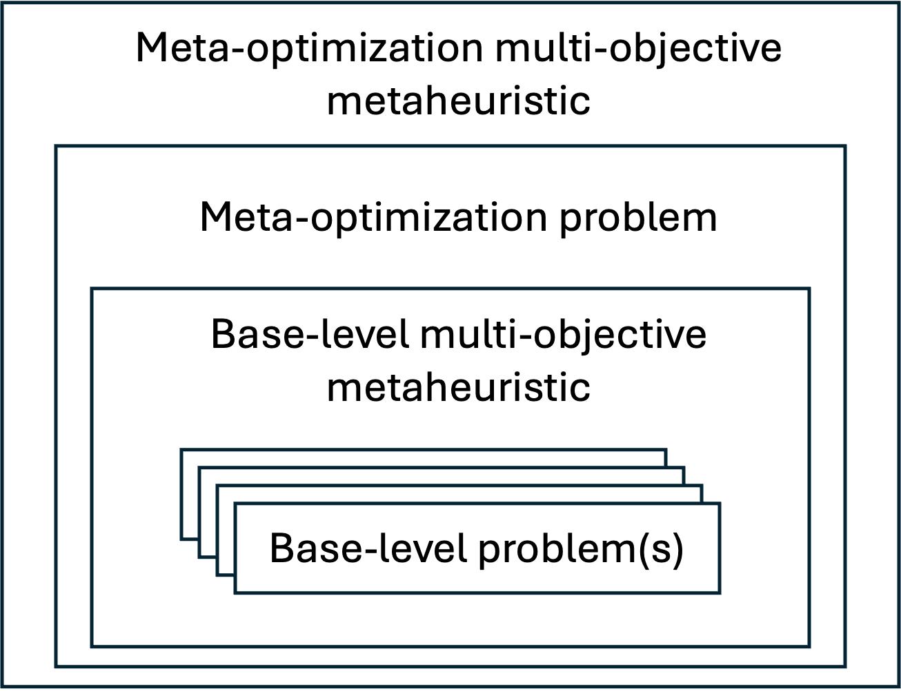

.. _introduction:

Introduction
============

The application of metaheuristics to multi-objective optimization has been an active research area for the past 25 years, 
particularly following the introduction of NSGA-II, SPEA2, and PAES around the year 2000. Since then, continuous advances have led to the development of new algorithms designed to address increasingly complex problem domains, such as many-objective, dynamic, and large-scale optimization. A fundamental challenge in this field is that the performance of 
metaheuristics is highly dependent on the proper tuning of the algorithm control parameters.  Given the *No Free Lunch* theorem, which states that no single metaheuristic outperforms all others across all optimization problems, 
parameter tuning remains a critical issue. Traditionally, this process has relied on manual trial-and-error methods, 
which lack scientific rigor and become even more challenging for domain experts who are not familiar with optimization algorithms.

To address this limitation, automated algorithm configuration tools, such as irace and paramILS, have been developed. These tools optimize parameter settings by iteratively generating and evaluating configurations on a selected training set of problems 
using predefined quality measures. The search process employs learning strategies to refine configurations, ultimately identifying high-performing  parameter settings. Once the training phase is complete, the selected configuration is validated on a separate testing set to assess its  generalization performance.

In this context, we have developed Evolver, a Java-based package for the automatic configuration of multi-objective metaheuristics. Evolver formulates the tuning process itself as a multi-objective optimization problem, which is then solved using another metaheuristic. It is built upon the jMetal multi-objective optimization framework, which provides a diverse collection of metaheuristic algorithms, benchmark problems, and quality indicators. As a result, Evolver becomes a versatile tool for meta-optimization and a valuable research platform in this field.

Meta-Optimization Approach
--------------------------

   Overview of Evolver's meta-optimization approach

The meta-optimization approach follows the scheme shown in the figure above. The goal is to find the best configuration of a base-level multi-objective metaheuristic to efficiently solve a set of base-level problems, which we call the training set. This goal is formulated as a meta-optimization problem, where the solution space is composed of algorithm configurations for the base-level optimizer and the objective space is defined by set of quality indicators that must be minimized. The resulting meta-optimization problem is solvable by a metaheuristic, which we call the meta-optimization algorithm.

Under this approach, a solution of the meta-optimization problem is a particular configuration of the base-level algorithm, 
and evaluating the solution by the meta-optimizer involves running the base-level algorithm on the training set. Then, the quality of the obtained front approximations is assessed by applying a number of quality indicators, which constitute the objective values of the solution.   

For detailed explanation, see :doc:`concepts/meta_optimization_approach`.

Parameter Space
---------------
If we consider classical multi-objective metaheuristics, such as NSGA-II or MOEA/D, their parameter spaces are small. For example, the parameters of NSGA-II that need to be tuned to solve continuous problems are: population size, crossover and mutation probabilities, and the distribution indices of simulated binary crossover (SBX) and polynomial mutation. However, if we keep the main feature of NSGA-II (i.e., fast non-dominance ranking and crowding distance density estimator, used in the replacement step), there are many other features that could be incorporated. 

The concept of *parameter space* is key in Evolver, as it defines the space of possible configurations of a base-level metaheuristic. A parameter space is defined by a set of parameters, each with a name, a type (integer, double, categorical), and a definition of the values it can take. In the case of categorical parameters, they can include a list of conditional parameters, which are only considered if the categorical parameter takes a specific value. A parameter can also have a list of global sub-parameters, which are always considered independently of the value of the parameter.

Parameter spaces in Evolver are defined in YAML files. See :doc:`concepts/parameter_spaces` for comprehensive documentation.

Solution Encoding and Evaluation
--------------------------------

Evolver encodes all parameters of a given configuration in a vector of real values in the range [0.0, 1.0]. Evaluating a solution requires decoding the real values into the corresponding parameters in order to configure the base algorithm, run it on the base-level problems, and compute the quality indicators for the obtained solutions.

Refer to :doc:`concepts/solution_encoding` and :doc:`concepts/evaluation` for further details.

Objective Functions
-------------------

jMetal provides a wide range of quality indicators that measure the degree of convergence and/or diversity of a Pareto front approximation obtained by a multi-objective metaheuristic, such as additive epsilon (EP), inverted generational distance (IGD), spread (SP), or hypervolume (HV).

As mentioned before, the objective functions of the meta-optimization problem are based on a list of the desired quality indicators. All quality indicators used as objective functions are intended to be minimized in Evolver. 

Additional information can be found in :doc:`concepts/objective_functions`.

Base-Level Metaheuristics
-------------------------

A base-level metaheuristic is a multi-objective algorithm that must be configured from any given valid configuration of its parameter space. As a consequence, the existing algorithms in jMetal cannot be used as provided in that framework because their implementation is not generic enough. 

Evolver includes a set of algorithms that have been modified to be used as base-level metaheuristics. See :doc:`concepts/base_level_metaheuristics` for more information.

Meta-Optimization-Level Metaheuristics 
--------------------------------------

As previously mentioned, choosing a real encoding for the meta-optimizer allows the use of most multi-objective metaheuristics available in jMetal. This includes evolutionary algorithms (NSGA-II, MOEA/D, SMS-EMOA, SPEA2, etc.), differential evolution (GDE3, MOEA/D-DE), and particle swarm optimization algorithms (OMOPSO, SMPSO).

The ability to evaluate the population or swarm in parallel using a synchronous parallel scheme can significantly speed up execution. For NSGA-II, an asynchronous parallel version is also available. Using parallel meta-optimizers is highly desirable as a meta-optimization can take a long time to complete, and parallelization can significantly reduce the total running time.

More details on this issue can be found in section :ref:`meta-optimization-level-metaheuristics`.