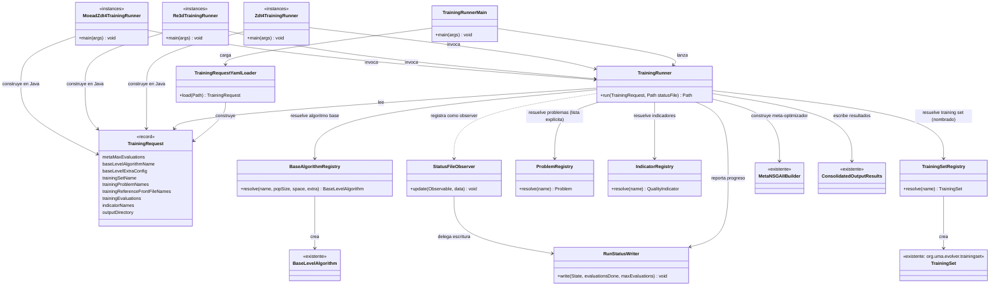

# Prototipo de runner uniforme para entrenamiento (`org.uma.evolver.cli.runner`)

**Proyecto:** Evolver (jMetal)
**Rama:** `study/uniform-training-runner` (prototipo de estudio, no integrado en `main`)
**Motivación:** permitir que una herramienta externa (p. ej. un futuro GUI, [Evolver-Studio](https://github.com/jMetal/Evolver-Studio)) lance y monitorice runs de meta-optimización sin recompilar, sin sustituir los runners monolíticos existentes en `org.uma.evolver.example.training`, que siguen siendo la vía preferida para quien programa y prefiere leer un único fichero de arriba a abajo.

## Motivación

Los runners de `example.training` funcionan bien para ese uso, pero cada uno define su configuración con constantes Java hardcodeadas y un `main(String[] args)` ad hoc (algunos ignoran `args`, otros exigen posiciones fijas sin nombre). Eso los hace perfectos para copiar y editar, pero imposibles de invocar desde fuera del proceso Java sin recompilar. `cli.runner` es la fontanería que resuelve justo ese problema: una única entrada estructurada (`TrainingRequest`), un runner (`TrainingRunner`) que reutiliza el pipeline ya existente (`MetaNSGAIIBuilder`, `ConsolidatedOutputResults`, observers), y un contrato de fichero YAML de petición/estado/resultado pensado para ser leído por un proceso externo.

Se probó deliberadamente contra tres casos distintos para evitar sobreajustar el diseño a uno solo:

| Caso de referencia | Qué ejercita |
|---|---|
| `NSGAIIOptimizingNSGAIIForProblemZDT4` | Un solo problema de entrenamiento |
| `NSGAIIOptimizingNSGAIIForBenchmarkRE3D` | Un training set con nombre y varios problemas (`TrainingSet`) |
| `NSGAIIOptimizingMOEADForProblemZDT4` | Un algoritmo base distinto de NSGA-II, con configuración extra propia (`weightVectorFilesDirectory`) |

## Diagrama de clases

## Dos formas de disparar el mismo `TrainingRunner`

1. **Fichero YAML** (`TrainingRunnerMain <request.yaml> [status.yaml]`): la vía pensada para un proceso externo — el GUI escribe `request.yaml`, hace polling de `status.yaml` mientras el run progresa, y al terminar lee `results.yaml` (que apunta a `METADATA.txt`/`INDICATORS.csv`/`CONFIGURATIONS.csv`, ya generados por `ConsolidatedOutputResults`).
2. **Objeto Java plano** (paquete `cli.runner.instances`): para quien prefiere programar directamente, sin aprender el formato YAML. Cada clase (`Zdt4TrainingRunner`, `Re3dTrainingRunner`, `MoeadZdt4TrainingRunner`) construye un `TrainingRequest` con valores a la vista — igual de legible que los runners de `example.training` — y llama a `new TrainingRunner().run(request, statusPath)`.

Ambas vías comparten exactamente el mismo motor (`TrainingRunner` y sus registries), por lo que ninguna decisión de diseño queda duplicada entre ellas.

## Notas de alcance (prototipo)

- El meta-optimizador está fijo a NSGA-II (como en los tres ejemplos de referencia); generalizarlo a otros meta-optimizadores (`MetaSMPSOBuilder`, etc.) queda fuera de este prototipo.
- Los *registries* (`ProblemRegistry`, `IndicatorRegistry`, `TrainingSetRegistry`, `BaseAlgorithmRegistry`) solo registran lo necesario para los tres casos de referencia; son el punto de extensión natural para añadir más problemas, indicadores, training sets o algoritmos base.
- `TrainingSetRegistry` depende únicamente de la interfaz `TrainingSet` (no de las subclases concretas como `RE3DTrainingSet`), que ya modela un training set como tres listas paralelas (problemas, frentes de referencia, evaluaciones) más un nombre — el mismo criterio se siguió al diseñar los campos equivalentes de `TrainingRequest`.
