# Prototipo de runner uniforme para entrenamiento (`org.uma.evolver.cli.runner`)

**Proyecto:** Evolver (jMetal)
**Rama:** `study/uniform-training-runner` (prototipo de estudio, no integrado en `main`)
**Motivación:** permitir que una herramienta externa (p. ej. un futuro GUI, [Evolver-Studio](https://github.com/jMetal/Evolver-Studio)) lance y monitorice runs de meta-optimización sin recompilar, sin sustituir los runners monolíticos existentes en `org.uma.evolver.example.training`, que siguen siendo la vía preferida para quien programa y prefiere leer un único fichero de arriba a abajo.

## Motivación

Los runners de `example.training` funcionan bien para ese uso, pero cada uno define su configuración con constantes Java hardcodeadas y un `main(String[] args)` ad hoc (algunos ignoran `args`, otros exigen posiciones fijas sin nombre). Eso los hace perfectos para copiar y editar, pero imposibles de invocar desde fuera del proceso Java sin recompilar. `cli.runner` es la fontanería que resuelve justo ese problema: una entrada estructurada (`TrainingRequest`), un runner (`TrainingRunner`) que reutiliza el pipeline ya existente, y un contrato de fichero YAML de petición/estado/resultado pensado para ser leído por un proceso externo.

Se probó deliberadamente contra cuatro casos distintos para evitar sobreajustar el diseño a uno solo:

| Caso de referencia | Qué ejercita |
|---|---|
| `NSGAIIOptimizingNSGAIIForProblemZDT4` | Un solo problema de entrenamiento; codificación plana |
| `NSGAIIOptimizingNSGAIIForBenchmarkRE3D` | Varios problemas de entrenamiento; codificación plana |
| `NSGAIIOptimizingMOEADForProblemZDT4` | Un algoritmo base distinto de NSGA-II, con configuración extra propia (`weightVectorFilesDirectory`); codificación plana |
| `TreeNSGAIIOptimizingNSGAIIForBenchmarkRE3D` | Codificación en árbol de derivación (sin YAML de meta-nivel) |

Añadido después: `async-nsgaii-zdt4-request.yaml` ejercita un motor meta-optimizador distinto de NSGA-II (`"AsyncNSGA-II"`, `AsynchronousMultiThreadedNSGAII`), confirmando que `MetaAlgorithmRegistry` generaliza a motores con una forma de algoritmo distinta (sin `EvolutionaryAlgorithm` como supertipo común).

## `TrainingRequest` en dos partes independientes

El cuarto caso destapó que la codificación plana y la de árbol no son solo "valores distintos para los mismos campos": la codificación en árbol no usa ningún YAML de meta-nivel — el meta-optimizador opera directamente sobre derivaciones de la propia gramática del algoritmo base, con dos operadores fijos (`SubtreeCrossover`, `TreeMutation`) parametrizados por un puñado de valores escalares. Por eso `TrainingRequest` se dividió en dos partes independientes:

- **`BaseLevelConfig`**: qué se está ajustando y sobre qué training set — algoritmo base, su espacio de parámetros YAML, el training set (siempre como tres listas paralelas explícitas: problemas, frentes de referencia, evaluaciones — el CLI no resuelve training sets por nombre, ver más abajo), y los indicadores. Es exactamente igual sea cual sea la codificación del meta-nivel. Igual que `metaSearch` (ver siguiente punto), **no** se declara inline en `request.yaml`: el campo `baseLevel` es el *nombre* de un fichero reusable bajo `src/main/resources/baseLevelConfigurations/` (p. ej. `baseLevel: Zdt4NSGAIIBaseLevel.yaml`), cargado por `BaseLevelConfigurationReader`.
- **`MetaSearchConfig`** (interfaz sellada): cómo busca el meta-optimizador. Tampoco se declara inline: el campo `metaSearch` es el *nombre* de un fichero de configuración meta-optimizador reusable (p. ej. `metaSearch: MetaParallelNSGAIIFlatConfiguration.yaml`), cargado por `MetaOptimizerConfigurationReader` desde `src/main/resources/metaOptimizerConfigurations/`. Ambas variantes declaran un campo `algorithm` (resuelto por `MetaAlgorithmRegistry`, ver más abajo; `"ParallelNSGA-II"` y `"AsyncNSGA-II"` están registrados para `flat`, solo `"ParallelNSGA-II"` para `tree`). Se llama "Parallel" y no simplemente "NSGA-II" porque toda variante de NSGA-II usada como meta-optimizador evalúa siempre en paralelo (`MultiThreadedEvaluation`, `numberOfCores`):
  - `FlatMetaSearchConfig`: `algorithm`, población, evaluaciones, núcleos, y `operatorFlags` — el resto de claves del fichero meta (`crossover`, `mutation`, `crossoverProbability`, `selection`, ...), convertidas a pares `["--clave", "valor", ...]` listos para `BaseLevelAlgorithm.parse(String[])`.
  - `TreeMetaSearchConfig`: `algorithm`, población, evaluaciones, núcleos, y los tres escalares de `SubtreeCrossover`/`TreeMutation`.
- **`outputDirectory`, `writeFrequency`, `statusFrequency`, `frontPlotFrequency`**: a diferencia de `baseLevel`/`metaSearch`, sí se declaran inline en `request.yaml`, como campos propios de `TrainingRequest` (no de `BaseLevelConfig`/`MetaSearchConfig`). Los cuatro son específicos de *esa* ejecución concreta, no de la receta que se ejecuta — dos requests pueden compartir exactamente el mismo `baseLevel`/`metaSearch` (p. ej. comparar `ParallelNSGA-II` vs. `AsyncNSGA-II` sobre el mismo problema, ver `nsgaii-zdt4-request.yaml`/`async-nsgaii-zdt4-request.yaml`, que comparten `Zdt4NSGAIIBaseLevel.yaml`) y aun así querer escribir en sitios distintos, con una cadencia de reporte distinta, o con/sin visualización en vivo. Si vivieran dentro de un fichero reusable, esa reutilización sería imposible.
  - `outputDirectory`: obligatorio.
  - `writeFrequency` (cada cuántas evaluaciones se escriben `CONFIGURATIONS.csv`/`INDICATORS.csv`) y `statusFrequency` (cada cuántas evaluaciones se actualizan `status.yaml`/el log): opcionales, por defecto 100 — no todas las evaluaciones, aproximadamente una vez por generación.
  - `frontPlotFrequency`: opcional, **sin** valor por defecto — ausente significa sin gráfico. Si está presente, `TrainingRunner` registra un `FrontPlotObserver` en vivo (frente de Pareto del meta-optimizador, actualizado cada `frontPlotFrequency` evaluaciones), derivando título/ejes/leyenda de `metaSearch.algorithm()`/los dos indicadores/`trainingSet.label()` — el usuario no tiene que indicar nada más que la frecuencia. Deliberadamente opt-in: `TrainingRunner` puede ser lanzado por un proceso externo (p. ej. un GUI) que no querría que apareciese una ventana Swing en su máquina.

### `request.yaml` referencia dos ficheros reusables, no uno

Un `TrainingRequest` completo son en realidad **tres piezas independientes**, el mismo patrón que ya usaba `baseLevel.yamlParameterSpaceFile`/`defaultConfigurations/*.txt` a nivel de algoritmo base, aplicado ahora también al `TrainingRequest` en su conjunto:

1. **`request.yaml`** — `baseLevel:` (nombre de fichero), `metaSearch:` (nombre de fichero), `outputDirectory:` (string inline, obligatorio) y, opcionalmente, `writeFrequency:`/`statusFrequency:` (enteros inline, por defecto 100) y `frontPlotFrequency:` (entero inline, sin default — ausente = sin gráfico) — todos específicos de esta ejecución.
2. **El fichero de `baseLevel`** (p. ej. `Zdt4NSGAIIBaseLevel.yaml`, bajo `src/main/resources/baseLevelConfigurations/`) — qué se ajusta y sobre qué training set, reutilizable entre cualquier número de requests.
3. **El fichero de `metaSearch`** (p. ej. `MetaParallelNSGAIIFlatConfiguration.yaml`, bajo `src/main/resources/metaOptimizerConfigurations/`) — una receta completa y reutilizable del meta-optimizador: `algorithm`, `encoding`, los escalares (`metaMaxEvaluations`, `metaPopulationSize`, `numberOfCores`) y, para `flat`, los operadores concretos (`crossover: SBX`, `crossoverProbability: 0.9`, `selection: tournament`, ...) — todo en un único nivel de claves, sin evolucionar nunca.

El catálogo de operadores disponibles para el propio meta-optimizador (`NSGAIIMetaDouble.yaml`/`AsyncNSGAIIMetaDouble.yaml`, mismo formato `ParameterSpace` que usa `baseLevel.yamlParameterSpaceFile` pero restringido) **no es un campo del request**: como solo hay un catálogo legal por algoritmo registrado, `MetaAlgorithmRegistry` lo hardcodea internamente en vez de repetirlo en cada fichero de `metaSearch`. `MetaAlgorithmRegistry` también fija ahí mismo los tres flags sin alternativa real dentro de ese catálogo (`--algorithmResult population --createInitialSolutions default --variation crossoverAndMutationVariation`), que `.parse(String[])` exige presentes aunque solo tengan un valor legal.

En resumen: `baseLevel.yamlParameterSpaceFile` es siempre el espacio evolucionado; el fichero de `baseLevel` (el `request.yaml`), el fichero de `metaSearch` y el catálogo interno que valida sus operadores nunca lo son — son la configuración, elegida una vez, de qué se ajusta y de la herramienta que hace el ajuste.

### Los ficheros de `baseLevel`/`metaSearch` se generan, no se escriben a mano

`src/main/java/org/uma/evolver/cli/runner/generators/` tiene una clase por fichero de `baseLevelConfigurations/` (p. ej. `Zdt4BaseLevelConfigurationGenerator`): construye un `BaseLevelConfig` en Java (con el chequeo de tipos/tamaños de lista del compilador) y llama a `BaseLevelConfigurationWriter.save(config, path)` para (re)escribir el fichero — evita mantener los mismos valores duplicados a mano en Java y en YAML. Estas clases **no ejecutan ningún entrenamiento**: ejecutar un experimento se hace siempre vía `TrainingRunnerMain <request.yaml>`.

## Diagrama de clases

```mermaid
classDiagram
    class TrainingRunnerMain {
        +main(args) void
    }
    class TrainingRequestYamlLoader {
        +load(Path) TrainingRequest
    }
    class TrainingRequest {
        <<record>>
        baseLevel: BaseLevelConfig
        metaSearch: MetaSearchConfig
        outputDirectory: String
        writeFrequency: int
        statusFrequency: int
        frontPlotFrequency: Integer
    }
    class BaseLevelConfig {
        <<record>>
        algorithmName
        populationSize
        yamlParameterSpaceFile
        extraConfig
        trainingProblemNames
        trainingReferenceFrontFileNames
        trainingEvaluations
        indicatorNames
    }
    class BaseLevelConfigurationReader {
        +load(fileName) BaseLevelConfig
    }
    class BaseLevelConfigurationWriter {
        +save(BaseLevelConfig, Path) void
    }
    class MetaSearchConfig {
        <<sealed interface>>
        algorithm() String
        metaMaxEvaluations() int
        numberOfCores() int
    }
    class FlatMetaSearchConfig {
        <<record>>
        algorithm
        metaPopulationSize
        operatorFlags
    }
    class TreeMetaSearchConfig {
        <<record>>
        algorithm
        metaPopulationSize
        metaOffspringSize
        crossoverProbability
        mutationProbability
        mutationDistributionIndex
    }
    class TrainingRunner {
        +run(TrainingRequest, Path statusFile) Path
        -runFlat(...) Path
        -runTree(...) Path
    }
    class RunStatusWriter {
        +write(State, evaluationsDone, maxEvaluations) void
    }
    class StatusFileObserver {
        +update(Observable, data) void
    }
    class BaseAlgorithmRegistry {
        +resolve(name, popSize, space, extra) BaseLevelAlgorithm
    }
    class ProblemRegistry {
        +resolve(name) Problem
    }
    class IndicatorRegistry {
        +resolve(name) QualityIndicator
    }
    class MetaAlgorithmRegistry {
        +familyOf(name) Family
        +resolveFlat(name, problem, config) EvolutionaryAlgorithm
        +resolveFlatAsync(name, problem, config) AsynchronousMultiThreadedNSGAII
        +validateTreeAlgorithm(name) void
    }
    class MetaOptimizerConfigurationReader {
        +load(fileName) MetaSearchConfig
    }

    class BaseLevelAlgorithm {
        <<existente>>
    }
    class DoubleNSGAII {
        <<existente>>
    }
    class ConsolidatedOutputResults {
        <<existente>>
    }
    class TreeOutputResults {
        <<existente: org.uma.evolver.encoding.util>>
    }
    class SubtreeCrossover {
        <<existente>>
    }
    class TreeMutation {
        <<existente>>
    }

    class Zdt4BaseLevelConfigurationGenerator {
        <<generators>>
        +main(args) void
    }
    class Re3dBaseLevelConfigurationGenerator {
        <<generators>>
        +main(args) void
    }
    class MoeadZdt4BaseLevelConfigurationGenerator {
        <<generators>>
        +main(args) void
    }
    class TreeRe3dBaseLevelConfigurationGenerator {
        <<generators>>
        +main(args) void
    }

    TrainingRequest *-- BaseLevelConfig
    TrainingRequest *-- MetaSearchConfig
    MetaSearchConfig <|.. FlatMetaSearchConfig
    MetaSearchConfig <|.. TreeMetaSearchConfig

    TrainingRunnerMain --> TrainingRequestYamlLoader : carga
    TrainingRunnerMain --> TrainingRunner : lanza
    TrainingRequestYamlLoader --> TrainingRequest : construye
    TrainingRequestYamlLoader --> BaseLevelConfigurationReader : resuelve baseLevel por nombre
    TrainingRequestYamlLoader --> MetaOptimizerConfigurationReader : resuelve metaSearch por nombre

    TrainingRunner --> TrainingRequest : lee
    TrainingRunner --> RunStatusWriter : reporta progreso
    TrainingRunner --> BaseAlgorithmRegistry : resuelve algoritmo base
    TrainingRunner --> ProblemRegistry : resuelve problemas (siempre lista explícita)
    TrainingRunner --> IndicatorRegistry : resuelve indicadores
    TrainingRunner --> MetaAlgorithmRegistry : runFlat()/runTree() resuelven algoritmo meta
    TrainingRunner --> ConsolidatedOutputResults : runFlat() escribe resultados
    TrainingRunner --> SubtreeCrossover : runTree()
    TrainingRunner --> TreeMutation : runTree()
    TrainingRunner --> TreeOutputResults : runTree() escribe resultados
    TrainingRunner ..> StatusFileObserver : registra como observer

    MetaAlgorithmRegistry --> DoubleNSGAII : resolveFlat("ParallelNSGA-II", ...) construye

    StatusFileObserver --> RunStatusWriter : delega escritura
    BaseAlgorithmRegistry --> BaseLevelAlgorithm : crea

    Zdt4BaseLevelConfigurationGenerator --> BaseLevelConfig : construye en Java
    Zdt4BaseLevelConfigurationGenerator --> BaseLevelConfigurationWriter : guarda a YAML
    Re3dBaseLevelConfigurationGenerator --> BaseLevelConfig : construye en Java
    Re3dBaseLevelConfigurationGenerator --> BaseLevelConfigurationWriter : guarda a YAML
    MoeadZdt4BaseLevelConfigurationGenerator --> BaseLevelConfig : construye en Java
    MoeadZdt4BaseLevelConfigurationGenerator --> BaseLevelConfigurationWriter : guarda a YAML
    TreeRe3dBaseLevelConfigurationGenerator --> BaseLevelConfig : construye en Java
    TreeRe3dBaseLevelConfigurationGenerator --> BaseLevelConfigurationWriter : guarda a YAML
```

## Una única forma de ejecutar: `TrainingRunnerMain <request.yaml>`

`TrainingRunnerMain <request.yaml> [status.yaml]` es ahora la única vía para ejecutar un entrenamiento — el GUI (o un usuario) escribe `request.yaml` (`baseLevel:`, `metaSearch:`, `outputDirectory:` y opcionalmente `writeFrequency:`/`statusFrequency:`/`frontPlotFrequency:`, ver más arriba), hace polling de `status.yaml` mientras el run progresa, y al terminar lee `results.yaml` (que apunta a `METADATA.txt`/`INDICATORS.csv`/`CONFIGURATIONS.csv`).

Antes existía una segunda vía (paquete `cli.runner.instances`, objetos Java planos que construían un `TrainingRequest` y lo ejecutaban directamente). Se eliminó: en cuanto `baseLevel` pasó a cargarse por referencia a fichero igual que `metaSearch`, esas clases se volvieron duplicados casi exactos de invocar `TrainingRunnerMain` sobre el `request.yaml` correspondiente — la misma configuración escrita a mano en dos sitios sin que ninguno fuera la fuente de verdad. En su lugar, `cli.runner.generators` (ver arriba) cubre el caso de uso real que sí aportaba algo (construir una configuración con el chequeo de tipos del compilador): generan los ficheros de `baseLevelConfigurations/`, no ejecutan nada.

## Notas de alcance (prototipo)

- El algoritmo meta-optimizador se elige explícitamente vía `metaSearch.algorithm`, resuelto por `MetaAlgorithmRegistry`. Para `flat` hay dos motores registrados: `"ParallelNSGA-II"` (construye `DoubleNSGAII` directamente, sin pasar por `MetaNSGAIIBuilder`) y `"AsyncNSGA-II"` (construye `AsynchronousMultiThreadedNSGAII` vía `MetaAsyncNSGAIIBuilder`, con crossover/mutación configurables desde un `ParameterSpace` reducido — `AsyncNSGAIIMetaDouble.yaml`, solo esos dos parámetros, ya que selección y reemplazo están hardcodeados dentro del algoritmo asíncrono). Para `tree` sigue habiendo solo una pipeline implementada (`"ParallelNSGA-II"`). `MetaAlgorithmRegistry.familyOf(algorithm)` es la única fuente de verdad sobre qué forma de algoritmo (`EvolutionaryAlgorithm` vs. `AsynchronousMultiThreadedNSGAII`, sin supertipo común en jMetal) devuelve cada nombre, y `TrainingRunner` despacha a `runFlat`/`runFlatAsync` según esa clasificación. Generalizar a otros motores (SMPSO, SPEA2, ...) queda fuera de este prototipo, pero el registro ya está estructurado para que añadir uno sea una entrada nueva. Nota: `TrainingRunnerMain` termina con `System.exit(0)` porque `AsynchronousMultiThreadedNSGAII` no cierra su pool de hilos por sí solo (mismo motivo por el que los ejemplos `AsyncNSGAIIOptimizing*` de `example.training` ya hacían lo mismo).
- Los *registries* (`ProblemRegistry`, `IndicatorRegistry`, `BaseAlgorithmRegistry`, `MetaAlgorithmRegistry`) solo registran lo necesario para los casos de referencia; son el punto de extensión natural para añadir más problemas, indicadores, algoritmos base o motores meta-optimizadores.
- **Contrato para Evolver-Studio:** un fichero de `metaSearch` (p. ej. `MetaParallelNSGAIIFlatConfiguration.yaml`) es un YAML plano de un solo nivel — `algorithm`, `encoding`, los escalares, y los operadores concretos como pares clave-valor (`crossover: SBX`, `crossoverProbability: 0.9`, ...) — deliberadamente *no* el formato `ParameterSpace` (categórico/condicional) que usa `baseLevel.yamlParameterSpaceFile`, porque aquí no hay nada que evolucionar ni que acotar: es una receta fija, no un espacio. El renderer de Evolver-Studio para el algoritmo base (`evolver_studio/parameter_space.py`/`parameter_form.py`) no aplica tal cual; lo natural del lado de Evolver-Studio es un formulario simple de campos clave-valor (o directamente editar el YAML), no el mismo componente de sliders/multiselect. Adaptar eso es trabajo pendiente en el lado de Evolver-Studio, no de este prototipo.
- El CLI **no** resuelve training sets por nombre (no hay `TrainingSetRegistry`): aunque `org.uma.evolver.trainingset.RE3DTrainingSet` ya empaqueta los 7 problemas RE de tres objetivos bajo el nombre "RE3D", `Re3dNSGAIIBaseLevel.yaml`/`Re3dNSGAIITreeBaseLevel.yaml` (y los generadores que los producen) los listan explícitamente en las tres listas paralelas de `BaseLevelConfig` (mismo criterio que ya usa `TrainingSet`: problemas, frentes de referencia, evaluaciones). Así ningún request queda con campos a `null` a la espera de "una u otra forma", y no hace falta cruzar referencias con las subclases de `org.uma.evolver.trainingset` para saber qué ejecuta realmente. La contrapartida es que `METADATA.txt` etiqueta estos casos como `Problem Family: custom` en vez de `RE3D`, al no conocer el CLI ese nombre.
