# Prototipo de runner uniforme para entrenamiento (`org.uma.evolver.cli.runner`)

**Proyecto:** Evolver (jMetal)
**Rama:** `study/uniform-training-runner` (prototipo de estudio, no integrado en `main`)
**Motivación:** permitir que una herramienta externa (p. ej. un futuro GUI, [Evolver-Studio](https://github.com/jMetal/Evolver-Studio)) lance y monitorice runs de meta-optimización sin recompilar, sin sustituir los runners monolíticos existentes en `org.uma.evolver.example.training`, que siguen siendo la vía preferida para quien programa y prefiere leer un único fichero de arriba a abajo.

## Motivación

Los runners de `example.training` funcionan bien para ese uso, pero cada uno define su configuración con constantes Java hardcodeadas y un `main(String[] args)` ad hoc (algunos ignoran `args`, otros exigen posiciones fijas sin nombre). Eso los hace perfectos para copiar y editar, pero imposibles de invocar desde fuera del proceso Java sin recompilar. `cli.runner` es la fontanería que resuelve justo ese problema: una entrada estructurada (`TrainingRequest`), un runner (`TrainingRunner`) que reutiliza el pipeline ya existente, y un contrato de fichero YAML de petición/estado/resultado pensado para ser leído por un proceso externo.

Se probó deliberadamente contra cuatro casos distintos para evitar sobreajustar el diseño a uno solo:

| Caso de referencia | Qué ejercita |
|---|---|
| `NSGAIIOptimizingNSGAIIForProblemZDT4` | Un solo problema de entrenamiento; codificación plana |
| `NSGAIIOptimizingNSGAIIForBenchmarkRE3D` | Un training set con nombre y varios problemas (`TrainingSet`); codificación plana |
| `NSGAIIOptimizingMOEADForProblemZDT4` | Un algoritmo base distinto de NSGA-II, con configuración extra propia (`weightVectorFilesDirectory`); codificación plana |
| `TreeNSGAIIOptimizingNSGAIIForBenchmarkRE3D` | Codificación en árbol de derivación (sin YAML de meta-nivel) |

## `TrainingRequest` en dos partes independientes

El cuarto caso destapó que la codificación plana y la de árbol no son solo "valores distintos para los mismos campos": la codificación en árbol ni siquiera usa `MetaNSGAIIBuilder` ni un YAML de meta-nivel — el meta-optimizador opera directamente sobre derivaciones de la propia gramática del algoritmo base, con dos operadores fijos (`SubtreeCrossover`, `TreeMutation`) parametrizados por un puñado de valores escalares. Por eso `TrainingRequest` se dividió en dos partes independientes:

- **`BaseLevelConfig`**: qué se está ajustando y sobre qué training set — algoritmo base, su espacio de parámetros YAML, el training set (nombrado o explícito), los indicadores y el directorio de salida. Es exactamente igual sea cual sea la codificación del meta-nivel.
- **`MetaSearchConfig`** (interfaz sellada): cómo busca el meta-optimizador. Exactamente una de dos formas:
  - `FlatMetaSearchConfig`: población, evaluaciones, núcleos, `mutationProbabilityFactor` y el YAML de meta-nivel (donde cruce/mutación/selección del propio meta-optimizador son parámetros categóricos).
  - `TreeMetaSearchConfig`: población, evaluaciones, núcleos, y los tres escalares de `SubtreeCrossover`/`TreeMutation` — sin ningún fichero YAML.

## Diagrama de clases

```mermaid
classDiagram
    class TrainingRunnerMain {
        +main(args) void
    }
    class TrainingRequestYamlLoader {
        +load(Path) TrainingRequest
    }
    class TrainingRequest {
        <<record>>
        baseLevel: BaseLevelConfig
        metaSearch: MetaSearchConfig
    }
    class BaseLevelConfig {
        <<record>>
        algorithmName
        populationSize
        yamlParameterSpaceFile
        extraConfig
        trainingSetName
        trainingProblemNames
        trainingReferenceFrontFileNames
        trainingEvaluations
        indicatorNames
        outputDirectory
    }
    class MetaSearchConfig {
        <<sealed interface>>
        metaMaxEvaluations() int
        numberOfCores() int
    }
    class FlatMetaSearchConfig {
        <<record>>
        metaPopulationSize
        mutationProbabilityFactor
        metaYamlParameterSpaceFile
    }
    class TreeMetaSearchConfig {
        <<record>>
        metaPopulationSize
        metaOffspringSize
        crossoverProbability
        mutationProbability
        mutationDistributionIndex
    }
    class TrainingRunner {
        +run(TrainingRequest, Path statusFile) Path
        -runFlat(...) Path
        -runTree(...) Path
    }
    class RunStatusWriter {
        +write(State, evaluationsDone, maxEvaluations) void
    }
    class StatusFileObserver {
        +update(Observable, data) void
    }
    class BaseAlgorithmRegistry {
        +resolve(name, popSize, space, extra) BaseLevelAlgorithm
    }
    class ProblemRegistry {
        +resolve(name) Problem
    }
    class IndicatorRegistry {
        +resolve(name) QualityIndicator
    }
    class TrainingSetRegistry {
        +resolve(name) TrainingSet
    }

    class BaseLevelAlgorithm {
        <<existente>>
    }
    class TrainingSet {
        <<existente: org.uma.evolver.trainingset>>
    }
    class MetaNSGAIIBuilder {
        <<existente>>
    }
    class ConsolidatedOutputResults {
        <<existente>>
    }
    class TreeOutputResults {
        <<existente: org.uma.evolver.encoding.util>>
    }
    class SubtreeCrossover {
        <<existente>>
    }
    class TreeMutation {
        <<existente>>
    }

    class Zdt4TrainingRunner {
        <<instances, flat>>
        +main(args) void
    }
    class Re3dTrainingRunner {
        <<instances, flat>>
        +main(args) void
    }
    class MoeadZdt4TrainingRunner {
        <<instances, flat>>
        +main(args) void
    }
    class TreeRe3dTrainingRunner {
        <<instances, tree>>
        +main(args) void
    }

    TrainingRequest *-- BaseLevelConfig
    TrainingRequest *-- MetaSearchConfig
    MetaSearchConfig <|.. FlatMetaSearchConfig
    MetaSearchConfig <|.. TreeMetaSearchConfig

    TrainingRunnerMain --> TrainingRequestYamlLoader : carga
    TrainingRunnerMain --> TrainingRunner : lanza
    TrainingRequestYamlLoader --> TrainingRequest : construye

    TrainingRunner --> TrainingRequest : lee
    TrainingRunner --> RunStatusWriter : reporta progreso
    TrainingRunner --> BaseAlgorithmRegistry : resuelve algoritmo base
    TrainingRunner --> ProblemRegistry : resuelve problemas (lista explícita)
    TrainingRunner --> TrainingSetRegistry : resuelve training set (nombrado)
    TrainingRunner --> IndicatorRegistry : resuelve indicadores
    TrainingRunner --> MetaNSGAIIBuilder : runFlat() construye meta-optimizador
    TrainingRunner --> ConsolidatedOutputResults : runFlat() escribe resultados
    TrainingRunner --> SubtreeCrossover : runTree()
    TrainingRunner --> TreeMutation : runTree()
    TrainingRunner --> TreeOutputResults : runTree() escribe resultados
    TrainingRunner ..> StatusFileObserver : registra como observer

    StatusFileObserver --> RunStatusWriter : delega escritura
    BaseAlgorithmRegistry --> BaseLevelAlgorithm : crea
    TrainingSetRegistry --> TrainingSet : crea

    Zdt4TrainingRunner --> TrainingRequest : construye en Java
    Zdt4TrainingRunner --> TrainingRunner : invoca
    Re3dTrainingRunner --> TrainingRequest : construye en Java
    Re3dTrainingRunner --> TrainingRunner : invoca
    MoeadZdt4TrainingRunner --> TrainingRequest : construye en Java
    MoeadZdt4TrainingRunner --> TrainingRunner : invoca
    TreeRe3dTrainingRunner --> TrainingRequest : construye en Java
    TreeRe3dTrainingRunner --> TrainingRunner : invoca
```

## Dos formas de disparar el mismo `TrainingRunner`

1. **Fichero YAML** (`TrainingRunnerMain <request.yaml> [status.yaml]`): la vía pensada para un proceso externo — el GUI escribe `request.yaml` (con sus dos secciones `baseLevel`/`metaSearch`, esta última con un campo `encoding: flat|tree`), hace polling de `status.yaml` mientras el run progresa, y al terminar lee `results.yaml` (que apunta a `METADATA.txt`/`INDICATORS.csv`/`CONFIGURATIONS.csv`).
2. **Objetos Java planos** (paquete `cli.runner.instances`): para quien prefiere programar directamente, sin aprender el formato YAML. Cada clase (`Zdt4TrainingRunner`, `Re3dTrainingRunner`, `MoeadZdt4TrainingRunner`, `TreeRe3dTrainingRunner`) construye un `BaseLevelConfig` + un `MetaSearchConfig` con valores a la vista — igual de legible que los runners de `example.training` — y llama a `new TrainingRunner().run(new TrainingRequest(baseLevel, metaSearch), statusPath)`.

Ambas vías comparten exactamente el mismo motor (`TrainingRunner` y sus registries), por lo que ninguna decisión de diseño queda duplicada entre ellas.

## Notas de alcance (prototipo)

- El algoritmo meta-optimizador está fijo a NSGA-II (como en los cuatro ejemplos de referencia) en ambas codificaciones; generalizarlo a otros meta-optimizadores (`MetaSMPSOBuilder`, etc.) queda fuera de este prototipo.
- Los *registries* (`ProblemRegistry`, `IndicatorRegistry`, `TrainingSetRegistry`, `BaseAlgorithmRegistry`) solo registran lo necesario para los cuatro casos de referencia; son el punto de extensión natural para añadir más problemas, indicadores, training sets o algoritmos base.
- `TrainingSetRegistry` depende únicamente de la interfaz `TrainingSet` (no de las subclases concretas como `RE3DTrainingSet`), que ya modela un training set como tres listas paralelas (problemas, frentes de referencia, evaluaciones) más un nombre — el mismo criterio se siguió al diseñar los campos equivalentes de `BaseLevelConfig`.
