# Uniform training runner prototype (`org.uma.evolver.cli.training`)

**Project:** Evolver (jMetal)
**Branch:** `study/uniform-training-runner` (study prototype, not merged into `main`)
**Motivation:** let an external tool (e.g. a future GUI, [Evolver-Studio](https://github.com/jMetal/Evolver-Studio)) launch and monitor meta-optimization runs without recompiling, without replacing the existing monolithic runners under `org.uma.evolver.example.training`, which remain the preferred path for anyone programming who prefers reading a single file top to bottom.

## Motivation

`example.training`'s runners work well for that use case, but each one defines its configuration with hardcoded Java constants and an ad hoc `main(String[] args)` (some ignore `args`, others require fixed, unnamed positions). That makes them perfect to copy and edit, but impossible to invoke from outside the Java process without recompiling. `cli.training` is the plumbing that solves exactly that problem: a structured input (`TrainingRequest`), a runner (`TrainingRunner`) that reuses the existing pipeline, and a request/status/result YAML file contract meant to be read by an external process.

It is called `cli.training`, not simply `cli.runner`: the CLI will likely gain more capabilities in the future (validation, configuration generation, ...), and `runner` is too generic to distinguish them — the same capability-based partitioning already used by `example.training`/`example.validation`/`example.configuration`. `cli` stays as a stable namespace for those future sibling packages (`cli.validation`, ...).

Deliberately tested against several distinct cases to avoid overfitting the design to just one:

| Reference case | What it exercises |
|---|---|
| `NSGAIIOptimizingNSGAIIForProblemZDT4` | A single training problem; flat encoding |
| `NSGAIIOptimizingNSGAIIForBenchmarkRE3D` | Several training problems; flat encoding |
| `NSGAIIOptimizingMOEADForProblemZDT4` | A base algorithm other than NSGA-II, with its own extra config (`weightVectorFilesDirectory`); flat encoding |
| `TreeNSGAIIOptimizingNSGAIIForBenchmarkRE3D` | Derivation-tree encoding (no meta-level YAML) |
| `AsyncNSGAIIOptimizingNSGAIIForBenchmarkDTLZ` | Asynchronous meta-optimizer engine (`"AsyncNSGA-II"`, `AsynchronousMultiThreadedNSGAII`), with no `EvolutionaryAlgorithm` common supertype |
| `SMPSOOptimizingNSGAIIForProblemRE31` | Meta-optimizer engine with a third algorithm shape (`"SMPSO"`, `ParticleSwarmOptimizationAlgorithm`, not generic), with no operator catalogue of its own |
| `SPEA2OptimizingNSGAIIForProblemDTLZ3` | Second evolutionary meta-optimizer engine (`"SPEA2"`), which reuses `NSGA-II`'s `EvolutionaryAlgorithm` shape but hardcodes its own operators |

The last three (`AsyncNSGAIIOptimizingNSGAIIForBenchmarkDTLZ`, `SMPSOOptimizingNSGAIIForProblemRE31`, `SPEA2OptimizingNSGAIIForProblemDTLZ3`) are additionally rewritten to use the `cli.training` pipeline itself (`BaseLevelConfigurationReader`/`MetaOptimizerConfigurationReader`/`TrainingRunner`) instead of assembling the meta-optimizer by hand: their configuration lives as YAML text embedded in the class (via `loadFromYaml`, see below) and, in parallel, as the same reusable files under `src/main/resources/` referenced by their corresponding `request.yaml` — so the exact same experiment can be run from Java or from the CLI without duplicating the recipe by hand.

## `TrainingRequest` in two independent parts

The fourth case revealed that the flat and tree encodings are not just "different values for the same fields": the tree encoding uses no meta-level YAML at all — the meta-optimizer operates directly on derivations of the base algorithm's own grammar, with two fixed operators (`SubtreeCrossover`, `TreeMutation`) parameterized by a handful of scalar values. That is why `TrainingRequest` was split into two independent parts:

- **`BaseLevelConfig`**: what is being tuned and on which training set — base algorithm, its YAML parameter space, the training set (always as three explicit parallel lists: problems, reference fronts, evaluations — the CLI does not resolve training sets by name, see below), and the indicators. Exactly the same regardless of the meta-level encoding. Like `metaSearch` (see next point), it is **not** declared inline in `request.yaml`: the `baseLevel` field is the *name* of a reusable file under `src/main/resources/baseLevelConfigurations/` (e.g. `baseLevel: Zdt4NSGAIIBaseLevel.yaml`), loaded by `BaseLevelConfigurationReader`.
- **`MetaSearchConfig`** (sealed interface): how the meta-optimizer searches. Also not declared inline: the `metaSearch` field is the *name* of a reusable meta-optimizer configuration file (e.g. `metaSearch: MetaNSGAIIFlatConfiguration.yaml`), loaded by `MetaOptimizerConfigurationReader` from `src/main/resources/metaOptimizerConfigurations/`. Both variants declare an `algorithm` field (resolved by `MetaAlgorithmRegistry`, see below; `"NSGA-II"`, `"SPEA2"`, `"AsyncNSGA-II"` and `"SMPSO"` are registered for `flat`, only `"NSGA-II"` for `tree`). None of the four names carries a "Parallel" qualifier: all four evaluate using `numberOfCores` (via `MultiThreadedEvaluation` or, for `AsyncNSGA-II`, its own asynchronous evaluation), so singling one out as "parallel" would be misleading, not informative:
  - `FlatMetaSearchConfig`: `algorithm`, population, evaluations, cores, and `operatorFlags` — every other key in the meta file (`crossover`, `mutation`, `crossoverProbability`, `selection`, ...), converted into `["--key", "value", ...]` pairs ready for `BaseLevelAlgorithm.parse(String[])`.
  - `TreeMetaSearchConfig`: `algorithm`, population, evaluations, cores, and `SubtreeCrossover`/`TreeMutation`'s three scalars.
- **`outputDirectory`, `writeFrequency`, `statusFrequency`, `frontPlotFrequency`**: unlike `baseLevel`/`metaSearch`, these *are* declared inline in `request.yaml`, as `TrainingRequest`'s own fields (not `BaseLevelConfig`'s/`MetaSearchConfig`'s). All four are specific to *this particular* run, not to the recipe being executed — two requests can share the exact same `baseLevel`/`metaSearch` (e.g. comparing `NSGA-II` vs. `AsyncNSGA-II` on the same problem, see `nsgaii-zdt4-request.yaml`/`async-nsgaii-zdt4-request.yaml`, which share `Zdt4NSGAIIBaseLevel.yaml`) and still want to write to different places, at a different reporting cadence, or with/without live visualization. If they lived inside a reusable file, that reuse would be impossible.
  - `outputDirectory`: required.
  - `writeFrequency` (how often, in evaluations, `CONFIGURATIONS.csv`/`INDICATORS.csv` are written) and `statusFrequency` (how often `status.yaml`/the log are updated): optional, default 100 — not every evaluation, roughly once per generation.
  - `frontPlotFrequency`: optional, **with no** default — absent means no plot. When present, `TrainingRunner` registers a live `FrontPlotObserver` (the meta-optimizer's Pareto front, updated every `frontPlotFrequency` evaluations), deriving title/axes/legend from `metaSearch.algorithm()`/the two indicators/`trainingSet.label()` — the user does not have to specify anything beyond the frequency. Deliberately opt-in: `TrainingRunner` can be launched by an external process (e.g. a GUI) that would not want a Swing window popping up on its machine.

### `request.yaml` references two reusable files, not one

A full `TrainingRequest` is actually **three independent pieces**, the same pattern already used by `baseLevel.yamlParameterSpaceFile`/`defaultConfigurations/*.txt` at the base-algorithm level, now applied to `TrainingRequest` as a whole too:

1. **`request.yaml`** — `baseLevel:` (file name), `metaSearch:` (file name), `outputDirectory:` (inline string, required) and, optionally, `writeFrequency:`/`statusFrequency:` (inline integers, default 100) and `frontPlotFrequency:` (inline integer, no default — absent = no plot) — all specific to this run.
2. **The `baseLevel` file** (e.g. `Zdt4NSGAIIBaseLevel.yaml`, under `src/main/resources/baseLevelConfigurations/`) — what is tuned and on which training set, reusable across any number of requests.
3. **The `metaSearch` file** (e.g. `MetaNSGAIIFlatConfiguration.yaml`, under `src/main/resources/metaOptimizerConfigurations/`) — a complete, reusable meta-optimizer recipe: `algorithm`, `encoding`, the scalars (`metaMaxEvaluations`, `metaPopulationSize`, `numberOfCores`) and, for `flat`, the concrete operators (`crossover: SBX`, `crossoverProbability: 0.9`, `selection: tournament`, ...) — all at a single level of keys, never evolved.

The catalogue of operators available to the meta-optimizer itself (`NSGAIIMetaDouble.yaml`/`AsyncNSGAIIMetaDouble.yaml`, the same `ParameterSpace` format `baseLevel.yamlParameterSpaceFile` uses, but restricted) is **not a request field**: since there is exactly one legal catalogue per registered algorithm, `MetaAlgorithmRegistry` hardcodes it internally instead of repeating it in every `metaSearch` file. `MetaAlgorithmRegistry` also fixes right there the three flags with no real alternative within that catalogue (`--algorithmResult population --createInitialSolutions default --variation crossoverAndMutationVariation`), which `.parse(String[])` requires present even though they only have one legal value.

In short: `baseLevel.yamlParameterSpaceFile` is always the space being evolved; the `baseLevel` file (the `request.yaml`), the `metaSearch` file, and the internal catalogue that validates its operators never are — they are the configuration, chosen once, of what is tuned and of the tool that does the tuning.

### `loadFromYaml`: the same configuration, embedded in Java

`BaseLevelConfigurationReader`/`MetaOptimizerConfigurationReader` do not only load by file name (`load(fileName)`): they also accept the YAML text directly (`loadFromYaml(String)`), with the same validation. The `example.training` examples exercised against a new meta-optimizer engine (`AsyncNSGAIIOptimizingNSGAIIForBenchmarkDTLZ`, `SMPSOOptimizingNSGAIIForProblemRE31`, `SPEA2OptimizingNSGAIIForProblemDTLZ3`, `TreeNSGAIIOptimizingNSGAIIForBenchmarkRE3D`) use this to keep their recipe as a Java text block inside the class itself — the example remains a single, readable, top-to-bottom file, without duplicating parsing/validation logic by hand, and runs through the same `TrainingRunner` the CLI uses. That same recipe also exists as the reusable files under `src/main/resources/{baseLevelConfigurations,metaOptimizerConfigurations}/`, referenced by an equivalent `request.yaml` under `src/main/resources/cli/training/` — so the same experiment can be launched from Java (`main()`) or from a terminal (`TrainingRunnerMain`) without keeping the configuration written by hand in two independent places.

### `baseLevel`/`metaSearch` files are generated, not hand-written

`src/main/java/org/uma/evolver/cli/training/generators/` has one class per `baseLevelConfigurations/` file (e.g. `Zdt4BaseLevelConfigurationGenerator`): it builds a `BaseLevelConfig` in Java (with the compiler's type/list-size checking) and calls `BaseLevelConfigurationWriter.save(config, path)` to (re)write the file — avoiding the same values kept duplicated by hand in Java and in YAML. These classes **run no training at all**: running an experiment is always done via `TrainingRunnerMain <request.yaml>`.

## Class diagram

```mermaid
classDiagram
    class TrainingRunnerMain {
        +main(args) void
    }
    class TrainingRequestYamlLoader {
        +load(Path) TrainingRequest
    }
    class TrainingRequest {
        <<record>>
        baseLevel: BaseLevelConfig
        metaSearch: MetaSearchConfig
        outputDirectory: String
        writeFrequency: int
        statusFrequency: int
        frontPlotFrequency: Integer
    }
    class BaseLevelConfig {
        <<record>>
        algorithmName
        populationSize
        yamlParameterSpaceFile
        extraConfig
        trainingProblemNames
        trainingReferenceFrontFileNames
        trainingEvaluations
        indicatorNames
    }
    class BaseLevelConfigurationReader {
        +load(fileName) BaseLevelConfig
        +loadFromYaml(yamlText) BaseLevelConfig
    }
    class BaseLevelConfigurationWriter {
        +save(BaseLevelConfig, Path) void
    }
    class MetaSearchConfig {
        <<sealed interface>>
        algorithm() String
        metaMaxEvaluations() int
        numberOfCores() int
    }
    class FlatMetaSearchConfig {
        <<record>>
        algorithm
        metaPopulationSize
        operatorFlags
    }
    class TreeMetaSearchConfig {
        <<record>>
        algorithm
        metaPopulationSize
        crossoverProbability
        mutationProbability
        mutationDistributionIndex
    }
    class TrainingRunner {
        +run(TrainingRequest, Path statusFile) Path
        -runFlat(...) Path
        -runTree(...) Path
    }
    class RunStatusWriter {
        +write(State, evaluationsDone, maxEvaluations) void
    }
    class StatusFileObserver {
        +update(Observable, data) void
    }
    class BaseAlgorithmRegistry {
        +resolve(name, popSize, space, extra) BaseLevelAlgorithm
    }
    class ProblemRegistry {
        +resolve(name) Problem
    }
    class IndicatorRegistry {
        +resolve(name) QualityIndicator
    }
    class MetaAlgorithmRegistry {
        <<Family: EVOLUTIONARY, ASYNCHRONOUS, PARTICLE_SWARM>>
        +familyOf(name) Family
        +resolveFlat(name, problem, config) EvolutionaryAlgorithm
        +resolveFlatAsync(name, problem, config) AsynchronousMultiThreadedNSGAII
        +resolveFlatPso(name, problem, config) ParticleSwarmOptimizationAlgorithm
        +validateTreeAlgorithm(name) void
    }
    class MetaOptimizerConfigurationReader {
        +load(fileName) MetaSearchConfig
        +loadFromYaml(yamlText) MetaSearchConfig
    }

    class BaseLevelAlgorithm {
        <<existing>>
    }
    class DoubleNSGAII {
        <<existing>>
    }
    class MetaSPEA2Builder {
        <<existing: org.uma.evolver.meta.builder>>
    }
    class MetaSMPSOBuilder {
        <<existing: org.uma.evolver.meta.builder>>
    }
    class ConsolidatedOutputResults {
        <<existing>>
    }
    class TreeOutputResults {
        <<existing: org.uma.evolver.encoding.util>>
    }
    class SubtreeCrossover {
        <<existing>>
    }
    class TreeMutation {
        <<existing>>
    }

    class Zdt4BaseLevelConfigurationGenerator {
        <<generators>>
        +main(args) void
    }
    class Re3dBaseLevelConfigurationGenerator {
        <<generators>>
        +main(args) void
    }
    class MoeadZdt4BaseLevelConfigurationGenerator {
        <<generators>>
        +main(args) void
    }
    class TreeRe3dBaseLevelConfigurationGenerator {
        <<generators>>
        +main(args) void
    }

    TrainingRequest *-- BaseLevelConfig
    TrainingRequest *-- MetaSearchConfig
    MetaSearchConfig <|.. FlatMetaSearchConfig
    MetaSearchConfig <|.. TreeMetaSearchConfig

    TrainingRunnerMain --> TrainingRequestYamlLoader : loads
    TrainingRunnerMain --> TrainingRunner : launches
    TrainingRequestYamlLoader --> TrainingRequest : builds
    TrainingRequestYamlLoader --> BaseLevelConfigurationReader : resolves baseLevel by name
    TrainingRequestYamlLoader --> MetaOptimizerConfigurationReader : resolves metaSearch by name

    TrainingRunner --> TrainingRequest : reads
    TrainingRunner --> RunStatusWriter : reports progress
    TrainingRunner --> BaseAlgorithmRegistry : resolves base algorithm
    TrainingRunner --> ProblemRegistry : resolves problems (always an explicit list)
    TrainingRunner --> IndicatorRegistry : resolves indicators
    TrainingRunner --> MetaAlgorithmRegistry : runFlat()/runTree() resolve meta algorithm
    TrainingRunner --> ConsolidatedOutputResults : runFlat() writes results
    TrainingRunner --> SubtreeCrossover : runTree()
    TrainingRunner --> TreeMutation : runTree()
    TrainingRunner --> TreeOutputResults : runTree() writes results
    TrainingRunner ..> StatusFileObserver : registers as observer

    MetaAlgorithmRegistry --> DoubleNSGAII : resolveFlat("NSGA-II", ...) builds
    MetaAlgorithmRegistry --> MetaSPEA2Builder : resolveFlat("SPEA2", ...) builds
    MetaAlgorithmRegistry --> MetaSMPSOBuilder : resolveFlatPso("SMPSO", ...) builds

    StatusFileObserver --> RunStatusWriter : delegates writing
    BaseAlgorithmRegistry --> BaseLevelAlgorithm : creates

    Zdt4BaseLevelConfigurationGenerator --> BaseLevelConfig : builds in Java
    Zdt4BaseLevelConfigurationGenerator --> BaseLevelConfigurationWriter : saves to YAML
    Re3dBaseLevelConfigurationGenerator --> BaseLevelConfig : builds in Java
    Re3dBaseLevelConfigurationGenerator --> BaseLevelConfigurationWriter : saves to YAML
    MoeadZdt4BaseLevelConfigurationGenerator --> BaseLevelConfig : builds in Java
    MoeadZdt4BaseLevelConfigurationGenerator --> BaseLevelConfigurationWriter : saves to YAML
    TreeRe3dBaseLevelConfigurationGenerator --> BaseLevelConfig : builds in Java
    TreeRe3dBaseLevelConfigurationGenerator --> BaseLevelConfigurationWriter : saves to YAML
```

## One single way to run: `TrainingRunnerMain <request.yaml>`

`TrainingRunnerMain <request.yaml> [status.yaml]` is now the only way to run a training — the GUI (or a user) writes `request.yaml` (`baseLevel:`, `metaSearch:`, `outputDirectory:` and optionally `writeFrequency:`/`statusFrequency:`/`frontPlotFrequency:`, see above), polls `status.yaml` while the run progresses, and once finished reads `results.yaml` (which points at `METADATA.txt`/`INDICATORS.csv`/`CONFIGURATIONS.csv`).

There used to be a second way (the `cli.training.instances` package, plain Java objects that built a `TrainingRequest` and ran it directly). It was removed: once `baseLevel` started being loaded by file reference just like `metaSearch`, those classes became near-exact duplicates of invoking `TrainingRunnerMain` on the corresponding `request.yaml` — the same configuration written by hand in two places with neither being the source of truth. Instead, `cli.training.generators` (see above) covers the real use case that did add value (building a configuration with the compiler's type checking): they generate `baseLevelConfigurations/` files, they run nothing.

## Scope notes (prototype)

- The meta-optimizer algorithm is chosen explicitly via `metaSearch.algorithm`, resolved by `MetaAlgorithmRegistry`. For `flat` there are four registered engines, grouped into three `Family` values (none with a common jMetal supertype exposing `run()`/`result()`/`observable()` — they are duck-typed, not a shared interface):
  - `Family.EVOLUTIONARY` → `EvolutionaryAlgorithm`: `"NSGA-II"` (builds `DoubleNSGAII` directly, without going through `MetaNSGAIIBuilder`) and `"SPEA2"` (via `MetaSPEA2Builder`, which hardcodes its own operators — SBX, polynomial mutation, strength ranking, KNN, tournament — and only exposes `populationSize`/`maxEvaluations`/`numberOfCores`/`mutationProbabilityFactor`, with no operator `ParameterSpace`).
  - `Family.ASYNCHRONOUS` → `AsynchronousMultiThreadedNSGAII`: `"AsyncNSGA-II"` (via `MetaAsyncNSGAIIBuilder`, with crossover/mutation configurable from a reduced `ParameterSpace` — `AsyncNSGAIIMetaDouble.yaml`, only those two parameters, since selection and replacement are hardcoded inside the asynchronous algorithm).
  - `Family.PARTICLE_SWARM` → `ParticleSwarmOptimizationAlgorithm` (not generic, fixed to `DoubleSolution`, a third algorithm shape distinct from the other two): `"SMPSO"` (via `MetaSMPSOBuilder`, which exposes no operator catalogue at all — just swarm size/evaluations/cores; a non-empty `operatorFlags` fails explicitly).

  For `tree` there is still only one implemented pipeline (`"NSGA-II"`). `MetaAlgorithmRegistry.familyOf(algorithm)` is the single source of truth for which algorithm shape each name returns, and `TrainingRunner` dispatches to `runFlat`/`runFlatAsync`/`runFlatPso` based on that classification. Note: `TrainingRunnerMain` ends with `System.exit(0)` because `AsynchronousMultiThreadedNSGAII` does not shut down its thread pool on its own — its internal `Worker`s are plain non-daemon `Thread`s in an infinite `while(true)` — (the same reason `example.training`'s `AsyncNSGAIIOptimizingNSGAIIForBenchmarkDTLZ` example already did the same, and why `TrainingRunnerSmokeIT`, see below, does not cover `AsyncNSGA-II`).
- Fixed a real defect uncovered while registering `"SMPSO"`: `MetaSMPSOBuilder.build()` requires `problem instanceof DoubleProblem`, but `MetaOptimizationProblem` never implemented that interface — so any use of `MetaSMPSOBuilder` against it (including `SMPSOOptimizingNSGAIIForProblemRE31` itself *before* this prototype) failed at run time with `"SMPSO requires a DoubleProblem"` despite compiling fine. Fixed by making `MetaOptimizationProblem implements DoubleProblem` (`variableBounds()` reuses the same `[0,1]` bounds `createSolution()` already built).
- The registries (`ProblemRegistry`, `IndicatorRegistry`, `BaseAlgorithmRegistry`, `MetaAlgorithmRegistry`) only register what the reference cases need; they are the natural extension point for adding more problems, indicators, base algorithms or meta-optimizer engines.
- **Smoke tests**: `TrainingRunnerSmokeIT` (`src/test/java/org/uma/evolver/cli/training/`, `@Tag("integration")`, run via `mvn verify`/`integration-test`) launches a real, minimal-budget training for every `flat`/`tree` engine safe to run in the same process as the tests (`NSGA-II` flat and tree, `SPEA2`, `SMPSO`) and checks it reaches `FINISHED` with its output files. `AsyncNSGA-II` is deliberately left out of this suite for the non-daemon-thread issue explained above — running it there would hang the build.
- **Contract for Evolver-Studio:** a `metaSearch` file (e.g. `MetaNSGAIIFlatConfiguration.yaml`) is a flat, single-level YAML — `algorithm`, `encoding`, the scalars, and the concrete operators as key-value pairs (`crossover: SBX`, `crossoverProbability: 0.9`, ...) — deliberately *not* the `ParameterSpace` format (categorical/conditional) `baseLevel.yamlParameterSpaceFile` uses, because there is nothing here to evolve or bound: it is a fixed recipe, not a space. Evolver-Studio's renderer for the base algorithm (`evolver_studio/parameter_space.py`/`parameter_form.py`) does not apply as-is; the natural fit on Evolver-Studio's side is a simple key-value field form (or editing the YAML directly), not the same slider/multiselect component. Adapting that is pending work on Evolver-Studio's side, not this prototype's.
- The CLI does **not** resolve training sets by name (there is no `TrainingSetRegistry`): even though `org.uma.evolver.trainingset.RE3DTrainingSet` already packages the 7 three-objective RE problems under the name "RE3D", `Re3dNSGAIIBaseLevel.yaml`/`Re3dNSGAIITreeBaseLevel.yaml` (and the generators that produce them) list them explicitly in `BaseLevelConfig`'s three parallel lists (the same approach `TrainingSet` already uses: problems, reference fronts, evaluations). This way no request is left with `null` fields waiting on "one shape or another", and there is no need to cross-reference `org.uma.evolver.trainingset`'s subclasses to know what it actually runs. The trade-off is that `METADATA.txt` labels these cases `Problem Family: custom` instead of `RE3D`, since the CLI does not know that name.
- **Fixed for every meta-optimizer:** the offspring population size always equals the meta population size (each generation's offspring is evaluated in parallel as a whole), and the result is the final population, never an external archive (meta-level fronts usually hold very few solutions). Neither is configurable: `offspringPopulationSize` in a flat `metaSearch` file, or `metaOffspringSize` in a tree one, fails explicitly.
