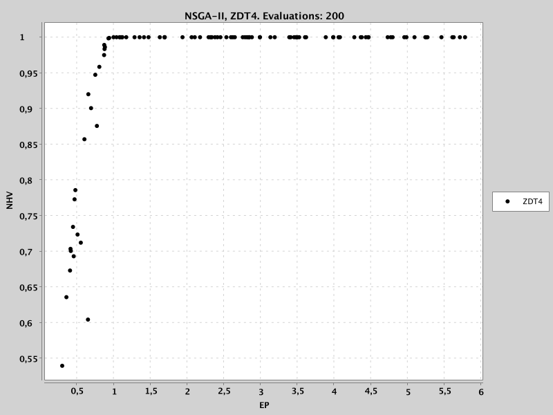
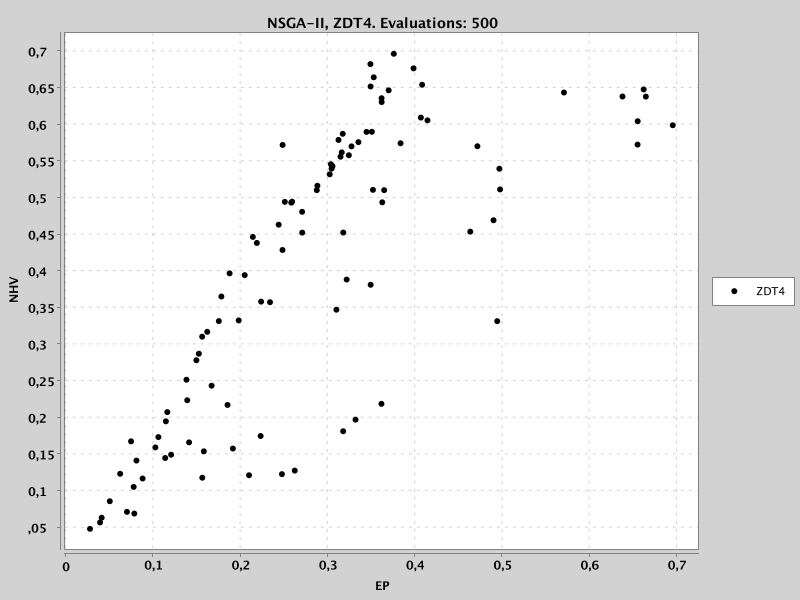
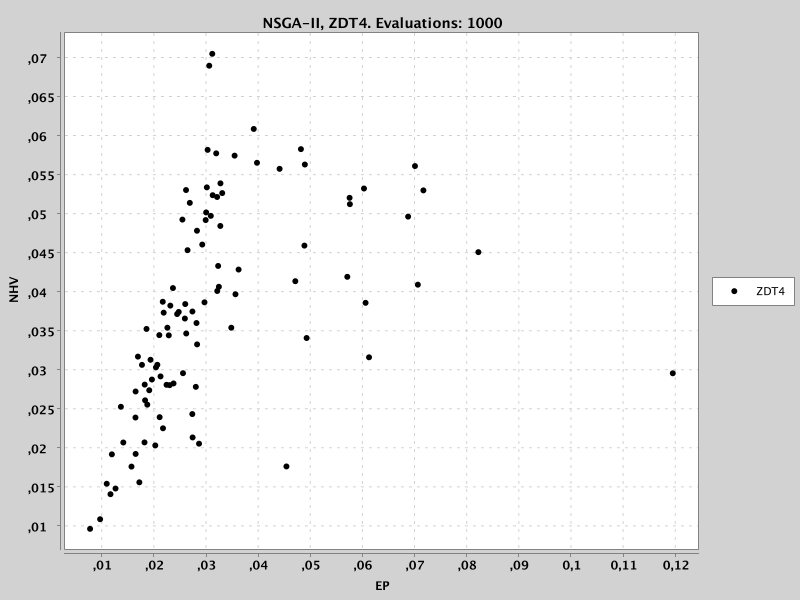
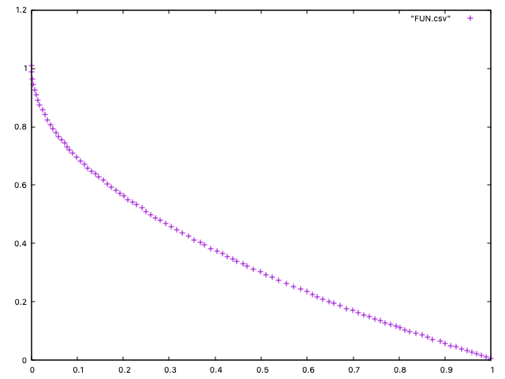

.. _getting_started:

Quick Start
===========

This guide will help you get started with Evolver by walking you through some simple examples.

The simplest way to use Evolver is to take a look to the examples included in the ``org.uma.evolver.algorithm.example`` package. This package contains two sub-packages:

- ``org.uma.evolver.algorithm.example.base``: Examples of base-level metaheuristics
- ``org.uma.evolver.algorithm.example.meta``: Examples of meta-optimization algorithms

Let us examine an example of each sub-package.

Base-level Metaheuristic Example: NSGA-II
-----------------------------------------
The `NSGAIIZDT4Example <https://github.com/jMetal/Evolver/blob/main/src/main/java/org/uma/evolver/example/base/NSGAIIZDT4Example.java>`_ class shows how to use the base-level NSGA-II algorithm to solve the ZDT4 problem. The contents of this class are as follows:

.. literalinclude:: ../src/main/java/org/uma/evolver/example/base/NSGAIIZDT4Example.java
   :language: java
   :linenos:
   :caption: NSGAIIZDT4Example.java
   :name: nsgaii-zdt4

If you run the class without arguments, the included parameter settings will be used. This configuration corresponds to a standard NSGA-II configuration commonly used in the literature. The resulting solutions and their corresponding function values will be stored in the ``VAR.csv`` and ``FUN.csv`` files in the current directory, respectively.

Alternatively, we can pass the configuration string in the command line. We have first to create a .jar file using Maven:

.. code-block:: bash

    mvn -DskipTests=true clean package

As a result, a file called ``Evolver-2.0.jar-with-dependencies.jar`` will be created in the ``target`` folder. We can run now the program using the following command:

.. code-block:: bash

    java -cp target/Evolver-2.0-SNAPSHOT.jar-with-dependencies.jar org.uma.evolver.example.base.NSGAIIZDT4Example --algorithmResult population --createInitialSolutions default --variation crossoverAndMutationVariation --offspringPopulationSize 100 --crossover SBX --crossoverProbability 0.9 --crossoverRepairStrategy bounds --sbxDistributionIndex 20.0 --mutation polynomial --mutationProbabilityFactor 1.0 --mutationRepairStrategy bounds --polynomialMutationDistributionIndex 20.0 --selection tournament --selectionTournamentSize 2

Meta-Optimization Example: NSGA-II Optimizing NSGA-II
-----------------------------------------------------
To illustrate a simple example of meta-optimization, let us consider the `NSGAIIOptimizingNSGAIIForProblemZDT4 <https://github.com/jMetal/Evolver/blob/main/src/main/java/org/uma/evolver/example/meta/NSGAIIOptimizingNSGAIIForProblemZDT4.java>`_ class. This class uses NSGA-II to optimize the parameters of NSGA-II for solving a training set composed only of the ZDT4 problem. We include the class next:

.. literalinclude:: ../src/main/java/org/uma/evolver/example/meta/NSGAIIOptimizingNSGAIIForProblemZDT4.java
   :language: java
   :linenos:
   :caption: NSGAIIOptimizingNSGAIIForProblemZDT4.java
   :name: nsgaii-optimizing-nsgaii

The NSGA-II used as meta-optimizer is obtained from a builder class ``MetaNSGAIIBuilder``, which by default creates a NSGA-II instance with a standard configuration with the SBX and polynomial mutation operators. Its population size is set to 100, the mutation probability factor is set to 1.5, and the stopping condition is set to 2000 function evaluations (meaning that 2000 configurations for the base-level NSGA-II will be generated).

The following screenshots show how the population of the meta-optimizer evolves over time (at 200, 500, and 1000 function evaluations):

   

We observe that after 300 function evaluations of the meta-optimizer, many solutions has a NHV equal to 1.0, meaning that corresponding configurations of these solutions lead the base-optimizer to obtain poor-quality fronts that are dominated by the reference point. At that stage, the meta-optimizer has found also solutions with NHV values lower than 1.0, existing only one non-dominated solution with NHV and EP values of 0,5304 and 0.305, respectively. When the meta-optimizer has generated 500 solutions we can see that the population is diverse, with again only a non-dominated solution (with NHV and EP values of 0,5304 and 0.305, respectively). After generating 1000 solutions the non-dominated solution of the population has NHV and EP values of 0.0096 and 0.0077, respectively; these values are rather low, suggesting that at this point the found configurations should be very accurate.

During the execution of the meta-optimizer, outfile files are written in the results directory. Among these we found:

- ``FUN.NSGA-II.ZDT4.EP.NHV.XX.csv``: contain the values of the EP and NHV indicators for the non-dominited solutions of the population of the optimizer after XX evaluations.
- ``VAR.NSGA-II.ZDT4.EP.NHV.XX.txt``: contain the configurations corresponding to the non-dominited solutions of the population of the optimizer after XX evaluations.

If we examine the contents of the file named ``VAR.NSGA-II.ZDT4.EP.NHV.1000.txt`` we found this configuration:

.. code-block:: bash

  --algorithmResult externalArchive --populationSizeWithArchive 89 --archiveType unboundedArchive --createInitialSolutions scatterSearch --offspringPopulationSize 20 --variation crossoverAndMutationVariation --crossover SBX --crossoverProbability 0.6885278888703463 --crossoverRepairStrategy bounds --sbxDistributionIndex 32.07999211591175 --blxAlphaCrossoverAlpha 0.640303817347435 --mutation linkedPolynomial --mutationProbabilityFactor 0.6952851214888922 --mutationRepairStrategy bounds --uniformMutationPerturbation 0.14262698171788724 --polynomialMutationDistributionIndex 18.40410700737766 --linkedPolynomialMutationDistributionIndex 17.696253388022207 --nonUniformMutationPerturbation 0.9843662953835077 --selection tournament --selectionTournamentSize 8 

If we configure the base-level NSGA-II to solve problem ZDT4 with these settings and run it, we get the following front:

This meta-optimization example can be easily extended to find, for instance, a configuration for the full ZDT benchmark. The only changes required are the following:

.. code-block:: java

    List<Problem<DoubleSolution>> trainingSet = List.of(new ZDT1(), new ZDT2(), new ZDT3(), new ZDT4(), new ZDT6());
    
    List<String> referenceFrontFileNames = List.of("resources/referenceFronts/ZDT1.csv", "resources/referenceFronts/ZDT2.csv", "resources/referenceFronts/ZDT3.csv", "resources/referenceFronts/ZDT4.csv", "resources/referenceFronts/ZDT6.csv");
    
    var maximumNumberOfEvaluations = List.of(12000, 12000, 12000, 12000, 12000);