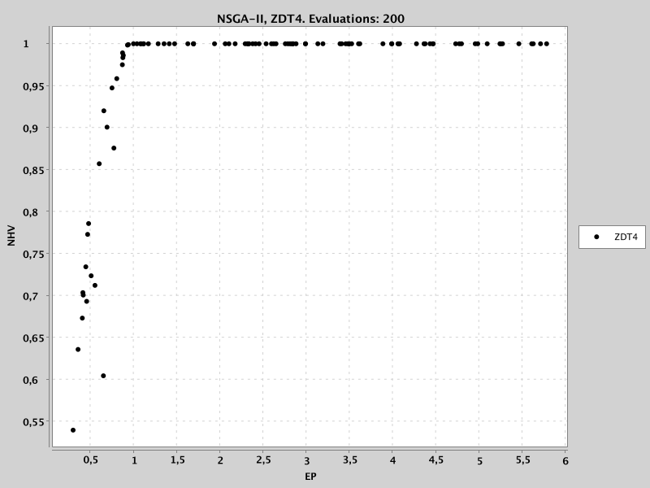
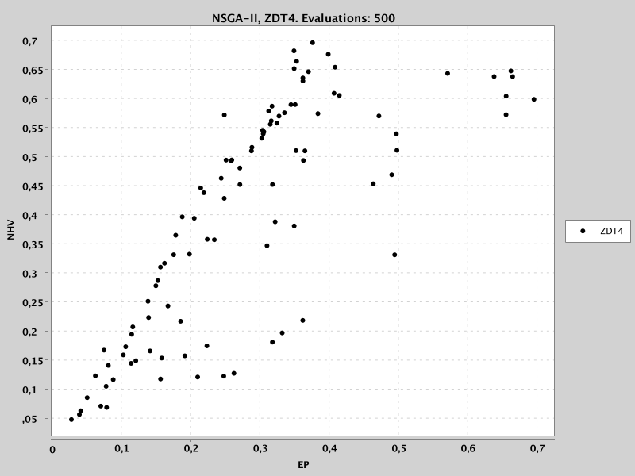
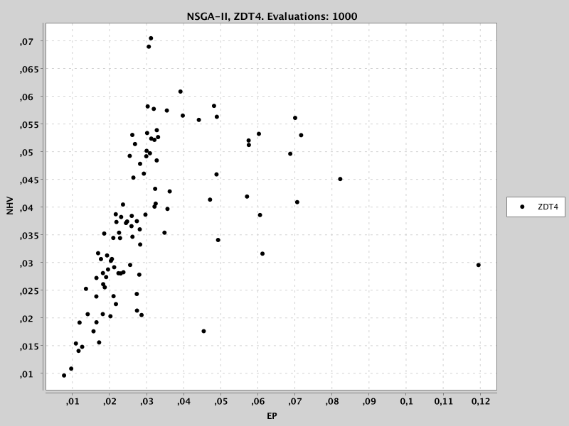
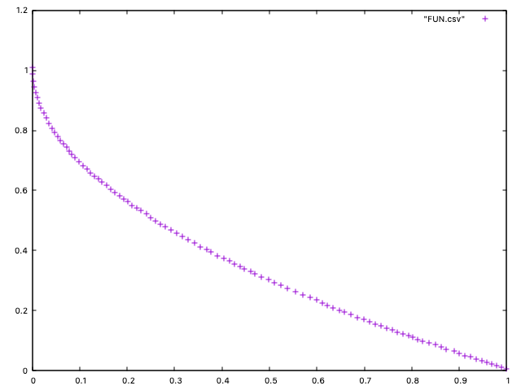

.. _getting_started:

Quick Start
===========

This guide will help you get started with Evolver by walking you through some simple examples.

The simplest way to use Evolver is to take a look at the examples included in the ``org.uma.evolver.example`` package. Two of its sub-packages match the two ways of using Evolver:

- ``org.uma.evolver.example.baselevel``: the configurable algorithms used on their own
- ``org.uma.evolver.example.training``: meta-optimization, i.e. finding configurations of those algorithms automatically

Let us examine an example of each.

Configurable Algorithm Example: NSGA-II
---------------------------------------
The `NSGAIIForZDT1Example <https://github.com/jMetal/Evolver/blob/main/src/main/java/org/uma/evolver/example/baselevel/standard/NSGAIIForZDT1Example.java>`_ class shows how to use the configurable NSGA-II to solve the ZDT1 problem. The contents of this class are as follows:

.. literalinclude:: ../src/main/java/org/uma/evolver/example/baselevel/standard/NSGAIIForZDT1Example.java
   :language: java
   :linenos:
   :caption: NSGAIIForZDT1Example.java
   :name: nsgaii-zdt1

The configuration string corresponds to a standard NSGA-II configuration commonly used in the literature. The resulting solutions and their corresponding function values are stored in the ``VAR.csv`` and ``FUN.csv`` files in the current directory, respectively.

Some examples, such as ``NSGAIIZDT4WithArchiveExample`` or ``AGEMOEAZDT4Example``, also accept the configuration string as command-line arguments, overriding the built-in one. We have first to create a .jar file using Maven:

.. code-block:: bash

    mvn -DskipTests=true clean package

As a result, a file called ``Evolver-<version>-jar-with-dependencies.jar`` will be created in the ``target`` folder. We can now run the program with a configuration of our own:

.. code-block:: bash

    java -cp target/Evolver-<version>-jar-with-dependencies.jar org.uma.evolver.example.baselevel.features.NSGAIIZDT4WithArchiveExample --algorithmResult population --createInitialSolutions default --variation crossoverAndMutationVariation --offspringPopulationSize 100 --crossover SBX --crossoverProbability 0.9 --crossoverRepairStrategy bounds --sbxDistributionIndex 20.0 --mutation polynomial --mutationProbabilityFactor 1.0 --mutationRepairStrategy bounds --polynomialMutationDistributionIndex 20.0 --selection tournament --selectionTournamentSize 2

Meta-Optimization Example: NSGA-II Optimizing NSGA-II
-----------------------------------------------------
To illustrate a simple example of meta-optimization, let us consider the `NSGAIIOptimizingNSGAIIForProblemZDT4 <https://github.com/jMetal/Evolver/blob/main/src/main/java/org/uma/evolver/example/training/zdt/NSGAIIOptimizingNSGAIIForProblemZDT4.java>`_ class. This class uses NSGA-II to optimize the parameters of NSGA-II for solving a training set composed only of the ZDT4 problem. We include the class next:

.. literalinclude:: ../src/main/java/org/uma/evolver/example/training/zdt/NSGAIIOptimizingNSGAIIForProblemZDT4.java
   :language: java
   :linenos:
   :caption: NSGAIIOptimizingNSGAIIForProblemZDT4.java
   :name: nsgaii-optimizing-nsgaii

The example describes the run in two YAML blocks: the base level (the algorithm to configure, its parameter space, the training set and the quality indicators used as objectives, here EP and NHV) and the meta-optimizer (NSGA-II with a population of 100, a mutation probability factor of 1.5 and a stopping condition of 2000 evaluations, meaning that 2000 configurations of the base-level NSGA-II will be generated). ``TrainingRunner`` then runs the meta-optimization. The same experiment can be run without writing Java code, from ``src/main/resources/cli/training/nsgaii-zdt4-request.yaml`` (see :doc:`utilities/cli_tools`).

The following screenshots show how the population of the meta-optimizer evolves over time (at 200, 500, and 1000 function evaluations):

   

We observe that after 300 function evaluations of the meta-optimizer, many solutions has a NHV equal to 1.0, meaning that corresponding configurations of these solutions lead the base-optimizer to obtain poor-quality fronts that are dominated by the reference point. At that stage, the meta-optimizer has found also solutions with NHV values lower than 1.0, existing only one non-dominated solution with NHV and EP values of 0,5304 and 0.305, respectively. When the meta-optimizer has generated 500 solutions we can see that the population is diverse, with again only a non-dominated solution (with NHV and EP values of 0,5304 and 0.305, respectively). After generating 1000 solutions the non-dominated solution of the population has NHV and EP values of 0.0096 and 0.0077, respectively; these values are rather low, suggesting that at this point the found configurations should be very accurate.

During the execution of the meta-optimizer, output files are written in the ``results/nsgaii/ZDT4`` directory:

- ``METADATA.txt``: the settings of the run (meta-optimizer, base-level algorithm, training set, indicators, …).
- ``INDICATORS.csv``: the indicator values (EP and NHV) of the configurations in the meta-optimizer population, per evaluation checkpoint.
- ``CONFIGURATIONS.csv``: the corresponding configurations, one parameter per column.
- ``VAR_CONF.txt``: the same configurations as configuration strings, together with their indicator values.
- ``status.yaml``: the progress of the run.

This is one of the configurations found after 1000 evaluations:

.. code-block:: bash

  --algorithmResult externalArchive --populationSizeWithArchive 89 --archiveType unboundedArchive --createInitialSolutions scatterSearch --offspringPopulationSize 20 --variation crossoverAndMutationVariation --crossover SBX --crossoverProbability 0.6885278888703463 --crossoverRepairStrategy bounds --sbxDistributionIndex 32.07999211591175 --blxAlphaCrossoverAlpha 0.640303817347435 --mutation linkedPolynomial --mutationProbabilityFactor 0.6952851214888922 --mutationRepairStrategy bounds --uniformMutationPerturbation 0.14262698171788724 --polynomialMutationDistributionIndex 18.40410700737766 --linkedPolynomialMutationDistributionIndex 17.696253388022207 --nonUniformMutationPerturbation 0.9843662953835077 --selection tournament --selectionTournamentSize 8 

If we configure the base-level NSGA-II to solve problem ZDT4 with these settings and run it, we get the following front:

This meta-optimization example can be easily extended to find, for instance, a configuration for the full ZDT benchmark. The only change required is the training set in the base-level YAML block:

.. code-block:: yaml

    trainingProblemNames: [ZDT1, ZDT2, ZDT3, ZDT4, ZDT6]
    trainingReferenceFrontFileNames:
      - resources/referenceFronts/ZDT1.csv
      - resources/referenceFronts/ZDT2.csv
      - resources/referenceFronts/ZDT3.csv
      - resources/referenceFronts/ZDT4.csv
      - resources/referenceFronts/ZDT6.csv
    trainingEvaluations: [12000, 12000, 12000, 12000, 12000]

The `NSGAIIOptimizingNSGAIIForBenchmarkZDT <https://github.com/jMetal/Evolver/blob/main/src/main/java/org/uma/evolver/example/training/zdt/NSGAIIOptimizingNSGAIIForBenchmarkZDT.java>`_ class follows this approach, with a budget of 10000 evaluations per problem.
