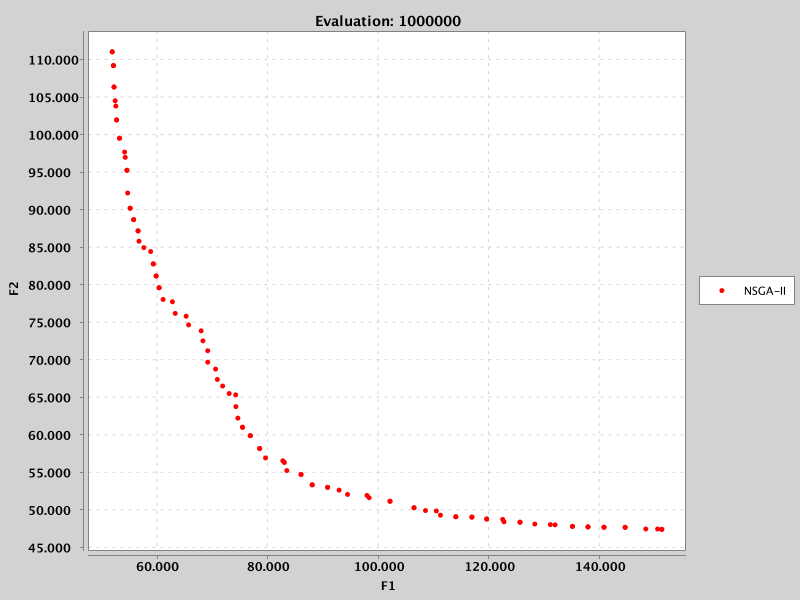
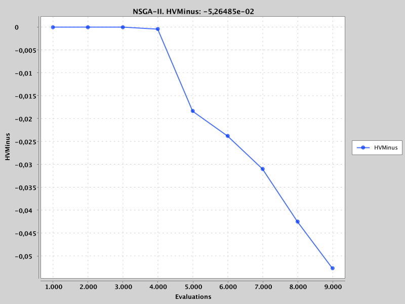
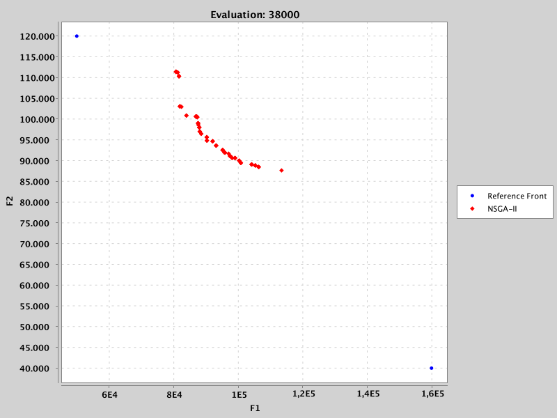

.. _reference_fronts:

Reference Fronts  
================
Evolver uses quality indicators to evaluate the performance of the configurations of base-level metaheuristics. If the base-level problems (training set) is composed of benchmark problems (e.g., ZDT, DTLZ, etc.), the reference fronts are usually available. The files containing the reference fronts of the included benchmark problems in jMetal are located in the ``resources/referenceFronts`` folder of the Evolver project. However, when dealing with real-world problems, the reference fronts are  usually unknown. In this section, we explain how we can deal with this issue by using the multi-objective traveling salesman problem as an example.

Finding Reference Fronts
------------------------
A way to find a reference Pareto front of a problem is to make a large number of runs of a number of multi-objective metaheuristics to solve it, merge the resulting fronts and get the non-dominated solutions, but this process can be very time consuming and we do not have any guarantee that the resulting front will be a good reference front. 

An alternative is to search for an approximated reference point that can be used to apply the HV minus (HV-) quality indicator. Let us suppose that we are interested in finding a configuration of NSGA-II for solving instances of the multi-objective TSP problem. Concretely, we take as base-level problem the ``KroAB100TSP`` instances, which is a bi-objective TSP problem with 100 cities where the objectives are to find the minimal tours for the ``KroA100TSP`` and ``KroB100TSP`` instances. Assuming that we don't know the reference front of the problem, we can try to optimize with NSGA-II during a 1,000,000 of evaluations. To do that, we can use the `NSGAIIBiObjectiveTSP <https://github.com/jMetal/Evolver/blob/main/src/main/java/org/uma/evolver/example/base/NSGAIIBiObjectiveTSP.java>`_ class. After running it once, this is the front we have obtained:

The resulting front has the following extreme points: [151374, 47399] and [51932, 111026]. Then, we can adopt a conservative approach and define a reference front with, for instance, the points [160000, 40000] and [50000, 120000]. We must note here that jMetal does not allow to have a reference front with only the reference point: we must indicate at least two points whose extreme values will be used to get the reference point. Of course we are aware that this reference front may probably be far from the unknown true Pareto front, but it can be used to compute HV values of the configurations found by the meta-optimizer. 

Validating the Reference Front
------------------------------

Once we have the reference front for the ``KroAB100TSP`` problem, we can validate it by running the `NSGAIIBiObjectiveWithObserversTSP <https://github.com/jMetal/Evolver/blob/main/src/main/java/org/uma/evolver/example/base/NSGAIIBiObjectiveWithObserversTSP.java>`_ class, which is similar to the `NSGAIIBiObjectiveTSP <https://github.com/jMetal/Evolver/blob/main/src/main/java/org/uma/evolver/example/base/NSGAIIBiObjectiveTSP.java>`_ class but with additional observers that show the values of the EP and HV- quality indicators. 

We include below the screen captures of the evolution of the HV- values as well as the front of solution after 38000 funcion evaluations of NSGA-II:

We observe that the HV- values are 0.0 for the fronts obtained before 4000 function evaluations, but after that it starts to decrease, meaning that the evaluated fronts have some solutions that dominate the reference point. This fact is illustrated in the second figure, were we plot the two extreme points previously defined.

Chosing the Objective Functions
-------------------------------
The approach presented in this section to define reference fronts does not allow to use most of quality indicators that measure converge and/or diversity (e.g., IGD, IGD+, etc.). Let us remind that, instead of the HV, we can use the HV-, as the indicators as objective functions have to be minimized.

However, using only the HV- as unique objective function is undesired, as at the begining of the optimization process, the first generated fronts usually have a poor quality and are not able to dominate the reference point, so the HV- values are 0.0. This means that there is a plateau in the search space and the meta-optimizer may get stuck there. To avoid this issue, we can use the EP as a secondary objective function. The idea is that the EP acts as a helper objective function to guide the search towards the Pareto front until some solution have negative HV- values.

We include an example in class `NSGAIIOptimizingNSGAIIForBiObjetiveTSP <https://github.com/jMetal/Evolver/blob/main/src/main/java/org/uma/evolver/example/meta/NSGAIIOptimizingNSGAIIForBiObjetiveTSP.java>`_
