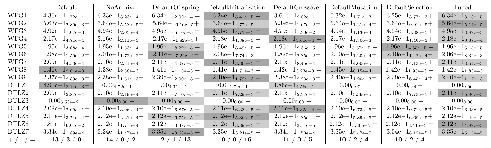
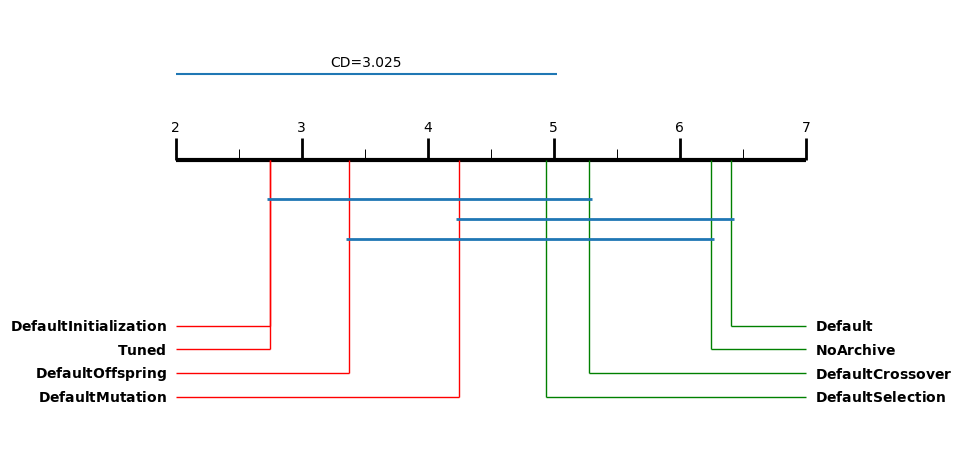

.. _tutorial_ablation:

E12. Ablation: Which Components Matter
======================================

:Level: Advanced
:Version: 1.0 (2026-10-06)
:Time: about 30 minutes, plus the ablation study (about 17 minutes)
:Timings measured on: Apple M5 Pro (18 cores, 16 of them used by the study), 64 GB of RAM,
   macOS 26.6.2, Java 21.0.12 (Oracle JDK), Python 3.11, SAES 1.5.0
:Prerequisites: :doc:`E8. Validating a configuration <validating_a_configuration>`

A training gives a configuration that is better than the default one, and that differs from it in
many parameters at once. The configuration of NSGA-II that tutorial E8 found for the bi-objective
WFG problems has an external archive, five offspring per generation instead of a hundred, another
initialization, another crossover, another mutation and a larger tournament. Which of those changes
explain the improvement? Answering it is an **ablation study**: take the tuned configuration, set
some of its components back to their default values, one at a time, and see how much each variant
loses. Ablation studies are common in papers that present a tuned or a new algorithm, since they
justify each part of it.

This tutorial makes the ablation of the configuration of E8, with the validation protocol of E8.
The code is the class
`AblationTutorial <https://github.com/jMetal/Evolver/blob/develop/src/main/java/org/uma/evolver/example/tutorial/AblationTutorial.java>`_
(package ``org.uma.evolver.example.tutorial``).

Step 1: choosing the components
-------------------------------

The two configurations, the default one and the tuned one, differ in these components:

.. list-table::
   :header-rows: 1
   :widths: 22 34 44

   * - Component
     - Default (``NSGAIIDoubleDefault.txt``)
     - Tuned (``NSGAIIWFG2D.txt``)
   * - Result
     - the population
     - an external archive (crowding distance), with a population of 197 during the search
   * - Offspring per generation
     - 100
     - 5
   * - Initialization
     - random
     - Latin hypercube sampling
   * - Crossover
     - SBX, probability 0.9
     - BLX-αβ, probability 0.88
   * - Mutation
     - polynomial, probability factor 1.0
     - Lévy flight, probability factor 0.21, ``round`` repair
   * - Selection
     - binary tournament
     - tournament of 8

The study has a variant for each component: the tuned configuration with that component set back
to the default. The researcher chooses the components and how to group the parameters into them,
and that is a decision to explain in a paper. Here the probability of the crossover goes with the
crossover, and the probability factor and the repair strategy of the mutation go with the
mutation:

.. literalinclude:: ../../src/main/java/org/uma/evolver/example/tutorial/AblationTutorial.java
   :language: java
   :start-after: // [step-1-start]
   :end-before: // [step-1-end]
   :dedent: 2

Step 2: deriving the variants
-----------------------------

Setting a component back is not a matter of replacing a word in the configuration. The crossover of
the tuned configuration, BLX-αβ, has two parameters of its own (``blxAlphaBetaCrossoverAlpha`` and
``blxAlphaBetaCrossoverBeta``); SBX has another one (``sbxDistributionIndex``). The variant must drop
the first two and add the third, or NSGA-II rejects the configuration. Without the archive,
``populationSizeWithArchive`` and ``archiveType`` disappear.

``ConfigurationVariants.derive`` does it from the parameter space: it takes a configuration, the
parameters to fix with their values, and a *fallback* configuration, and returns the configuration
whose parameters are exactly the active ones, taking each value from the changes, then from the
configuration, then from the fallback (for the parameters that the change activates):

.. literalinclude:: ../../src/main/java/org/uma/evolver/example/tutorial/AblationTutorial.java
   :language: java
   :start-after: // [step-2-start]
   :end-before: // [step-2-end]
   :dedent: 4

The variant without the default crossover, for instance, keeps everything of the tuned configuration
except:

.. code-block:: none

    --crossover SBX --crossoverProbability 0.9 --crossoverRepairStrategy bounds --sbxDistributionIndex 20.0

It also checks that the result is valid: a parameter that is not in the space, a value out of its
range, a parameter fixed but not active (``sbxDistributionIndex`` when the crossover is not SBX) or
an activated parameter with no value anywhere is an error that names the parameter.

One component is not as clean as it looks: **without the archive**, NSGA-II returns its population,
whose size is the one given to the constructor (100), so the variant also changes the size of the
population during the search, from 197 to 100. Taking away the archive takes away both, and the
result has to be read that way.

Step 3: running the study
-------------------------

The eight configurations (the default, the six variants and the tuned one) run on the problems of
E8: WFG1-9, seen during the training, and DTLZ1-7, not seen, all with two objectives, with 25000
evaluations and 25 independent runs, and the hypervolume and IGD+ as indicators. The study is the
validation of E8 with more configurations:

.. literalinclude:: ../../src/main/java/org/uma/evolver/example/tutorial/AblationTutorial.java
   :language: java
   :start-after: // [step-3-start]
   :end-before: // [step-3-end]
   :dedent: 4

The study took 17 minutes on 16 cores (3200 runs).

Step 4: what each component contributes
---------------------------------------

The Wilcoxon pivot table of E8, with the tuned configuration as the pivot, gives for each variant
whether the tuned configuration is significantly better (``+``), worse (``-``) or not different
(``=``) on each problem:

.. code-block:: bash

    python scripts/wilcoxon_pivot_tables.py results/tutorial-ablation/ablation/QualityIndicatorSummary.csv \
        --pivot Tuned \
        --order Default,NoArchive,DefaultOffspring,DefaultInitialization,DefaultCrossover,DefaultMutation,DefaultSelection,Tuned \
        --output-dir results/tutorial-ablation/tables --png

   Hypervolume: median and IQR of 25 runs. The last row counts, for each variant, the problems where
   the tuned configuration is better, worse or not different.

The last row is the ablation in a line (the table of IGD+ gives similar counts):

.. list-table::
   :header-rows: 1
   :widths: 28 18 54

   * - Variant
     - ``+ / - / =``
     - Reading
   * - ``Default``
     - 13 / 3 / 0
     - the improvement of the training
   * - ``NoArchive``
     - 14 / 0 / 2
     - the archive matters almost everywhere
   * - ``DefaultCrossover``
     - 11 / 0 / 5
     - the crossover matters on most problems
   * - ``DefaultMutation``, ``DefaultSelection``
     - 10 / 2 / 4
     - both matter on most problems, with a few losses
   * - ``DefaultOffspring``
     - 2 / 1 / 13
     - five offspring or a hundred make almost no difference
   * - ``DefaultInitialization``
     - 0 / 0 / 16
     - the initialization makes no difference at all

**Significant is not the same as large.** With 25 runs, very small differences are significant. The
loss of each variant, as a percentage of the median hypervolume of the tuned configuration, tells
how much each component contributes. On the 14 problems that the tuned configuration solves (on
DTLZ1 and DTLZ3 its hypervolume is 0, see below):

.. list-table::
   :header-rows: 1
   :widths: 30 25 45

   * - Variant
     - Median loss of HV
     - Problems where it loses more than 1 %
   * - ``Default``
     - 0.68 %
     - 4 (31 % on WFG1, 15 % on DTLZ6)
   * - ``NoArchive``
     - 0.36 %
     - 2 (WFG6 and WFG8, about 2.5 %)
   * - ``DefaultCrossover``
     - 0.10 %
     - 4 (43 % on WFG1, 12 % on WFG6, 4.5 % on WFG2, 3.2 % on WFG3)
   * - ``DefaultSelection``
     - 0.07 %
     - 1 (WFG1, 1.5 %)
   * - ``DefaultMutation``
     - 0.06 %
     - 0
   * - ``DefaultOffspring``, ``DefaultInitialization``
     - 0.00 %
     - 0

The two views together are the answer of the ablation:

- **The crossover explains most of the improvement**, where there is a large one. On WFG1, the
  problem where the training gains the most (31 % over the default), going back to SBX loses 43 %.
  BLX-αβ is the key change, and the training found it.
- **The archive is a small, consistent gain**: significant on 14 of 16 problems, but only 0.36 % on
  the median problem. Remember that the variant also changes the size of the population (Step 2).
- **The mutation and the selection are fine tuning**: significant on most problems, with losses below
  0.5 % except on WFG1 for the selection.
- **The offspring size and the initialization do not matter here.** The training changed them, but
  any value would have done: they are the parameters a meta-optimizer leaves wherever its search
  happened to put them.

**Over all the problems.** The critical difference plot of E8 ranks the eight configurations by their
average rank on the 16 problems:

.. code-block:: bash

    python scripts/critical_difference_plots.py results/tutorial-ablation/ablation/QualityIndicatorSummary.csv \
        --indicators HV --output-dir results/tutorial-ablation/tables

   Average ranks by hypervolume over the 16 problems (lower is better), and the critical difference
   of the Nemenyi test. Configurations joined by a bar are not significantly different.

With eight configurations and 16 problems the critical difference is large (3.0), so only the default
configuration and the variant without the archive are significantly worse than the tuned one. The
per-problem tests above are more sensitive; the plot is the cautious summary.

Step 5: interactions
--------------------

Two results show that the components do not act independently:

- On **WFG1**, the variant with the default crossover is **worse than the whole default
  configuration** (HV 0.361 against 0.436). SBX works well with the rest of the default
  configuration, and badly with the rest of the tuned one: the effect of a component depends on the
  others.
- On **DTLZ1 and DTLZ3** every variant of the tuned configuration fails (hypervolume 0, as in E8),
  except the one with the default crossover, which gets a median hypervolume of 0.386 on DTLZ1. The
  crossover found by the training on WFG is also the main reason why the tuned configuration fails
  on these two multimodal problems, which were not in the training set.

This is the limit of an ablation that sets one component back at a time: it measures the
contribution of each component *given the others*, and the contributions do not add up. Removing
two components at once, or the systematic **path ablation** of Fawcett and Hoos (*Analysing
differences between algorithm configurations through ablation*, J. Heuristics, 2016), which builds a
path from the default to the tuned configuration changing one parameter at a time and choosing at each
step the change that helps the most, go further. They are not part of this tutorial.

What to report
--------------

An ablation study in a paper should state:

- which components were ablated and why, and how the parameters were grouped into them;
- what a component was set back to (the default configuration, here);
- the protocol: problems, budget, runs, indicators, the tests, and a measure of the size of the
  differences, not only their significance;
- the components whose removal does not matter, which are as informative as the others.

Run it yourself
---------------

Run ``AblationTutorial`` from your IDE, or from the root of the Evolver repository, and then the
scripts of Step 4:

.. code-block:: bash

    java -cp target/Evolver-<version>-jar-with-dependencies.jar \
        org.uma.evolver.example.tutorial.AblationTutorial

Set ``NUMBER_OF_CORES`` in the class to what your machine has.

Try it yourself
---------------

- Group the parameters in another way: the mutation operator alone, without its probability
  factor. Does the conclusion about the mutation change?
- Remove two components at once (for instance the archive and the offspring size). Is the loss the
  sum of the two losses of the study?
- Make the reverse study: the default configuration with **one** component of the tuned one (only the
  archive, only five offspring). Which component improves the default the most on its own?
- Ablate the configuration that you found in E8, if you trained one.

What's next
-----------

- :doc:`E8 <validating_a_configuration>` explains the statistical tests used here.
- :doc:`E5 <designing_parameter_spaces>` uses what an ablation reveals to design a space: a
  component that never matters can be fixed, and one that matters can be given more options.
- The algorithm guides (:ref:`algorithm_guides`) describe each component of each algorithm.
