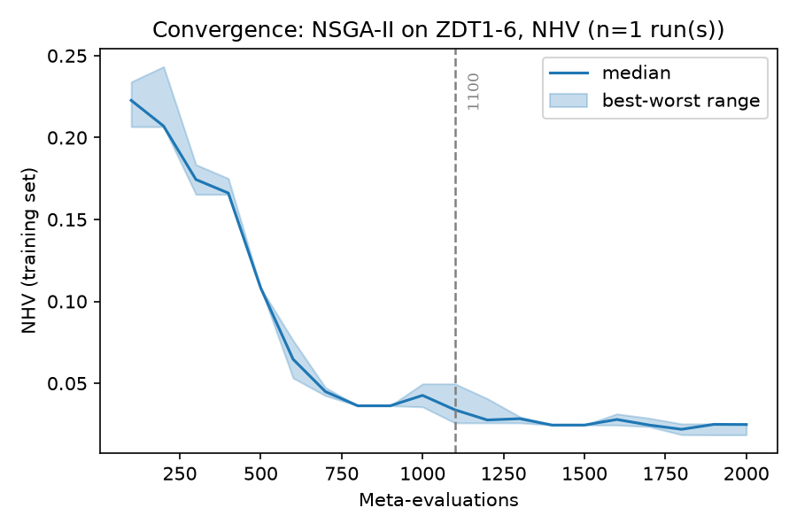
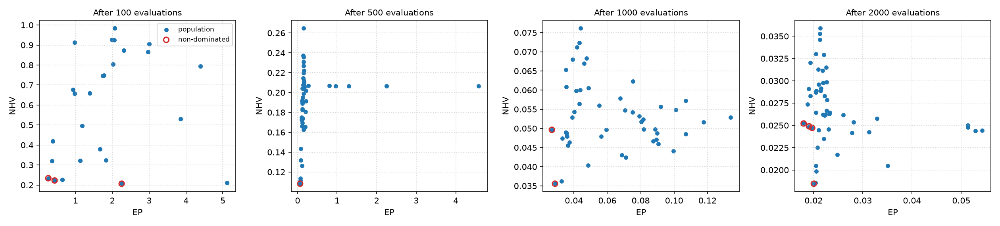
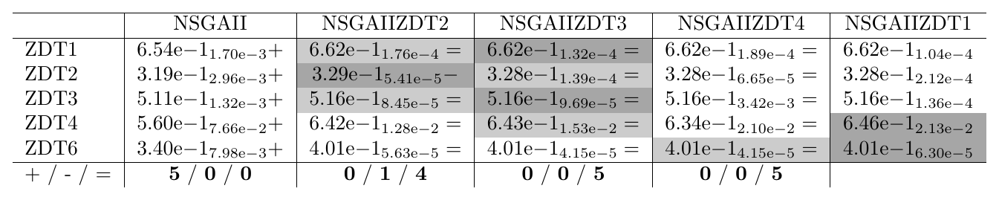
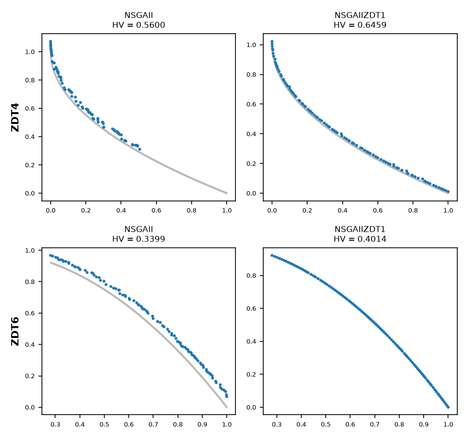

.. _tutorial_analyzing_training_results:

E8. Analyzing Training Results
==============================

:Level: Intermediate
:Version: 1.0 (2026-10-03)
:Time: about 2 hours, of which the training takes about 85 minutes and the validation about 2
:Timings measured on: Apple M5 Pro (18 cores, 16 of them used by the training and the validation),
   64 GB of RAM, macOS 26.6.2, Java 21.0.12 (Oracle JDK)
:Prerequisites: :doc:`E3. Meta-optimization workflow <meta_optimization_workflow>`,
   :doc:`E7. Training sets, indicators and budgets <training_sets_indicators_budgets>`

A training run ends with a set of files and a front of configurations. This tutorial shows how to
read those files to understand how the search went, how to choose a configuration from the front,
and how to check the choice with a validation. It also shows why the values of the configurations
must be reliable before choosing among them.

The example is simpler than the one of tutorial E7: NSGA-II is tuned for the bi-objective ZDT
problems, and each configuration is run five times on each problem, so that its indicator values
are medians of five runs instead of the values of a single run.

The code of this tutorial is the class
`TrainingAnalysisTutorial <https://github.com/jMetal/Evolver/blob/develop/src/main/java/org/uma/evolver/example/tutorial/TrainingAnalysisTutorial.java>`_,
in package ``org.uma.evolver.example.tutorial``.

The training run
----------------

The training is run from the command line with a bundled request:

.. literalinclude:: ../../src/main/resources/cli/training/tutorial-e8-request.yaml
   :language: yaml
   :caption: tutorial-e8-request.yaml

.. literalinclude:: ../../src/main/resources/baseLevelConfigurations/TutorialZdtBaseLevel.yaml
   :language: yaml
   :caption: TutorialZdtBaseLevel.yaml

NSGA-II is tuned for ZDT1, ZDT2, ZDT3, ZDT4 and ZDT6 with 8000 evaluations per run, and each
configuration is run five times on each problem (``numberOfIndependentRuns: 5``). The
meta-optimizer is the asynchronous NSGA-II of tutorial E7, with 2000 configurations and 16 cores
(``TutorialAsyncNSGAIIMetaSearch.yaml``). ``writePopulation: true`` also writes the whole population
of the meta-optimizer at every checkpoint. From the root of the repository:

.. code-block:: bash

    mvn -DskipTests package
    mkdir -p results/tutorial-e8
    cp src/main/resources/cli/training/tutorial-e8-request.yaml results/tutorial-e8/request.yaml
    java -cp target/Evolver-<version>-jar-with-dependencies.jar \
        org.uma.evolver.cli.training.TrainingRunnerMain results/tutorial-e8/request.yaml

It took about 85 minutes: five runs per problem make each evaluation five times more expensive, and
configurations that generate few offspring per generation, like the one finally chosen, are slower
than the default one.

The meta-optimizer runs its evaluations in parallel, so a training run cannot be reproduced exactly:
if you repeat it, the files, the front of the meta-optimizer and the configurations chosen will
differ from the ones shown here, although the analysis is the same.

The output files
----------------

The output directory, ``results/tutorial-e8/training``, holds:

.. list-table::
   :header-rows: 1
   :widths: 32 68

   * - File
     - Contents
   * - ``METADATA.txt``
     - The settings of the run: meta-optimizer, base level, training set and indicators.
   * - ``INDICATORS.csv``
     - The indicator values (EP and NHV) of the **non-dominated** configurations of the
       meta-optimizer's population, every 100 evaluations.
   * - ``CONFIGURATIONS.csv``
     - The same configurations, one parameter per column (``NaN`` for the parameters that are not
       active).
   * - ``VAR_CONF.txt``
     - The same configurations as configuration strings, with their indicator values. Each
       checkpoint starts with two lines, ``# Evaluation: <meta-evaluations>`` and
       ``# Time (min): <minutes>``, the computing time of the meta-optimizer at that checkpoint.
   * - ``POPULATION_INDICATORS.csv``, ``POPULATION_CONFIGURATIONS.csv``
     - The same as ``INDICATORS.csv`` and ``CONFIGURATIONS.csv`` for the **whole population**
       (only with ``writePopulation: true``).

The CSV files have one row per configuration and checkpoint, with the number of evaluations of the
meta-optimizer in the first column:

.. code-block:: none

    Evaluation,SolutionId,EP,NHV
    100,0,0.2593600107289191,0.23396709708932803
    100,1,2.2521376942556213,0.20660212064538036

Did the training converge?
--------------------------

``scripts/plot_training_convergence.py`` draws the median and the range of the NHV of the
configurations on the meta-optimizer's front at each checkpoint:

.. code-block:: bash

    python scripts/plot_training_convergence.py results/tutorial-e8/training --primary NHV \
        --label "NSGA-II on ZDT1-6"

NHV drops quickly during the first 800 meta-evaluations, from 0.22 to 0.04, and then improves
slowly: 95% of the improvement is reached at meta-evaluation 1100, and the last 900 meta-evaluations
refine configurations that are already good. A budget of about 1200 configurations would have been
enough for this training set; a curve that is still falling at the end would call for a larger
budget. The median can go up for a while (around meta-evaluation 1000 and at the end): the front
changes as new configurations join it and others leave it.

The population of the meta-optimizer
------------------------------------

The front only shows the best configurations. The population files show the whole population of the
meta-optimizer, and ``scripts/plot_meta_population.py`` plots it in the EP-NHV space at several
checkpoints, with its non-dominated configurations circled:

.. code-block:: bash

    python scripts/plot_meta_population.py results/tutorial-e8/training \
        --evaluations 100,500,1000,2000 --output meta-population.png

Each panel has its own axes. After 100 evaluations, the configurations are spread over NHV values
from 0.2 to 1, and EP values up to 5. After 500, most of them have an EP below 0.3, but NHV still
ranges from 0.1 to 0.27. After 1000 and 2000, the whole population has converged to NHV values
between 0.035 and 0.08, and then between 0.018 and 0.036: the meta-optimizer is refining a family of
similar configurations, and more meta-evaluations would bring little.

Choosing a configuration
------------------------

The final front of this run has four configurations:

.. code-block:: none

    NSGAIIZDT1: NHV = 0.0185, EP = 0.0200
    NSGAIIZDT2: NHV = 0.0247, EP = 0.0197
    NSGAIIZDT3: NHV = 0.0249, EP = 0.0191
    NSGAIIZDT4: NHV = 0.0252, EP = 0.0180

They are a trade-off between the two meta-objectives: the lower the NHV, the higher the EP. The
usual criteria to choose one are:

- the **lowest value of the main objective**, NHV, as in tutorials E3, E4 and E7;
- a **knee point**, where improving one objective starts to cost much in the other; here the front
  is very flat in EP (0.018 to 0.020), so NHV decides;
- a **preference** for one indicator, for instance EP when the worst case over the front matters
  more than its coverage.

Here the four configurations share the same structure: an external crowding-distance archive (an
unbounded one in one of them), one offspring per generation (a steady-state NSGA-II), SBX crossover
with a very high distribution index and Lévy flight mutation. They differ in the values of their
numerical parameters. The class orders them by NHV, and the first one is the chosen configuration:

.. literalinclude:: ../../src/main/java/org/uma/evolver/example/tutorial/TrainingAnalysisTutorial.java
   :language: java
   :start-after: // [step-1-start]
   :end-before: // [step-1-end]
   :dedent: 4

Reliable values: independent runs
~~~~~~~~~~~~~~~~~~~~~~~~~~~~~~~~~

Choosing by the values of the front only makes sense if those values are reliable. With a single
run per configuration (``numberOfIndependentRuns: 1``), the value of a configuration can be a lucky
one. In a training like the one of tutorial E7, with one run per configuration, the front ended with
a single configuration whose NHV was 0.176; evaluated again with five runs per problem, its NHV was
0.213, the same as the rest of the population. That configuration stayed alone on the front from
meta-evaluation 800 to the end, and the convergence plot showed a flat line that looked like
convergence but was an outlier that no other configuration could beat.

Running each configuration several times and taking the median makes the values of the front
reliable, at a proportional cost: here, five runs made the training about five times longer.

Validating the candidates
-------------------------

The validation checks the choice: it runs every configuration of the final front, and the standard
NSGA-II, on the same problems with a larger budget, 15000 evaluations, 15 times each:

.. literalinclude:: ../../src/main/java/org/uma/evolver/example/tutorial/TrainingAnalysisTutorial.java
   :language: java
   :start-after: // [step-2-start]
   :end-before: // [step-2-end]
   :dedent: 4

From the root of the repository:

.. code-block:: bash

    java -cp target/Evolver-<version>-jar-with-dependencies.jar \
        org.uma.evolver.example.tutorial.TrainingAnalysisTutorial
    python scripts/wilcoxon_pivot_tables.py \
        results/tutorial-e8/validation/QualityIndicatorSummary.csv \
        --pivot NSGAIIZDT1 --order NSGAII,NSGAIIZDT2,NSGAIIZDT3,NSGAIIZDT4,NSGAIIZDT1 \
        --indicators HV,IGD+ --output-dir results/tutorial-e8/tables --png

The validation took about 90 seconds. As in tutorial E7, the Wilcoxon pivot table has the chosen
configuration (``NSGAIIZDT1``) in the last column, and marks every other cell with ``+`` if the
chosen one is significantly better, ``-`` if it is worse and ``=`` if the difference is not
significant:

   Hypervolume (HV, higher is better), 15000 evaluations, 15 runs.

- **The chosen configuration is significantly better than the standard NSGA-II on the five
  problems.**
- **The four candidates are equivalent**: the only significant difference among them is on ZDT2,
  where ``NSGAIIZDT2`` is slightly better. With reliable training values, any configuration of the
  front would have been a good choice.

The fronts with the median HV show where the improvement is. On ZDT1, ZDT2 and ZDT3 both
configurations reach the front, and the tuned one only spreads its solutions more evenly. On ZDT4,
a problem with many local fronts, and ZDT6, with a biased search space, the difference is clear:

.. code-block:: bash

    python scripts/plot_median_fronts.py results/tutorial-e8/validation \
        --problems ZDT4,ZDT6 --algorithms NSGAII,NSGAIIZDT1 \
        --reference-fronts resources/referenceFronts --output median-fronts.png

   Fronts with the median HV of the standard NSGA-II and the chosen configuration on ZDT4 and ZDT6
   (15000 evaluations), over the reference front (in gray).

The standard NSGA-II does not reach the reference front of either problem, and on ZDT4 it only
covers its left half. The tuned configuration reaches both fronts and covers them completely.

Try it yourself
---------------

- Train with ``numberOfIndependentRuns: 1``: how many configurations does the final front have, and
  how do their training values compare with those of the validation?
- Validate the candidates with 8000 evaluations, the training budget: are the differences with the
  standard NSGA-II larger or smaller than with 15000?
- Plot the population at other checkpoints (``--evaluations``), or plot IGD+ instead of NHV
  (``--y``) if you train with IGD+ as a meta-objective.

What's next
-----------

- Tutorial E9 covers the design and the statistical analysis of validation studies.
- :doc:`../utilities/cli_tools` describes the request files and the output files of a training run.
