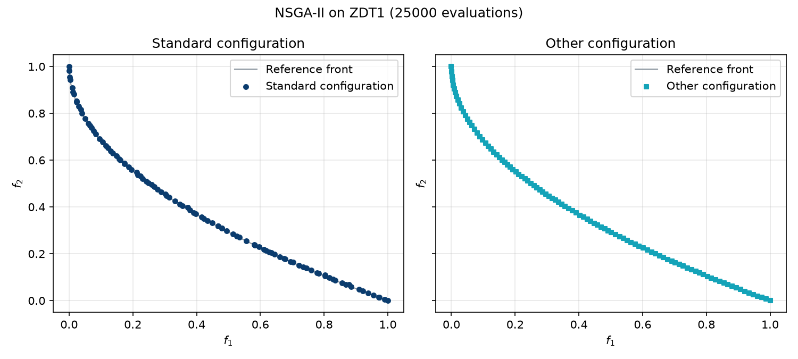

.. _tutorial_base_level_algorithms:

E2. Base-Level Algorithms
=========================

:Level: Introductory
:Version: 1.1 (2026-09-25)
:Time: about 25 minutes (running the tutorial class takes a few seconds)
:Timings measured on: Apple M5 Pro (18 cores), 64 GB of RAM, macOS 26.6.2, Java 21.0.12 (Oracle JDK)
:Prerequisites: :doc:`E1. Parameter spaces <parameter_spaces>`

Evolver's algorithms are **configurable**: instead of being written with a fixed crossover,
mutation or archive, they assemble those components from a configuration chosen in their parameter
space. This tutorial shows how to configure and run them, which is also how Evolver can be used on
its own, without meta-optimization, as an alternative to jMetal. You will:

- configure NSGA-II with a configuration string and run it on a continuous problem;
- read its results: the solutions found, the ``VAR``/``FUN`` files and two quality indicators;
- run it with a different configuration, with one read from a file, and on another problem;
- run NSGA-II on a binary problem.

The code of this tutorial is the class
`BaseLevelAlgorithmsTutorial <https://github.com/jMetal/Evolver/blob/develop/src/main/java/org/uma/evolver/example/tutorial/BaseLevelAlgorithmsTutorial.java>`_,
in package ``org.uma.evolver.example.tutorial``.

What is a base-level algorithm?
-------------------------------

The name comes from meta-optimization: the *base-level* algorithm is the one being configured, and
the *meta-level* algorithm is the one searching for its best configuration. On its own, a
base-level algorithm is simply a configurable multi-objective algorithm.

All of them implement the interface ``BaseLevelAlgorithm`` (package ``org.uma.evolver.algorithm``),
which has four methods:

.. list-table::
   :header-rows: 1
   :widths: 30 70

   * - Method
     - What it does
   * - ``parameterSpace()``
     - Returns the algorithm's parameter space.
   * - ``parse(String[] configuration)``
     - Fixes a configuration: sets the value of every active parameter (tutorial E1, step 4).
   * - ``build()``
     - Assembles the configured algorithm and returns it as a jMetal ``Algorithm``, ready to run.
   * - ``createInstance(problem, maximumNumberOfEvaluations)``
     - Returns a new, not yet configured copy of the algorithm for another problem or budget.

Algorithms and encodings
~~~~~~~~~~~~~~~~~~~~~~~~

Each algorithm has one class per encoding, named ``<Encoding><Algorithm>`` (``DoubleNSGAII``,
``BinaryNSGAII``, ``PermutationNSGAII``), and one parameter space per encoding, named
``<Algorithm><Encoding>.yaml``, loaded with the parameter factory of the encoding
(``DoubleParameterFactory``, ``BinaryParameterFactory``, ``PermutationParameterFactory``):

.. list-table::
   :header-rows: 1
   :widths: 20 15 15 15 35

   * - Algorithm
     - Double
     - Binary
     - Permutation
     - Extra constructor arguments
   * - NSGA-II
     - ✓
     - ✓
     - ✓
     -
   * - NSGA-III
     - ✓
     -
     -
     - optionally, the reference vectors (generated by default)
   * - MOEA/D
     - ✓
     - ✓
     - ✓
     - the reference vectors, as the directory of the weight vector files
   * - SMS-EMOA
     - ✓
     - ✓
     - ✓
     -
   * - MOPSO
     - ✓
     -
     -
     - the size of the leader archive (instead of the population size)
   * - RDEMOEA
     - ✓
     -
     - ✓
     -
   * - RVEA
     - ✓
     -
     -
     - the reference vectors
   * - AGE-MOEA
     - ✓
     -
     -
     -
   * - SSMOEA
     - ✓
     -
     -
     -
   * - PAES
     - ✓
     - ✓
     - ✓
     - the size of the archive (instead of the population size)

The reference vectors of NSGA-III, MOEA/D and RVEA are the same thing under different names
(reference points in NSGA-III, weight vectors in MOEA/D): a set of vectors evenly spread over the
objective space, one per niche or sub-problem, whose number is tied to the population size. Each
algorithm obtains them differently: NSGA-III generates them (Das-Dennis) unless it is given a set,
MOEA/D reads them from a directory of files named after the number of objectives and the population
size (``W3D_100.dat``, …), and RVEA requires them.

Apart from those extra arguments, all of them are configured and run exactly as NSGA-II is in this
tutorial.

Step 1: configuring and running NSGA-II
---------------------------------------

The step creates NSGA-II for the ZDT1 problem, fixes a standard configuration (SBX crossover,
polynomial mutation, binary tournament) and runs it:

.. literalinclude:: ../../src/main/java/org/uma/evolver/example/tutorial/BaseLevelAlgorithmsTutorial.java
   :language: java
   :start-after: // [step-1-start]
   :end-before: // [step-1-end]
   :dedent: 4

The constructor takes four arguments: the **problem**, the **population size**
(``populationSize``, 100), the **evaluation budget** (``maximumNumberOfEvaluations``, 25000
evaluations) and the **parameter space**. The population size and the budget are not part of the
parameter space: they are fixed by whoever runs the algorithm, while everything in the parameter
space, including the number of offspring per generation (``offspringPopulationSize``, also 100 in
this configuration), is part of the configuration. Both variables are reused by the following
steps.

``parse`` fixes the configuration, and ``build`` returns a jMetal ``EvolutionaryAlgorithm``: from
here on, it is an ordinary jMetal algorithm, with its ``run()`` and ``result()`` methods and its
observers.

Step 2: results and quality indicators
--------------------------------------

The result of the algorithm is a list of solutions, an approximation of the Pareto front of the
problem. The step prints its size, writes the solutions with jMetal's ``SolutionListOutput`` and
evaluates them with two quality indicators:

.. literalinclude:: ../../src/main/java/org/uma/evolver/example/tutorial/BaseLevelAlgorithmsTutorial.java
   :language: java
   :start-after: // [step-2-start]
   :end-before: // [step-2-end]
   :dedent: 4

``VAR.csv`` holds the variables of each solution and ``FUN.csv`` its objective values, one solution
per line; they are written to ``results/tutorial/E2``.

The method ``indicators`` of the tutorial class compares the front found with the reference front
of the problem (``resources/referenceFronts/ZDT1.csv``) using two indicators, both to be
minimized: **Epsilon** (EP), how far the front is from the reference front, and **normalized
hypervolume** (NHV), the fraction of the reference front's hypervolume that the front fails to
cover. They are also the two indicators most of Evolver's training examples use as objectives when
tuning an algorithm (tutorial E3).

.. code-block:: none

   100 solutions after 25000 evaluations
   Standard configuration on ZDT1: EP = 0.0103, NHV = 0.0098

The random seed is fixed at the start of the tutorial (``JMetalRandom.getInstance().setSeed(1)``),
so you should get the same values when you run it.

Step 3: a different configuration
---------------------------------

Changing the algorithm only means changing its configuration. The step runs NSGA-II with a
configuration that has little in common with the standard one:

.. literalinclude:: ../../src/main/java/org/uma/evolver/example/tutorial/BaseLevelAlgorithmsTutorial.java
   :language: java
   :start-after: // [step-3-start]
   :end-before: // [step-3-end]
   :dedent: 4

Among other things, this configuration:

- uses an **external archive**. With ``--algorithmResult externalArchive``, the result of the
  algorithm is no longer its final population but the archive: every solution the algorithm
  evaluates is offered to it, and it keeps the best ones, up to ``populationSize`` solutions (100,
  the population size given to the constructor), discarding the others with the crowding distance
  (``archiveType``). As the size of the result is now fixed by the archive, the size of the
  population the algorithm evolves becomes a configurable parameter,
  ``populationSizeWithArchive``: 20 in this configuration, a much smaller population than the
  100 solutions of the result;
- creates the initial population with **Latin hypercube sampling**, and produces 10 offspring per
  generation instead of 100;
- replaces SBX and polynomial mutation with **BLX-α crossover** and **uniform mutation**.

.. code-block:: none

   Standard configuration on ZDT1: EP = 0.0103, NHV = 0.0098
   Other configuration on ZDT1:    EP = 0.0056, NHV = 0.0062

The step also writes the front it finds to ``results/tutorial/E2/other``. The script
``scripts/plot_fronts.py`` draws both fronts, each in its own panel, against the reference front of
ZDT1 (the thin line):

.. code-block:: bash

    python scripts/plot_fronts.py resources/referenceFronts/ZDT1.csv \
        --front "Standard configuration=results/tutorial/E2/FUN.csv" \
        --front "Other configuration=results/tutorial/E2/other/FUN.csv" \
        --title "NSGA-II on ZDT1 (25000 evaluations)" --output fronts.png

Both configurations reach the reference front, but the second one spreads its solutions much more
evenly along it: that is the effect of its crowding-distance archive, which keeps the solutions that
are farthest apart from each other.

On this run, the second configuration obtains better values of both indicators. A single run is not
enough to conclude that it is better (that needs several runs and a statistical test, see
tutorial E9), but it shows how much the configuration of an algorithm matters, and why finding good
configurations automatically, which is what meta-optimization does, is worthwhile.

Step 4: configurations stored in files
--------------------------------------

Configurations can be kept in text files, one per line. Evolver ships a standard configuration for
most algorithms in ``src/main/resources/defaultConfigurations/`` (``NSGAIIDoubleDefault.txt``,
``MOEADDoubleDefault.txt``, ``AGEMOEADoubleDefault.txt``, …), and ``ConfigurationFileReader``
reads them:

.. literalinclude:: ../../src/main/java/org/uma/evolver/example/tutorial/BaseLevelAlgorithmsTutorial.java
   :language: java
   :start-after: // [step-4-start]
   :end-before: // [step-4-end]
   :dedent: 4

.. code-block:: none

   1 configuration(s) in the file

Lines are numbered from 1. The reader looks for the file under ``src/main/resources`` first and then
uses the path as given, so the tutorial must be run from the root of the Evolver repository.

Step 5: the same algorithm on another problem
---------------------------------------------

``createInstance`` returns a copy of the algorithm for another problem or evaluation budget. The copy
has a fresh parameter space, loaded again from the YAML file, so it is **not configured**: it must
be parsed before it is built. The step uses it to run the default configuration read in step 4 on
ZDT2:

.. literalinclude:: ../../src/main/java/org/uma/evolver/example/tutorial/BaseLevelAlgorithmsTutorial.java
   :language: java
   :start-after: // [step-5-start]
   :end-before: // [step-5-end]
   :dedent: 4

.. code-block:: none

   Default configuration on ZDT2:  EP = 0.0121, NHV = 0.0205

This is how meta-optimization evaluates configurations: for each configuration it proposes, it
creates an instance of the base-level algorithm for each training problem, parses the configuration
and runs it.

Step 6: a binary problem
------------------------

The same steps work for any encoding. The last step runs NSGA-II on OneZeroMax, a binary problem
with two objectives (maximizing the number of ones and the number of zeros of a bit string, here of
512 bits), with ``BinaryNSGAII``, ``NSGAIIBinary.yaml`` and ``BinaryParameterFactory``, and a
configuration with HUX crossover and bit-flip mutation:

.. literalinclude:: ../../src/main/java/org/uma/evolver/example/tutorial/BaseLevelAlgorithmsTutorial.java
   :language: java
   :start-after: // [step-6-start]
   :end-before: // [step-6-end]
   :dedent: 4

.. code-block:: none

   100 binary solutions; the first one has objectives -371.0 and -141.0

The objective values are negative because jMetal minimizes: a problem that maximizes an objective
negates it. The first solution has 371 ones and 141 zeros.

Running the tutorial
--------------------

Run ``BaseLevelAlgorithmsTutorial`` from your IDE, or build the project and run it from the root of
the Evolver repository:

.. code-block:: bash

    mvn -DskipTests package
    java -cp target/Evolver-<version>-jar-with-dependencies.jar \
        org.uma.evolver.example.tutorial.BaseLevelAlgorithmsTutorial

The whole tutorial runs in a few seconds.

Try it yourself
---------------

- Plot the front of step 2 against the reference front of ZDT1 with
  ``python scripts/plot_front.py`` (see ``scripts/README.md``).
- Run AGE-MOEA instead of NSGA-II: ``DoubleAGEMOEA`` has the same constructor, its parameter space is
  ``AGEMOEADouble.yaml``, and ``AGEMOEADoubleDefault.txt`` has a configuration for it. Note the extra
  top-level parameter, ``agemoeaVariant``.
- Change the seed, or remove the line that sets it, and run step 3 several times. Is the second
  configuration always better?
- Register a jMetal observer on the algorithm of step 1 before running it, for instance
  ``algorithm.observable().register(new EvaluationObserver(1000))``, to follow its progress.

What's next
-----------

- :doc:`E3. Meta-optimization workflow <meta_optimization_workflow>`: finding good configurations
  automatically.
- :doc:`../concepts/base_level_metaheuristics` describes each algorithm in more depth.
- The examples in ``org.uma.evolver.example.baselevel`` configure and run every algorithm, including
  configurations found by meta-optimization (``baselevel.tuned``).
