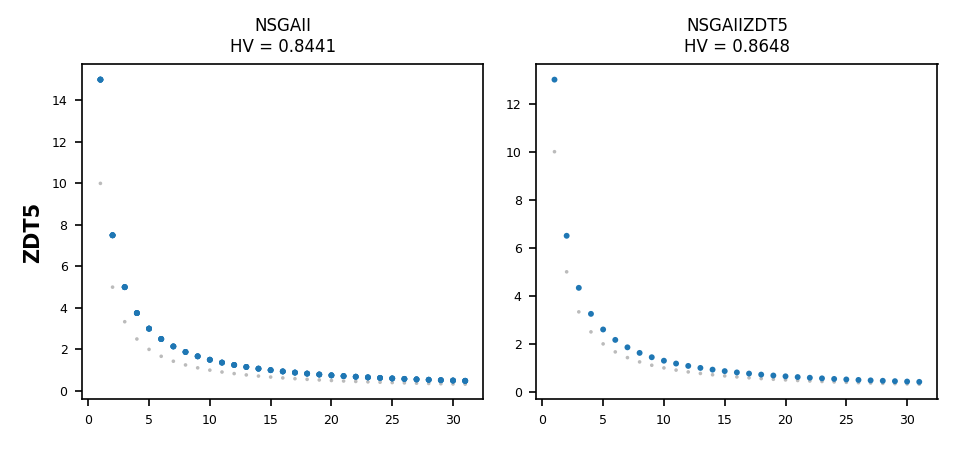
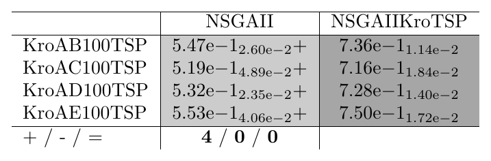
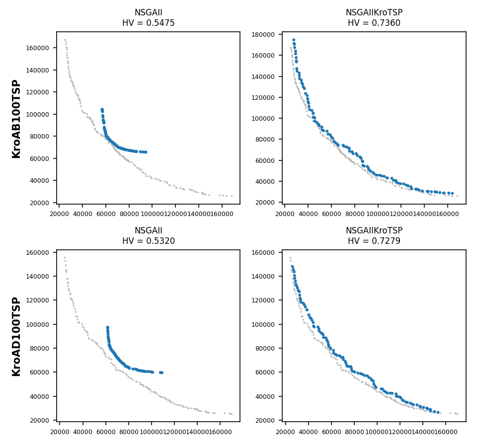

.. _tutorial_binary_and_permutation_encodings:

E11. Binary and Permutation Encodings
=====================================

:Level: Intermediate
:Version: 1.1 (2026-10-05)
:Time: about 1 hour 15 minutes, of which the two trainings (optional) take about 12 and 26 minutes
   and the validations about 2
:Timings measured on: Apple M5 Pro (18 cores, 16 of them used by the trainings and the
   validations), 64 GB of RAM, macOS 26.6.2, Java 21.0.12 (Oracle JDK), Python 3.11, SAES 1.5.0
:Prerequisites: :doc:`E2. Base-level algorithms <base_level_algorithms>`,
   :doc:`E3. Meta-optimization workflow <meta_optimization_workflow>`,
   :doc:`E6. Designing your own parameter space <designing_parameter_spaces>`

The previous tutorials tune algorithms for continuous problems. Evolver's algorithms also come in
versions for **binary** problems, whose solutions are bit strings, and **permutation** problems,
whose solutions are orderings, such as the routes of a travelling salesman. This tutorial tunes
NSGA-II for one problem of each kind: ZDT5, a binary benchmark, and the bi-objective travelling
salesman problem (TSP).

The code of this tutorial is the class
`EncodingsTutorial <https://github.com/jMetal/Evolver/blob/develop/src/main/java/org/uma/evolver/example/tutorial/EncodingsTutorial.java>`_,
in package ``org.uma.evolver.example.tutorial``.

Step 1: what changes with the encoding
--------------------------------------

The **meta-optimizer does not change**: it always searches the flat encoding of the parameters of
the base-level algorithm (tutorial E3), a vector of numbers in [0, 1], whatever the solutions of
the base-level problem are. What changes is the base-level algorithm, which comes in one class per
encoding, with its own parameter space and parameter factory:

.. list-table::
   :header-rows: 1
   :widths: 20 25 30 25

   * - Encoding
     - NSGA-II class
     - Parameter space
     - Factory
   * - Double
     - ``DoubleNSGAII``
     - ``NSGAIIDouble.yaml``
     - ``DoubleParameterFactory``
   * - Binary
     - ``BinaryNSGAII``
     - ``NSGAIIBinary.yaml``
     - ``BinaryParameterFactory``
   * - Permutation
     - ``PermutationNSGAII``
     - ``NSGAIIPermutation.yaml``
     - ``PermutationParameterFactory``

NSGA-II, MOEA/D, SMS-EMOA and PAES exist for the three encodings, and RDEMOEA for Double and
Permutation (see :doc:`../concepts/base_level_metaheuristics`). From the command line, a training
or solve request chooses the encoding with the ``encoding`` field of its base level (``Double``,
``Binary`` or ``Permutation``), and all of them can be tuned and run from it
(:doc:`../utilities/cli_tools` lists them with their encodings).

Step 2: the binary and the permutation parameter spaces
-------------------------------------------------------

The structure of the spaces is the one of the continuous NSGA-II (an external archive or not, the
offspring population size, the variation and the selection), but the operators are those of each
encoding:

- **Binary** (``NSGAIIBinary.yaml``): the crossovers HUX, uniform and single point, and the bit-flip
  mutation. As in the continuous space, the mutation probability is ``mutationProbabilityFactor``
  divided by the number of bits.
- **Permutation** (``NSGAIIPermutation.yaml``): the crossovers PMX, CX and OXD, which build a valid
  permutation from two parents, and six mutations (swap, insert, scramble, inversion, simple
  inversion and displacement). Here ``mutationProbability`` is the probability of mutating a
  solution, not a factor: a permutation cannot be mutated position by position independently.

Both are much smaller than the continuous space (tutorial E6):

.. code-block:: bash

    python scripts/plot_parameter_space.py \
        src/main/resources/parameterSpaces/NSGAIIPermutation.yaml --stats

.. list-table::
   :header-rows: 1
   :widths: 40 20 20 20

   * - Space
     - Parameters
     - Structures
     - Depth
   * - ``NSGAIIDouble.yaml``
     - 34
     - 777,600
     - 2
   * - ``NSGAIIBinary.yaml``
     - 12
     - 162
     - 2
   * - ``NSGAIIPermutation.yaml``
     - 12
     - 972
     - 2

The default configurations, used below as the baselines, are
``defaultConfigurations/NSGAIIBinaryDefault.txt`` (single-point crossover with probability 0.9,
bit-flip mutation with a factor of 1, binary tournament) and
``defaultConfigurations/NSGAIIPermutationDefault.txt`` (PMX crossover with probability 0.9, swap
mutation with probability 0.2, binary tournament), the settings of jMetal's NSGA-II examples.

Step 3: a binary problem, ZDT5
------------------------------

ZDT5 is the binary problem of the ZDT family: 80 bits in 11 variables, one of 30 bits and ten of 5.
The first objective counts the ones of the first variable, and the second one depends on the
other ten through a **deceptive** function: for a variable of 5 bits, more ones make it better
only when all five are ones, so a search guided by small improvements is led away from the
optimum. Its Pareto front is known exactly: 31 points, ``f2 = 10 / f1`` for ``f1`` from 1 to 31,
in ``resources/referenceFronts/ZDT5.csv``.

OneZeroMax, the binary problem of tutorial E2, is not a good training problem: every solution of
it is Pareto optimal, so there is nothing to tune.

The training is described by ``TutorialZdt5BinaryBaseLevel.yaml``:

.. literalinclude:: ../../src/main/resources/baseLevelConfigurations/TutorialZdt5BinaryBaseLevel.yaml
   :language: yaml
   :caption: TutorialZdt5BinaryBaseLevel.yaml

``ZDT5`` is a short name of the problems that ``DescribeMain`` lists, with the encoding of each one
(``Binary`` here, as ``Permutation`` for the TSP instances): a training checks that the encoding of
its problems is the one of the algorithm, and fails before it starts if it is not. Each
configuration is run three times with 10000 evaluations, and the meta-optimizer is the
asynchronous NSGA-II of tutorial E7 (2000 configurations). From the root of the repository:

.. code-block:: bash

    mvn -DskipTests package
    mkdir -p results/tutorial-e11/binary
    cp src/main/resources/cli/training/tutorial-e11-binary-request.yaml \
        results/tutorial-e11/binary/request.yaml
    java -cp target/Evolver-<version>-jar-with-dependencies.jar \
        org.uma.evolver.cli.training.TrainingRunnerMain results/tutorial-e11/binary/request.yaml

It took about 12 minutes. The configuration with the lowest NHV (0.012), bundled in
``tunedConfigurations/NSGAIIBinaryZDT5.txt``, keeps the single-point crossover of the default one
(probability 0.89) but uses an external archive of 192 solutions, generates 5 offspring per
generation instead of 100, mutates less (a factor of 0.63) and selects the parents at random
instead of by tournament.

Step 4: a permutation problem, the bi-objective TSP
---------------------------------------------------

In the bi-objective TSP, a solution is a route that visits every city once, and its two objectives
are its lengths with two different distance matrices. The instances of jMetal used here have 100
cities: ``KroAB100TSP`` combines the matrices of ``kroA100`` and ``kroB100``, ``KroAC100TSP`` those
of ``kroA100`` and ``kroC100``, and so on (the files are in ``resources/tspInstances/``).

These instances have **no reference front**. ``resources/referenceFrontsTSP/`` holds, for each of
them, only two extreme points that bound the objectives. That is enough for the hypervolume, which
needs a reference point, but not for the indicators that measure distances to a front, such as EP,
NHV or IGD+, which need a complete reference front. The meta-objectives of the training are:

- **HV−**, the hypervolume to be minimized, normalized with the extreme points: the main
  objective, and the only indicator whose values are meaningful here;
- **EP**, as a **helper objective**, as in tutorial E3. Measured against two points its values have
  no meaning of their own (they can even be negative, when a front goes beyond the extreme points),
  but they still tell apart the configurations whose fronts have no hypervolume at all (HV− = 0),
  which is frequent at the start of a training, and guide the meta-optimizer until HV− improves.

:doc:`E10 <problems_without_reference_front>` explains this approach.

.. literalinclude:: ../../src/main/resources/baseLevelConfigurations/TutorialKroTspPermutationBaseLevel.yaml
   :language: yaml
   :caption: TutorialKroTspPermutationBaseLevel.yaml

The training uses KroAB100 and KroAC100, with 25000 evaluations per run, 20% of the 125000 of the
validation (the budget of jMetal's NSGA-II example for the TSP):

.. code-block:: bash

    mkdir -p results/tutorial-e11/permutation
    cp src/main/resources/cli/training/tutorial-e11-permutation-request.yaml \
        results/tutorial-e11/permutation/request.yaml
    java -cp target/Evolver-<version>-jar-with-dependencies.jar \
        org.uma.evolver.cli.training.TrainingRunnerMain \
        results/tutorial-e11/permutation/request.yaml

It took about 26 minutes. The meta-objectives are HV− and EP, so the command of tutorial E3 that
chooses the configuration with the lowest NHV becomes:

.. code-block:: bash

    awk '/^# Evaluation/ {block = ""} / \| / {block = block $0 "\n"} END {printf "%s", block}' \
        results/tutorial-e11/permutation/training/VAR_CONF.txt \
      | sed 's/.*HVMinus=\([^ ]*\) .*| \(.*\)/\1 \2/' | sort -g | head -1 | cut -d' ' -f2-

The configuration found (HV− = −0.717, bundled in ``tunedConfigurations/NSGAIIPermutationKroTSP.txt``)
differs from the default one in every operator: OXD crossover with probability 0.43 instead of PMX
with 0.9, inversion mutation with probability almost 1 instead of swap with 0.2, 10 offspring per
generation instead of 100, and a tournament of size 6. The inversion mutation reverses a segment of
the route, which in a TSP removes two edges and adds two others: it is the classic 2-opt move of
TSP heuristics, and the meta-optimizer has found it on its own.

The values of EP in ``VAR_CONF.txt`` are negative (about −0.03), since the fronts go beyond the
extreme points: as a helper objective, only the order it gives to the configurations matters, not
its values. For the same reason, the validation cannot report EP or IGD+ against the extreme
points.

Step 5: the validations
-----------------------

``EncodingsTutorial`` runs two jMetal studies, one per encoding, comparing the standard NSGA-II with
the tuned one, with 25 independent runs each:

- **Binary**: ZDT5, 25000 evaluations, with EP, HV and IGD+ against its exact front.
- **Permutation**: KroAB100 and KroAC100 (seen during the training) and KroAD100 and KroAE100 (not
  seen), 125000 evaluations. The four instances share ``kroA100`` as the first matrix, so the
  unseen ones differ in their second objective only.

.. literalinclude:: ../../src/main/java/org/uma/evolver/example/tutorial/EncodingsTutorial.java
   :language: java
   :start-after: // [permutation-start]
   :end-before: // [permutation-end]
   :dedent: 4

The TSP study needs a reference front for the indicators. With only the two extreme points of the
training, the hypervolume would be the only valid indicator, and here it is not even informative:
on three of the four instances, the lower bounds of the points are far above the routes the
algorithms find, so their fronts dominate the whole box and the hypervolume of both is between
0.997 and 1.000. The study builds its own reference front instead, the non-dominated points of all
the runs of both algorithms (jMetal's
``GenerateReferenceParetoFront``, before ``ComputeQualityIndicators``), and computes EP, HV and IGD+
against it. This is the usual practice when a problem has no known front (:doc:`E10 <problems_without_reference_front>`). From the
root of the repository:

.. code-block:: bash

    java -cp target/Evolver-<version>-jar-with-dependencies.jar \
        org.uma.evolver.example.tutorial.EncodingsTutorial

It took about 2 minutes.

**Binary.** The tuned configuration is better than the default one in the three indicators, and
the Wilcoxon test finds the three differences significant:

.. list-table:: NSGA-II on ZDT5, median of 25 runs (25000 evaluations)
   :header-rows: 1
   :widths: 30 35 35

   * - Indicator
     - Default
     - Tuned
   * - EP (lower is better)
     - 0.0517
     - 0.0333
   * - HV (higher is better)
     - 0.8441
     - 0.8648
   * - IGD+ (lower is better)
     - 0.0350
     - 0.0225

The median fronts show what the numbers mean on a deceptive problem:

   Fronts with the median HV on ZDT5, over the optimal front (in gray).

Both find the 31 values of the first objective, but neither reaches the optimal front: the second
objective is ``g / f1``, and ``g`` is 15 for the default configuration and 13 for the tuned one,
against an optimum of 10. The deception of ZDT5 holds both of them back; the tuned configuration
gets closer.

**Permutation.** The difference is much larger:

   Hypervolume (HV, higher is better) against the reference front of the study, 125000
   evaluations, 25 runs.

The tuned configuration has a median HV between 0.72 and 0.75 on the four instances, against 0.52
to 0.55 of the default one, and is significantly better on all of them, including the two it was
not trained on; its IGD+ is between 0.024 and 0.039, against 0.12 to 0.16. Most of the reference
front comes from its runs (on KroAD100, all its 137 points). The fronts show the difference:

   Fronts with the median HV on KroAB100 (seen during the training) and KroAD100 (not seen), over
   the reference front of the study (in gray).

The default NSGA-II covers only the middle of the front, with routes between about 55000 and
110000; the tuned one covers it from end to end. Its shortest route for ``kroA100`` over all the runs on KroAB100 is
24857, 17% above the optimal tour of that instance (21282), while the shortest one of the default
NSGA-II is 54015, two and a half times the optimum.

Try it yourself
---------------

- Tune MOEA/D for ZDT5 or the TSP (``MOEADBinary.yaml``, ``MOEADPermutation.yaml``): the base level
  names ``algorithmName: MOEAD`` and needs ``extraConfig: {weightVectorFilesDirectory:
  resources/weightVectors}``, the weight vectors for two objectives.
- Write a reduced permutation space with only the inversion mutation (tutorial E6) and train with
  it: is the training faster, and is the configuration as good?
- Validate the tuned configuration on ``EuclidAB300``, an instance of 300 cities: does a
  configuration tuned with 100 cities scale?
- Validate the TSP configuration with the extreme points of ``resources/referenceFrontsTSP/`` instead
  of the reference front of the study, and compare the conclusions.

What's next
-----------

- :doc:`E10 <problems_without_reference_front>` covers problems without a reference front: the extreme points, HV−, and reference
  fronts built from the results.
- :doc:`E13 <tree_versus_flat_encoding>` compares the tree and the flat encodings of the meta-optimizer.
