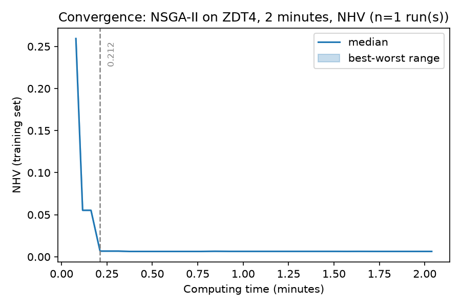

.. _tutorial_budgets:

E11. Budgets: Evaluations or Time
=================================

:Level: Intermediate
:Version: 1.0 (2026-10-05)
:Time: about 20 minutes, of which the training takes 2 minutes
:Timings measured on: Apple M5 Pro (18 cores, 14 of them used by the training), 64 GB of RAM,
   macOS 26.6.2, Java 21.0.12 (Oracle JDK)
:Prerequisites: :doc:`E3. Meta-optimization workflow <meta_optimization_workflow>`

A meta-optimization is expensive, and how much it costs is decided by its **budgets**. There are
two, one for each level:

- the **budget of the base level**: how many evaluations the algorithm being tuned gets in each run;
- the **budget of the meta-optimizer**: how long it searches for configurations. It can be a number
  of configurations (meta-evaluations) or a computing time, and the second is likely to be the
  natural choice in many studies: the budget you really have is the time you can wait.

This tutorial explains how to choose each one, and runs the training of tutorial E3 stopped by time
instead of by evaluations, to see what the stop does and what the output files record about it.

The code is in the class
`BudgetsTutorial <https://github.com/jMetal/Evolver/blob/develop/src/main/java/org/uma/evolver/example/tutorial/BudgetsTutorial.java>`_
(package ``org.uma.evolver.example.tutorial``).

The budget of the base level
----------------------------

When the meta-optimizer evaluates a configuration, it runs the base-level algorithm with it on every
problem of the training set, as many times as ``numberOfIndependentRuns`` says, each run with the
evaluations that ``trainingEvaluations`` gives to that problem. The cost of the whole training
follows from that:

.. code-block:: none

    configurations tried × problems × independent runs × evaluations of each run

Every factor is a decision. The last one has two values to choose:

- The budget of the **validation** follows the literature: the studies with the DTLZ and WFG
  problems with three objectives usually give each algorithm 40000 or 50000 evaluations.
- The budget of the **training** is a decision of its own, and a key one in real applications.
  Its cost grows linearly with the evaluations of each run, so it should be small enough for the
  training to be affordable, but large enough for the configurations it finds to be competitive when
  they are validated with the full budget. In tutorial :doc:`E6 <training_sets_indicators_budgets>`
  the training uses 10000 evaluations per problem, a fifth of the validation budget, which makes it
  five times cheaper than training with 50000.

The risk of a small training budget is that it rewards configurations that converge fast but may
stall, or lose diversity, when they are given more evaluations. Only the validation with the full
budget tells whether the compromise worked; if it does not, the training is repeated with a larger
budget (for instance, 15000 evaluations).

The budget of the meta-optimizer
--------------------------------

The meta-optimizer stops in one of two ways, given in its configuration file with one of two fields:

``metaMaxEvaluations``
    The number of configurations (meta-evaluations) it tries. This is the field of tutorial E3,
    where the meta-optimizer tries 2000.

``metaMaxComputingTimeMinutes``
    The computing time it is allowed, in minutes; decimals are accepted (``7.5``).

The two fields are **mutually exclusive**: a configuration file with both is rejected with an error.

Step 1: the two budgets
~~~~~~~~~~~~~~~~~~~~~~~

The base level is the one of tutorial E3. For the meta-optimizer, there are two files that differ in
a single line. The first is the one of E3, stopped after 2000 configurations
(``TutorialNSGAIIMetaSearch.yaml``); the second is stopped after two minutes:

.. literalinclude:: ../../src/main/resources/metaOptimizerConfigurations/TutorialTimeNSGAIIMetaSearch.yaml
   :language: yaml
   :caption: TutorialTimeNSGAIIMetaSearch.yaml

The program loads them and prints their budgets:

.. literalinclude:: ../../src/main/java/org/uma/evolver/example/tutorial/BudgetsTutorial.java
   :language: java
   :start-after: // [step-1-start]
   :end-before: // [step-1-end]
   :dedent: 4

.. code-block:: none

   Budget of the base level: [12000] evaluations
   Budget of the meta-optimizer, by evaluations: 2000 configurations
   Budget of the meta-optimizer, by time: 2.0 minutes

Step 2: running the training bounded by time
~~~~~~~~~~~~~~~~~~~~~~~~~~~~~~~~~~~~~~~~~~~~

The training is run exactly as in E3, with a ``TrainingRequest`` and ``TrainingRunner``. Only the
meta-optimizer file is different, so nothing in the code mentions the time:

.. literalinclude:: ../../src/main/java/org/uma/evolver/example/tutorial/BudgetsTutorial.java
   :language: java
   :start-after: // [step-2-start]
   :end-before: // [step-2-end]
   :dedent: 4

Step 3: how it stopped
~~~~~~~~~~~~~~~~~~~~~~

A training bounded by time records both the limit and what it actually did. The progress file,
``status.yaml``, has the limit (``maxComputingTimeMinutes``), the minutes elapsed
(``elapsedMinutes``) and the meta-evaluations done (``evaluationsDone``). ``METADATA.txt`` states the
stopping condition, and, at the end of the run, the meta-evaluations performed:

.. literalinclude:: ../../src/main/java/org/uma/evolver/example/tutorial/BudgetsTutorial.java
   :language: java
   :start-after: // [step-3-start]
   :end-before: // [step-3-end]
   :dedent: 4

.. code-block:: none

   Stopped after 2.04 minutes (limit: 2.0), with 1650 meta-evaluations done
   Max Computing Time: 2 min (0h 2m 0s)
   Stopping condition: computing time
   Meta-evaluations performed: 1650

With a limit on evaluations, the same files say ``Max Evaluations: 2000`` and ``Stopping condition:
evaluations``, so any result says how its training was bounded. The last line matters when the
limit is time: **the number of configurations the meta-optimizer got to try** is the other half of
the budget, and it is not known in advance. Here the machine tried 1650 configurations in two
minutes.

Step 4: the time of every checkpoint
~~~~~~~~~~~~~~~~~~~~~~~~~~~~~~~~~~~~

Whatever the stopping condition, each checkpoint of ``VAR_CONF.txt`` has, after the number of
evaluations, the computing time of the meta-optimizer at that point (``# Time (min): <minutes>``):

.. literalinclude:: ../../src/main/java/org/uma/evolver/example/tutorial/BudgetsTutorial.java
   :language: java
   :start-after: // [step-4-start]
   :end-before: // [step-4-end]
   :dedent: 4

.. code-block:: none

   Meta-evaluation  100 at minute 0.08
   Meta-evaluation  150 at minute 0.12
   Meta-evaluation  200 at minute 0.16
   ...
   Meta-evaluation 1600 at minute 1.98
   Meta-evaluation 1650 at minute 2.04

This is what lets a training be plotted over time, which is what matters when time is the budget.
``scripts/plot_training_convergence.py`` does it with ``--x time`` (it works with any training run
of Evolver 2.2 or later, whatever stopped it):

.. code-block:: bash

    python scripts/plot_training_convergence.py results/tutorial/budgets --primary NHV --x time

In this run the NHV of the configurations on the meta-optimizer's front falls from 0.26 to 0.007
within the first 0.2 minutes, and the other 1.8 minutes bring almost nothing. It is worth
looking at this plot before choosing a limit: in a problem as easy as ZDT4, two minutes is far more
than this training needed, and so are the 2000 configurations of tutorial E3, whose convergence plot
reaches 95% of the improvement at meta-evaluation 400. With a
harder problem or a larger parameter space, the curve would still be falling when the time ran out,
and the plot would say that the training needs more.

How the stop works
------------------

The limit is checked while the meta-optimizer runs, and the run does not end at the exact instant:

- A **generational** meta-optimizer (NSGA-II, AGE-MOEA and SPEA2, also with the tree encoding, and
  SMPSO, by iterations) checks it at the beginning of each generation, so the generation in progress
  is **completed** before the run stops. The real time exceeds the limit by up to the time of one generation, that is, the time to
  evaluate the population of the meta-optimizer in parallel. Here it took 2.04 minutes for a limit
  of 2, a couple of seconds more. With a large population and configurations that take long to
  evaluate, the difference can be minutes.
- ``RandomSearch`` evaluates batches of ``numberOfCores`` configurations and checks the limit
  between batches.
- The asynchronous meta-optimizer (``AsyncNSGA-II``) has no generations: it checks the limit after
  every evaluation, so it exceeds it by at most one evaluation. The evaluations in progress when it
  stops are discarded.
- The **initial population is always evaluated**, even if that takes longer than the limit: a
  limit shorter than that gives a result that is the initial population.

Evaluations or time?
--------------------

.. list-table::
   :header-rows: 1
   :widths: 25 37 38

   * -
     - By evaluations
     - By time
   * - What is fixed
     - The search effort: the number of configurations tried.
     - The wait: what you can afford.
   * - What varies
     - The time, with the machine, its load and the cost of each configuration.
     - The number of configurations tried, and so the result.
   * - The same on any machine
     - Yes, in the amount of search (the results still vary from run to run, as in any stochastic
       algorithm).
     - No: a faster machine tries more configurations in the same time.
   * - When it fits
     - Tutorials and studies that must be reproducible on other machines; the cost of a
       configuration is known.
     - The cost of a configuration is not known or varies a lot (for instance, SMS-EMOA with
       hypervolume against NSGA-II), or you have a fixed time to spend.

The time of a training also depends on the configurations the search happens to visit: a
configuration that produces one offspring per generation takes several times longer than one that
produces a hundred (the :doc:`NSGA-II guide <../algorithms/nsgaii>` measures 6 to 10 times), so two
trainings of the same experiment do not take the same time.

There is a third reason for time, **fair comparisons**. Evolver (with the flat or the tree
encoding) and a tuner such as irace do not spend the same time per evaluation, so comparing them at
the same number of evaluations favours the cheaper one; the equitable comparison gives all of them
the same wall-clock time, and reports the configurations each one tried (``Meta-evaluations
performed``).

Two precautions when the limit is time:

- State the **hardware** the result was obtained on (CPU, cores) and, if the machine is shared, its
  load: the result depends on both.
- Keep the evaluation limit for what must be exact, such as the experiments of a tutorial that
  others will repeat.

Running it from the command line
--------------------------------

From the command line, the same training is a request file that points to the time-bounded
meta-optimizer file:

.. literalinclude:: ../../src/main/resources/cli/training/tutorial-budgets-request.yaml
   :language: yaml
   :caption: tutorial-budgets-request.yaml

As in E3, copy it to a working directory first, since ``TrainingRunnerMain`` writes ``results.yaml``
next to the request:

.. code-block:: bash

    mvn -DskipTests package
    mkdir -p results/tutorial/budgets-cli
    cp src/main/resources/cli/training/tutorial-budgets-request.yaml results/tutorial/budgets-cli/request.yaml
    java -cp target/Evolver-<version>-jar-with-dependencies.jar \
        org.uma.evolver.cli.training.TrainingRunnerMain results/tutorial/budgets-cli/request.yaml

A longer example is bundled too: ``nsgaii-re3d-computing-time-request.yaml`` stops the training
of NSGA-II on the RE3D problems after 60 minutes. From Java, the builders of the meta-optimizers have
``setMaxComputingTimeMinutes`` as the alternative to ``setMaxEvaluations`` (see
:doc:`../utilities/cli_tools`).

Running the tutorial
--------------------

Run ``BudgetsTutorial`` from your IDE, or from the root of the Evolver repository:

.. code-block:: bash

    java -cp target/Evolver-<version>-jar-with-dependencies.jar \
        org.uma.evolver.example.tutorial.BudgetsTutorial

Try it yourself
---------------

- Change ``metaMaxComputingTimeMinutes`` to 0.5. How many configurations does the meta-optimizer
  try, and how far does the NHV get? Compare it with the plot above.
- Run the training of E3 (``TutorialNSGAIIMetaSearch.yaml``, 2000 configurations) on your machine and
  note how long it takes, and repeat it. Is it more or less than the two minutes of this tutorial,
  and is it the same in both runs?
- Use ``AsyncNSGA-II`` as the meta-optimizer (``MetaAsyncNSGAIIFlatConfiguration.yaml``, replacing
  ``metaMaxEvaluations`` by ``metaMaxComputingTimeMinutes``) and compare how much the real time
  exceeds the limit with that of NSGA-II.
- Put a limit of 0.001 minutes. The training still evaluates the 50 configurations of the initial
  population, and stops right after: the result is their front, and the time it reports is a few
  seconds, not the limit.

What's next
-----------

- :doc:`E6 <training_sets_indicators_budgets>` designs a training with several problems and
  validates its result.
- :doc:`E7 <analyzing_training_results>` explains the output files of a training run in depth.
- :doc:`../utilities/cli_tools` describes the request files and the fields of the meta-optimizer
  configuration files.
