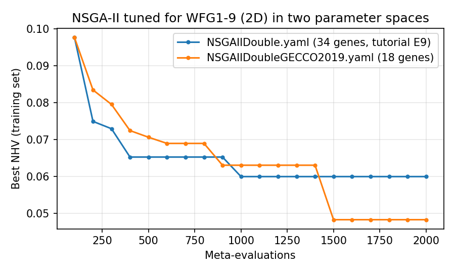
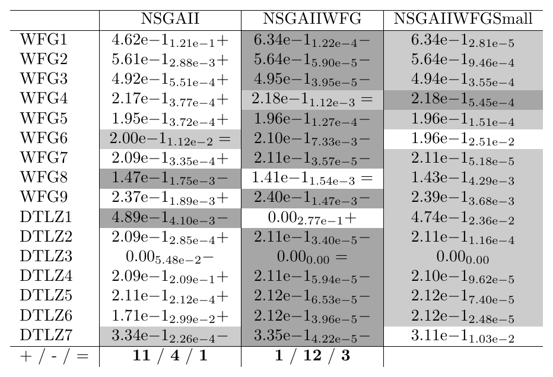
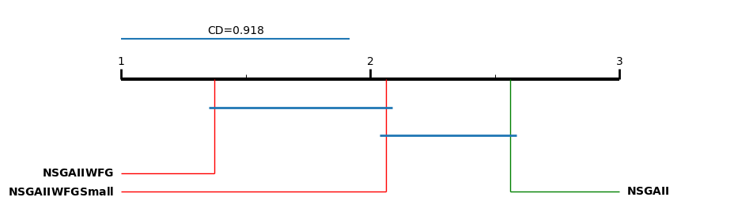

.. _tutorial_designing_parameter_spaces:

E5. Designing Your Own Parameter Space
======================================

:Level: Intermediate
:Version: 1.0 (2026-10-05)
:Time: about 45 minutes, of which the training (optional) takes about 21 minutes and the validation
   about 6
:Timings measured on: Apple M5 Pro (18 cores, 16 of them used by the training and the validation),
   64 GB of RAM, macOS 26.6.2, Java 21.0.12 (Oracle JDK), Python 3.11, SAES 1.5.0
:Prerequisites: :doc:`E1. Parameter spaces <parameter_spaces>`,
   :doc:`E3. Meta-optimization workflow <meta_optimization_workflow>`; recommended:
   :doc:`E8. Validating a configuration <validating_a_configuration>`

The parameter space is part of the design of a training, like the training set or the budget: it
decides which configurations the meta-optimizer can find. The spaces bundled with Evolver are
broad, so that they cover most uses, but a space of your own can leave out what you know is not
useful, add what is missing, or reproduce the space of a published study. This tutorial shows how
to reduce and extend a parameter space, what the implementation of the algorithms does not allow,
how to measure the size of a space, and, with a case study, why a smaller space is not necessarily
a better one.

The case study continues tutorial E8. There, Evolver tuned NSGA-II in its full parameter space
(``NSGAIIDouble.yaml``) and found a configuration similar to the one irace found in Nebro et al.,
*Automatic Configuration of NSGA-II with jMetal and irace* (GECCO 2019 Companion,
`doi:10.1145/3319619.3326832 <https://doi.org/10.1145/3319619.3326832>`_), in a much smaller
space. What happens if Evolver searches that smaller space?

The code of this tutorial is the class
`ParameterSpaceDesignTutorial <https://github.com/jMetal/Evolver/blob/develop/src/main/java/org/uma/evolver/example/tutorial/ParameterSpaceDesignTutorial.java>`_,
in package ``org.uma.evolver.example.tutorial``.

Step 1: what a parameter space file contains
--------------------------------------------

Tutorial :doc:`E1 <parameter_spaces>` and :doc:`../concepts/parameter_spaces` describe the format;
this is a summary of what matters when writing one:

- The **top-level parameters** are the components of the algorithm. For NSGA-II they are
  ``algorithmResult``, ``createInitialSolutions``, ``offspringPopulationSize``, ``variation`` and
  ``selection``.
- A **categorical** parameter lists its ``values``, either as a list (``[random, round, bounds]``)
  or as a map, where a value can activate **conditional parameters** (``conditionalParameters``).
  A categorical parameter can also have **global sub-parameters** (``globalSubParameters``), active
  whatever its value, such as the probability of any crossover.
- An **integer** or **double** parameter has an inclusive ``range``. A categorical parameter can
  also list numbers (``values: [10, 20, 50]``), which turns a numeric parameter into an ordinal
  one, as the offspring population size of NSGA-II.
- The **names** are not free: each value of a component must be one that Evolver's catalogue
  implements (an operator, an archive, an initialization strategy), and each parameter one that the
  algorithm reads.

A parameter space is loaded by name from ``src/main/resources/parameterSpaces/``, or by its path
when it is a file of your own: the ``yamlParameterSpaceFile`` of a training request accepts both.

Step 2: reducing a parameter space
----------------------------------

Reducing a space means removing values (operators, archives, strategies), narrowing ranges, or
fixing a parameter to a single value. ``NSGAIIDoubleReduced.yaml``, bundled with Evolver, is a
reduced version of ``NSGAIIDouble.yaml``: it keeps three crossovers of ten and four mutations of
eight, and drops some archives and initialization strategies.

Two rules apply:

- **Every top-level parameter must stay.** A space without ``selection`` loads, but the algorithm
  cannot be built, and the error says what is missing:

  .. code-block:: none

     Parameter not found: selection. The parameter space does not define it; a parameter space
     must define every parameter the algorithm requires (defined: [algorithmResult, ...])

  To leave a component out of the search, give it a single value instead.
- **A parameter with a single value is still a gene.** In the flat encoding of the meta-optimizers
  (tutorial E3), each parameter is a variable in [0, 1], whatever the number of its values. A
  parameter with one value always decodes to that value, so the meta-optimizer wastes a little of
  its effort mutating it. It does no harm, but a space with many fixed parameters is less
  efficient than its number of parameters suggests. The tree encoding (:doc:`E14 <tree_versus_flat_encoding>`) does not have
  this problem.

Step 3: extending a parameter space
-----------------------------------

Extending a space means adding values or widening ranges. Values must exist in the catalogue: a
crossover that Evolver does not implement is rejected when the space is loaded, with the list of
valid names:

.. code-block:: none

   Error processing specific subparameter crossover: Invalid crossover operator name: fooCrossover.
   Supported names are: [SBX, blxAlpha, wholeArithmetic, arithmetic, fuzzyRecombination, laplace,
   blxAlphaBeta, PCX, UNDC, SDX]

Adding a new operator to the catalogue is the subject of tutorial E17. A parameter that the
algorithm does not use cannot be added either: the space loads, but every configuration must then
give it a value, and the algorithm ignores it.

Widening ranges is where the implementation of the algorithms sets limits that the space does not
show. Some values are accepted although they are unusual: an ``offspringPopulationSize`` of 3, 7,
60, 91 or 125 works with NSGA-II, NSGA-III, AGE-MOEA and RVEA (jMetal produces exactly that many
offspring, discarding the second child of the last pair when the number is odd). Others are not:

.. list-table:: Values that a widened range can produce and the operators reject (NSGA-II)
   :header-rows: 1
   :widths: 40 60

   * - Value
     - Why it fails
   * - ``offspringPopulationSize`` = 0
     - The variation must produce at least one offspring.
   * - ``selectionTournamentSize`` larger than the population
     - A tournament needs that many solutions. The population is ``populationSize``, or
       ``populationSizeWithArchive`` with an external archive, so the limit depends on two
       parameters.
   * - ``populationSizeWithArchive`` = 1
     - The crossover needs two parents (the tournament of size 2 fails first).
   * - ``crossoverProbability`` outside [0, 1]
     - It is a probability.
   * - ``mutationProbabilityFactor`` larger than the number of variables
     - The mutation probability is the factor divided by the number of variables of the problem,
       so the limit depends on the training problems: 30 for ZDT1, 7 for the bi-objective DTLZ1.

The bundled spaces respect these limits (for instance, the tournament goes from 2 to 10 and
``populationSizeWithArchive`` from 10), so a widened space must respect them too. A single invalid
configuration makes the whole training fail, and the error says why:

.. code-block:: none

   A configuration failed on problem ZDT1 (2000 evaluations): mutationProbabilityFactor (48.87)
   divided by the number of variables of the problem (30) gives a mutation probability of 1.63,
   which is not in [0, 1]: for this problem, mutationProbabilityFactor must be in [0, 30]
   Configuration: --algorithmResult population --populationSizeWithArchive 2480 ...

This message, from a training on a space with ranges widened on purpose, failed in the initial
population of the meta-optimizer: such a space fails quickly, which is better than failing after
an hour. ``docs/proposals/failing-configurations.md`` explains why a failing configuration stops
the training instead of being skipped.

Step 4: measuring the size of a space
-------------------------------------

``scripts/plot_parameter_space.py`` prints a space as a tree, and with ``--stats`` its size:

.. code-block:: bash

    python scripts/plot_parameter_space.py \
        src/main/resources/parameterSpaces/NSGAIIDouble.yaml --stats

Three numbers describe it:

- **Parameters**: the number of genes of the flat encoding, which is the dimension of the problem
  the meta-optimizer solves.
- **Structures**: the number of distinct combinations of categorical values, that is, of different
  algorithms the space describes, before choosing any numeric value. Each value counts with the
  conditional parameters it activates.
- **Depth**: the levels below the top-level parameters.

.. list-table:: Size of three parameter spaces of NSGA-II
   :header-rows: 1
   :widths: 40 20 20 20

   * - Space
     - Parameters
     - Structures
     - Depth
   * - ``NSGAIIDouble.yaml``
     - 34
     - 777,600
     - 2
   * - ``NSGAIIDoubleReduced.yaml``
     - 20
     - 17,496
     - 2
   * - ``NSGAIIDoubleGECCO2019.yaml``
     - 18
     - 12,096
     - 2

The number of structures grows as the product of the choices: removing values divides it, which
is why a reduced space can be far smaller than its number of parameters suggests.

Step 5: case study, the space of the 2019 paper
-----------------------------------------------

``NSGAIIDoubleGECCO2019.yaml`` writes the parameter space of the 2019 paper (its Figure 4) for
Evolver:

.. literalinclude:: ../../src/main/resources/parameterSpaces/NSGAIIDoubleGECCO2019.yaml
   :language: yaml
   :caption: NSGAIIDoubleGECCO2019.yaml

It has two crossovers (SBX and BLX-alpha) and two mutations (polynomial and uniform), where
``NSGAIIDouble.yaml`` has ten and eight, and only a crowding distance archive. The population size
with an archive is ordinal, as in the paper (a categorical parameter with numbers), and so is the
offspring population size. The comments of the file list the differences with the paper.

The training is the one of tutorial E8, with this space instead of the full one: NSGA-II tuned for
WFG1-9 with two objectives, 10000 evaluations per run, NHV and EP as meta-objectives and 2000
configurations. From the root of the repository:

.. code-block:: bash

    mvn -DskipTests package
    mkdir -p results/tutorial-parameter-space-design
    cp src/main/resources/cli/training/tutorial-parameter-space-design-request.yaml results/tutorial-parameter-space-design/request.yaml
    java -cp target/Evolver-<version>-jar-with-dependencies.jar \
        org.uma.evolver.cli.training.TrainingRunnerMain results/tutorial-parameter-space-design/request.yaml

It took about 21 minutes, against 17 for the full space: the configurations it ended up exploring
generate one offspring per generation, which is slower. The chosen configuration is bundled in
``src/main/resources/tunedConfigurations/NSGAIIWFG2DGECCO2019.txt``. The best NHV of each training
over the meta-evaluations:

The small space does not converge faster: for most of the training it is behind the full one
(briefly ahead around meta-evaluation 900), and at meta-evaluation 1500 it finds a configuration
with NHV = 0.048, better than the 0.060 of the full space. It is
a steady-state NSGA-II (one offspring per generation), without an archive, with BLX-alpha
crossover, uniform mutation and a tournament of size 8, different from the configuration of the
full space (an external archive of 197 solutions, five offspring per generation, BLX-alpha-beta
crossover and Lévy flight mutation).

Which space is better? The training values cannot tell: they come from one run per configuration,
with the training budget, and each training is a single sample (tutorial E8). The validation can.

Step 6: comparing the two spaces by validation
----------------------------------------------

``ParameterSpaceDesignTutorial`` validates both configurations, together with the standard NSGA-II,
with the design of tutorial E8: WFG1-9 and DTLZ1-7 with two objectives, 25000 evaluations, 25
independent runs and the indicators EP, Spread, HV and IGD+:

.. code-block:: bash

    java -cp target/Evolver-<version>-jar-with-dependencies.jar \
        org.uma.evolver.example.tutorial.ParameterSpaceDesignTutorial

It took about 6 minutes. The tags are ``NSGAIIWFG`` (the configuration of the full space) and
``NSGAIIWFGSmall`` (the configuration of the small space). The Wilcoxon pivot table of HV, with the
small space as the pivot:

.. code-block:: bash

    python scripts/wilcoxon_pivot_tables.py \
        results/tutorial-parameter-space-design/validation/QualityIndicatorSummary.csv \
        --pivot NSGAIIWFGSmall --order NSGAII,NSGAIIWFG,NSGAIIWFGSmall --indicators HV,IGD+ \
        --output-dir results/tutorial-parameter-space-design/tables --png

   Hypervolume (HV, higher is better), 25000 evaluations, 25 runs.

The configuration of the small space beats the standard NSGA-II on 11 of the 16 problems, but it
is worse than the configuration of the full space on 12 of them. Most of those differences are in
the fourth decimal, but they are consistent: on almost every run the configuration of the full
space is a little better. Three problems stand out:

- On **DTLZ1**, the configuration of the small space solves the problem (median HV 0.474), where
  the one of the full space fails (0): with its steady-state replacement it escapes the local
  fronts of this multimodal problem, which tutorial E8 identified as the weak point of the tuned
  configuration.
- On **DTLZ7**, whose front has disconnected regions, it is worse than both (0.311 against 0.335
  and 0.334).
- On **WFG6**, it is worse than both too (0.196 against 0.210 and 0.200).

Over all the problems, the critical difference plot and the Friedman test with Holm's procedure
(tutorial E8) agree:

The configuration of the full space has the best average rank (1.38), the one of the small space
the second (2.06) and the standard NSGA-II the last (2.56). Only the difference between the
configuration of the full space and the standard NSGA-II is larger than the critical difference;
the configuration of the small space is not significantly different from either (Holm's adjusted
p-values 0.10 and 0.16).

**The lesson.** The small space found a configuration with a better training value, and the
validation showed it to be no better, and on most problems slightly worse, than the one of the
full space. A smaller space is easier to describe, not necessarily easier to search or better to
search in: it can exclude the components that would have made the difference (here, the external
archive and the operators of the full space), and its best training value can be a lucky one.
Parameter spaces, like configurations, are compared by validating what they produce. With one
training per space, the comparison is still a single sample of each; a study of the spaces
themselves would repeat each training several times.

Step 7: using a parameter space of your own
-------------------------------------------

- **From the command line**, put its name (in ``src/main/resources/parameterSpaces/``) or its path
  in the ``yamlParameterSpaceFile`` of the base level of a training request, as
  ``TutorialWfg2DGECCO2019BaseLevel.yaml`` does.
- **From Java**, load it with ``new YAMLParameterSpace(file, new DoubleParameterFactory())``, with
  the factory of its encoding, and pass it to the algorithm.
- **With irace** (tutorial :doc:`E15 <tuning_with_irace>`), generate its parameter file with
  ``IraceParameterDescriptionGenerator``:

  .. code-block:: bash

      java -cp target/Evolver-<version>-jar-with-dependencies.jar \
          org.uma.evolver.irace.IraceParameterDescriptionGenerator \
          NSGAIIDoubleGECCO2019.yaml Double > parameters-NSGAII-GECCO2019.txt

  which is, up to the differences listed in the YAML file, the parameter file of the 2019 paper.

Try it yourself
---------------

- Write a space with SBX as the only crossover and polynomial as the only mutation, train with it,
  and add its configuration to the validation (``ParameterSpaceDesignTutorial`` takes the two
  configuration files as arguments).
- Add the external archive types and the operators of the full space, one group at a time, to the
  space of the paper: which addition brings the configuration closer to the one of the full space?
- Fix ``offspringPopulationSize`` to 100 in the space of the paper: is the configuration found
  still steady-state-like in its other parameters?
- Repeat the training of the small space two more times: is NHV = 0.048 typical, or a lucky run?

What's next
-----------

- Tutorial E10 configures and tunes algorithms for binary and permutation problems, with their own
  parameter spaces.
- :doc:`E14 <tree_versus_flat_encoding>` compares the tree and the flat encodings, which treat the parameters of a space
  differently.
- Tutorial E17 adds new components to the catalogue, so that they can be used in a parameter space.
