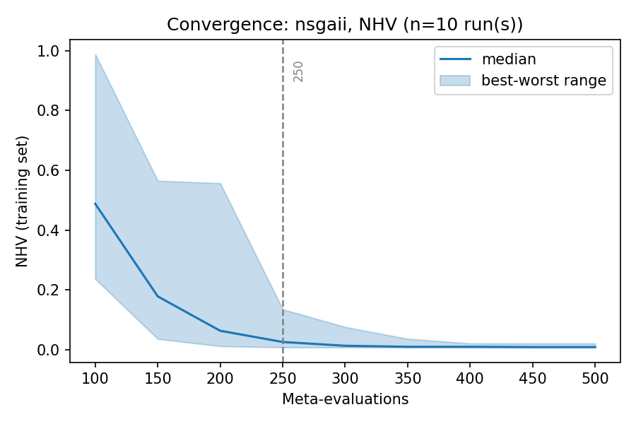
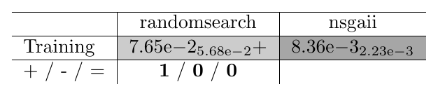

.. _tutorial_independent_replications:

E18. Independent Replications of a Training
===========================================

:Level: Advanced
:Version: 1.0 (2026-10-08)
:Time: about 40 minutes, plus the replications of the example (about 10 minutes)
:Timings measured on: Apple M5 Pro (18 cores, 8 of them used by each training), 64 GB of RAM,
   macOS 26.6.2, Java 21.0.12 (Oracle JDK), Python 3.10, SAES 1.5.0
:Prerequisites: :doc:`E7. Analyzing training results <analyzing_training_results>`,
   :doc:`E8. Validating a configuration <validating_a_configuration>`,
   :doc:`E16. Automating Evolver with the CLI <automating_with_the_cli>`

Every tutorial so far runs **one** training per experiment. That is enough to learn how Evolver
works, and often enough to get a good configuration, but not to make claims about the training
itself: the meta-optimizer is a metaheuristic, and two runs of it with the same settings return
different fronts. A study that says that one setting of the training is better than another (an
encoding, a meta-optimizer, a training set, a budget) needs **independent replications** of each
training, usually 10, 15 or 30, and statistics over them, exactly as a validation study needs many
runs of each algorithm.

This tutorial explains why, what it costs, and how to do it: by hand on one computer, with a slurm
job array on a cluster, and how to analyze the replications with the scripts of Evolver.

Step 1: two kinds of repetition
-------------------------------

A training has two different repetitions, which are easy to confuse:

.. list-table::
   :header-rows: 1
   :widths: 24 38 38

   * -
     - Independent runs of the base level
     - Independent replications of the training
   * - Where
     - ``numberOfIndependentRuns`` of the base-level file (tutorial E3)
     - As many trainings as replications, each in its own process
   * - What varies
     - The runs of one configuration on one problem
     - The whole search of the meta-optimizer
   * - What it reduces
     - The noise of the value of each configuration: the meta-optimizer is less fooled by a lucky
       run
     - Nothing in a training; it measures how much the **result** of a training varies
   * - Cost
     - Multiplies the time of each meta-evaluation
     - Multiplies the time of the whole study

This tutorial is about the second one. With a single training you know what that training found,
not what the setting of the training finds in general.

Step 2: what it costs
---------------------

The cost is simple: the time of one training multiplied by the number of replications, and by the
number of settings to compare. With the trainings of the previous tutorials, measured on this
computer:

.. list-table::
   :header-rows: 1
   :widths: 40 20 20 20

   * - Training
     - One run
     - 15 replications
     - 30 replications
   * - E4 (ZDT4, 500 configurations)
     - 35 seconds
     - 9 minutes
     - 18 minutes
   * - E3 (ZDT4, the workflow)
     - 4 minutes
     - 1 hour
     - 2 hours
   * - E8 (bi-objective WFG, 2000 configurations)
     - 17 minutes
     - 4 hours
     - 8.5 hours
   * - E6 (training sets, 35 minutes)
     - 35 minutes
     - 9 hours
     - 17.5 hours

A study rarely compares a single setting: two encodings on three training sets, with 15
replications, are 90 trainings, so even the 17 minutes of E8 become a full day on a laptop, which is
also the computer you work with. The trainings of the papers are longer than those of the tutorials
(more problems, more evaluations per configuration, more configurations), and their studies were
run on a supercomputer: one training per node of 40 cores, 15 replications of each, all of them at
the same time.

There are three ways out, and they can be combined:

- **Make each training cheaper** while it is still meaningful: fewer evaluations per configuration,
  a smaller training set, a time limit (tutorial E11). The cost is that the result is about a
  cheaper training.
- **Run the replications at the same time** on a cluster (Steps 4 and 5). Each replication is an
  independent process, so they are as parallel as the cluster allows.
- **Start with a few replications** (3 or 5) to see the order of magnitude of the differences and
  of the spread, and run 15 or 30 only for the comparisons that matter.

Step 3: replications by hand
----------------------------

A replication is an ordinary training. ``TrainingRunnerMain`` takes the option ``--output-dir``,
which writes the results to that directory instead of the ``outputDirectory`` of the request, and
puts ``status.yaml`` and ``results.yaml`` there too, so that all the replications share one request
file. The convention of Evolver is a directory per study with a subdirectory per replication:

.. code-block:: none

    results/<study>/
        run01/     INDICATORS.csv, CONFIGURATIONS.csv, VAR_CONF.txt, METADATA.txt,
        run02/     status.yaml, results.yaml
        ...

That is what the analysis scripts read (Step 6). Each replication runs in its own Java process, so
the replications are independent: they share neither the random generator nor any state.

The example of this tutorial compares two meta-optimizers on the short training of tutorial E4
(NSGA-II tuned for ZDT4, 500 configurations, 8 cores): NSGA-II, and random search with the same
budget, the baseline that every meta-optimizer should beat (tutorial E13). Ten replications of each,
one after the other, from the root of the repository:

.. code-block:: bash

    mkdir -p results/tutorial-replications
    cp src/main/resources/cli/training/tutorial-replications-request.yaml \
       src/main/resources/cli/training/tutorial-replications-randomsearch-request.yaml \
       results/tutorial-replications/
    JAR=target/Evolver-<version>-jar-with-dependencies.jar
    for i in $(seq -w 1 10); do
        java -cp $JAR org.uma.evolver.cli.training.TrainingRunnerMain \
            results/tutorial-replications/tutorial-replications-request.yaml \
            --output-dir results/tutorial-replications/nsgaii/run$i
        java -cp $JAR org.uma.evolver.cli.training.TrainingRunnerMain \
            results/tutorial-replications/tutorial-replications-randomsearch-request.yaml \
            --output-dir results/tutorial-replications/randomsearch/run$i
    done

The two requests differ only in ``metaSearch``: ``TutorialQuickNSGAIIMetaSearch.yaml`` and
``TutorialQuickRandomSearchMetaSearch.yaml``. The twenty trainings took about 10 minutes: between
21 and 62 seconds each replication of NSGA-II, and about 24 seconds each one of random search. The
time of a training depends on the configurations it tries, so it varies between replications too.

With more than one computer, or more cores than one training uses, run several replications at the
same time, as long as each one gets the cores of its ``numberOfCores``: two trainings of 8 cores on
16 cores, not on 8.

Step 4: replications on a slurm cluster
---------------------------------------

On a cluster managed by slurm, the natural shape of the replications is a **job array**: one task
per replication, each one a training on its own node (or on part of one). Evolver includes a
generic one in ``scripts/slurm/``, which works for any training request because the request holds
everything that defines the training:

- ``train_replicas.sbatch <jar> <request.yaml> <study-dir>``: task ``i`` of the array runs
  ``TrainingRunnerMain <request.yaml> --output-dir <study-dir>/runNN``.
- ``submit_replicas.sh <jar> <request.yaml> <study-dir> <replications> <cpus> [sbatch options]``:
  creates ``logs/`` and submits the array, with ``--cpus-per-task=<cpus>``.

The study directory on the cluster holds the jar, the ``resources/`` directory of Evolver (for the
reference fronts; the parameter spaces and the bundled base-level and meta-optimizer files are
inside the jar), the request, and any base-level or meta-optimizer file of your own that it
references by a path relative to that directory. Then:

.. code-block:: bash

    scripts/slurm/submit_replicas.sh Evolver-<version>-jar-with-dependencies.jar \
        studies/wfg/request.yaml results/wfg-nsgaii 15 40 --constraint=cal

Three things must be adapted to each cluster, and they are marked at the top of
``train_replicas.sbatch``:

- the ``#SBATCH`` lines: memory, time limit, partition or constraint (the options given to
  ``submit_replicas.sh`` override them);
- ``JAVA_SETUP``, how Java 21 or later is put on the path (``module load java/jdk-25`` by default);
- ``SCRATCH_DIR``, a local disk of the node on which to run (by default the ``LOCALSCRATCH`` of the
  cluster, if it defines one): the script copies the jar, ``resources/`` and the directory of the
  request there, runs, and copies the replication back. Empty, it runs in place.

``--cpus-per-task`` must be the ``numberOfCores`` of the meta-optimizer file of the request: the
meta-optimizer uses that many threads whatever slurm gives it, so fewer slows the training and more
are wasted.

Two details make long campaigns easier. ``submit_replicas.sh`` submits only the replications that
have no ``results.yaml`` yet, so after a task fails or hits the time limit the same command
resubmits only what is missing. And the ``.sbatch`` file runs without slurm too, one replication at
a time, which is a way to check a study on a laptop before submitting it:

.. code-block:: bash

    TASK=1 bash scripts/slurm/train_replicas.sbatch $JAR request.yaml results/my-study

When the array finishes, bring ``results/<study>/`` back to your computer: the analysis needs only
the files of the replications.

Step 5: convergence over the replications
-----------------------------------------

``plot_training_convergence.py`` (tutorial E7) accepts the directory of a study: it pools the fronts
of all the replications at each checkpoint, and draws their median and the range between the best
and the worst:

.. code-block:: bash

    python scripts/plot_training_convergence.py results/tutorial-replications/nsgaii --primary NHV \
        --output-dir results/tutorial-replications/plots-nsgaii

   NHV of the configurations on the front of the meta-optimizer at each checkpoint, over the ten
   replications of NSGA-II.

With one training the curve is one line; with ten, the band shows how much the replications differ.
Here they differ a lot at the beginning (between 0.03 and 0.56 at 150 configurations) and agree at
the end, and 95% of the improvement is reached at 250 configurations (between 200 and 350 depending
on the replication): a budget of 500 is enough for this training, and a single replication would
not have told how much the curve can vary.

Step 6: the best value of each replication
------------------------------------------

``training_replicas.py`` reads the final front of each replication and keeps, for each
meta-objective, its best value, and the configuration with the best value of the primary one. With
the directories of the two studies:

.. code-block:: bash

    python scripts/training_replicas.py results/tutorial-replications/nsgaii \
        results/tutorial-replications/randomsearch --primary NHV \
        --output-dir results/tutorial-replications/analysis

.. code-block:: none

    20 replications; best value of each meta-objective on the final front
                  median               IQR
                      EP      NHV       EP      NHV
    Study
    nsgaii       0.01008 0.008361 0.005571 0.002229
    randomsearch  0.0523   0.0765   0.0679  0.05683

It writes three things in the output directory:

- ``replicas.csv``: a row per replication, with its meta-evaluations, minutes, the size of its front
  and the best value of each meta-objective;
- ``configurations/<study>/runNN.txt``: the configuration with the best NHV of each replication, a
  file that ``ValidationTutorial`` takes as argument (tutorial E8);
- ``QualityIndicatorSummary.csv``: the same values in the format of a validation study of jMetal,
  with the study as the algorithm, ``Training`` as the problem and the replication as the run.

The table already shows the point of this tutorial. NSGA-II is better in the median, and its
replications are close to each other (NHV between 0.0070 and 0.0176). Random search spreads much
more (between 0.0098 and 0.279), and its second replication (0.0098) is better than the first
replication of NSGA-II (0.0176): a comparison of one training of each could have concluded that
random search is as good as NSGA-II, or better.

Step 7: comparing two settings
------------------------------

Since ``QualityIndicatorSummary.csv`` has the format of a validation study, the scripts of tutorial
E8 compare the studies over their replications, as they compare algorithms over their runs:

.. code-block:: bash

    python scripts/wilcoxon_pivot_tables.py \
        results/tutorial-replications/analysis/QualityIndicatorSummary.csv \
        --pivot nsgaii --order randomsearch,nsgaii \
        --output-dir results/tutorial-replications/analysis/tables --png
    python scripts/effect_size_tables.py \
        results/tutorial-replications/analysis/QualityIndicatorSummary.csv --pivot nsgaii \
        --output-dir results/tutorial-replications/analysis/effect

   Median and IQR of the best NHV of the ten replications of each meta-optimizer; ``+``: NSGA-II
   is significantly better (Wilcoxon rank-sum test, 0.05).

The difference is significant, and large: the Vargha-Delaney A12 of NSGA-II against random search
is 0.95, that is, a replication of NSGA-II is better than one of random search 95% of the time.
With ten replications the test can detect a difference this large; smaller ones, such as between two
encodings or two good meta-optimizers, need 15 or 30, which is where the cluster of Step 4 comes in.

Two cautions when reading such a comparison:

- The values are those of the **training set**, measured by the training itself. They say which
  setting trains better, not which configuration is better on other problems: that is a validation
  (tutorial E8).
- When the budgets are not the same, compare at the same budget. Here both meta-optimizers evaluated
  500 configurations; with a time limit, compare at the same time.

Step 8: which configuration to validate
---------------------------------------

Ten replications give ten configurations. Validating the best one of all of them reports the luck
of the best replication as if it were the result of the training; the honest choice is the
configuration of the **median** replication, which represents what the training typically gives,
and the spread of the replications as a measure of how much that can vary. Here the median of the
best NHV is between run03 (0.0082) and run08 (0.0085), so the configuration to validate is
``configurations/nsgaii/run03.txt``:

.. code-block:: bash

    java -cp target/Evolver-<version>-jar-with-dependencies.jar \
        org.uma.evolver.example.tutorial.ValidationTutorial \
        results/tutorial-replications/analysis/configurations/nsgaii/run03.txt

``ValidationTutorial`` validates on the problems of tutorial E8; for a training of your own, use the
same protocol with its problems. If the configurations of the replications are very different and all of them
are good, that is also a result: the parameter space has many good regions, and the ablation of
tutorial E12 can tell which of their components matter.

What you can try
----------------

- Run the comparison with 3, 5 and 10 replications and see from how many the Wilcoxon test detects
  the difference.
- Compare the flat and the tree encodings (tutorial E14) with 10 replications each and the same time
  limit.
- Adapt ``train_replicas.sbatch`` to a cluster you have access to, and run the replications of the
  training of tutorial E8.
