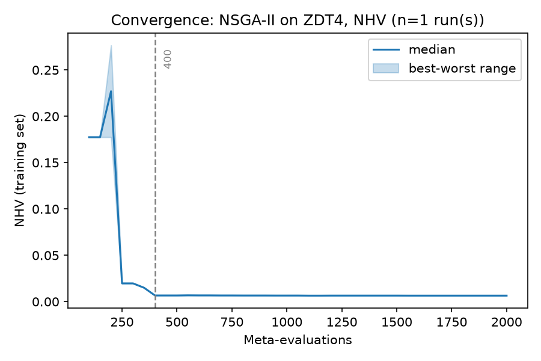
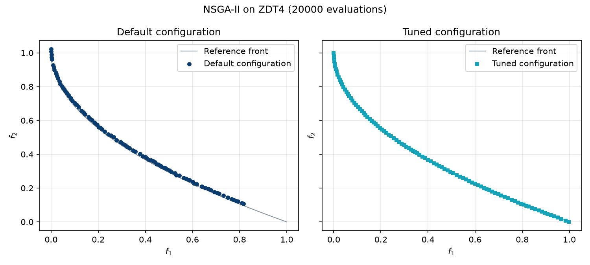

.. _tutorial_meta_optimization_workflow:

E3. Meta-Optimization Workflow
==============================

:Level: Introductory
:Version: 1.0 (2026-09-25)
:Time: about 30 minutes, of which the training takes about 4 minutes
:Timings measured on: Apple M5 Pro (18 cores, 14 of them used by the training), 64 GB of RAM,
   macOS 26.6.2, Java 21.0.12 (Oracle JDK)
:Prerequisites: :doc:`E1. Parameter spaces <parameter_spaces>`, :doc:`E2. Base-level algorithms <base_level_algorithms>`

In tutorial E2 we saw that the configuration of an algorithm matters a lot. This tutorial shows how
Evolver finds good configurations automatically, by **meta-optimization**: another multi-objective
algorithm, the meta-optimizer, searches the parameter space of the algorithm to configure. You will:

- describe a training run: the algorithm to configure, the problem to train it on, the quality
  indicators to optimize, and the meta-optimizer;
- run it, from Java and from the command line, and look at the files it produces;
- choose a configuration from its results and compare it with the default configuration of the
  algorithm.

To keep it quick, the example tunes NSGA-II for a single problem, ZDT4, and runs each configuration
once. Training sets with several problems are the subject of a later tutorial.

The code of this tutorial is the class
`MetaOptimizationWorkflowTutorial <https://github.com/jMetal/Evolver/blob/develop/src/main/java/org/uma/evolver/example/tutorial/MetaOptimizationWorkflowTutorial.java>`_,
in package ``org.uma.evolver.example.tutorial``.

The pieces of a training run
----------------------------

.. code-block:: none

    Meta-optimizer (NSGA-II)
      proposes configurations of the base-level algorithm
        └─> Base-level algorithm (NSGA-II, parameter space NSGAIIDouble.yaml)
              runs each configuration on the training problems (ZDT4)
                └─> Quality indicators of the fronts found (NHV, EP)
                      are the objectives the meta-optimizer minimizes

- The **base level** is the algorithm to configure (tutorial E2), with its parameter space
  (tutorial E1), and the **training set** of problems it is tuned for.
- The **meta-optimizer** treats configurations as solutions: it searches the parameter space, and
  evaluates each configuration by running the base-level algorithm with it on the training set.
  Its **objectives** are **quality indicators** that measure how good the front found by each
  configuration is.

A training run is described by two files, written in YAML and loaded by name from
``src/main/resources/baseLevelConfigurations/`` and
``src/main/resources/metaOptimizerConfigurations/``.

Step 1: the base level
----------------------

.. literalinclude:: ../../src/main/resources/baseLevelConfigurations/TutorialZdt4BaseLevel.yaml
   :language: yaml
   :caption: TutorialZdt4BaseLevel.yaml

NSGA-II, with a population of 100, is tuned for ZDT4, a problem with many local fronts on which the
default NSGA-II struggles. Each configuration is run once (``numberOfIndependentRuns: 1``) with
12000 evaluations.

The file also lists, in ``indicatorNames``, the quality indicators computed on the front found by
each run. They are declared here because they are computed on the fronts of the base-level
algorithm, but they are the **objectives of the meta-optimizer**, which minimizes them:

- **NHV**, the normalized hypervolume, is the main objective, because it accounts for both the
  convergence and the diversity of a front: only a front that is close to the reference front and
  well spread along it gets a low value. It is 0 for a front as good as the reference front, and 1
  for a front that does not dominate the reference point at all.
- **EP**, the Epsilon indicator, is a helper objective. Early in the search many configurations
  produce fronts far from the reference point, which all get NHV = 1: EP still tells them apart,
  and guides the meta-optimizer until NHV starts to improve.

The step loads the file:

.. literalinclude:: ../../src/main/java/org/uma/evolver/example/tutorial/MetaOptimizationWorkflowTutorial.java
   :language: java
   :start-after: // [step-1-start]
   :end-before: // [step-1-end]
   :dedent: 4

Step 2: the meta-optimizer
--------------------------

.. literalinclude:: ../../src/main/resources/metaOptimizerConfigurations/TutorialNSGAIIMetaSearch.yaml
   :language: yaml
   :caption: TutorialNSGAIIMetaSearch.yaml

The meta-optimizer is also NSGA-II, searching the *flat* encoding of the parameter space (each
configuration is a vector of numbers in [0, 1], see :doc:`../concepts/solution_encoding`). It
evaluates 2000 configurations with a population of 50, and evaluates them in parallel on 14 cores:
set ``numberOfCores`` to the number of cores of your machine. The rest of the fields configure the
meta-optimizer's own operators, as in any NSGA-II. In total, the training runs NSGA-II 2000 times,
24 million evaluations of ZDT4.

.. literalinclude:: ../../src/main/java/org/uma/evolver/example/tutorial/MetaOptimizationWorkflowTutorial.java
   :language: java
   :start-after: // [step-2-start]
   :end-before: // [step-2-end]
   :dedent: 4

Step 3: running the training
----------------------------

A ``TrainingRequest`` joins both files with the directory where the results are written, how often
they are written (every 50 evaluations of the meta-optimizer) and how often the progress is
reported. ``TrainingRunner`` runs it:

.. literalinclude:: ../../src/main/java/org/uma/evolver/example/tutorial/MetaOptimizationWorkflowTutorial.java
   :language: java
   :start-after: // [step-3-start]
   :end-before: // [step-3-end]
   :dedent: 4

.. code-block:: none

   Base level: NSGA-II on [ProblemSpec[className=ZDT4, args=[]]] with [12000] evaluations, indicators [Epsilon, NormalizedHypervolume]
   Meta-optimizer: NSGA-II, 2000 configurations
   Training finished in 250 s; results in results/tutorial/E3

The output directory holds:

.. list-table::
   :header-rows: 1
   :widths: 25 75

   * - File
     - Contents
   * - ``METADATA.txt``
     - The settings of the run: meta-optimizer, base level, training set and indicators.
   * - ``INDICATORS.csv``
     - The indicator values of the configurations, at every checkpoint.
   * - ``CONFIGURATIONS.csv``
     - The same configurations, one parameter per column.
   * - ``VAR_CONF.txt``
     - The same configurations as configuration strings, with their indicator values.
   * - ``status.yaml``
     - The progress of the run (``RUNNING``/``FINISHED``/``FAILED``, evaluations done).

At each checkpoint, the files only keep the **non-dominated** configurations of the meta-optimizer's
population: its current front in the NHV/EP space. The last checkpoint is its final front.

How did the training converge?
------------------------------

``INDICATORS.csv`` records the meta-optimizer's front at every checkpoint, so it shows how the
training progressed. The script ``scripts/plot_training_convergence.py`` draws, for each
meta-objective, the median value of the configurations on that front at each checkpoint, a band
between the best and the worst one, and a dashed line at the meta-evaluation where 95% of the total
improvement of the main objective was reached:

.. code-block:: bash

    python scripts/plot_training_convergence.py results/tutorial/E3 --primary NHV \
        --label "NSGA-II on ZDT4"

In this run, NHV reaches 95% of its improvement at meta-evaluation 400: the rest of the budget
barely improves the result, so a smaller budget would have been enough for this problem. The median
can rise for a while, as around meta-evaluation 200: the front of the meta-optimizer changes as new
configurations join it and others leave it. The same script accepts several training
runs of the same experiment (replications), and then pools them, which gives a more reliable picture
of the convergence (see ``scripts/README.md``).

Step 4: choosing a configuration
--------------------------------

The step reads the final front from ``VAR_CONF.txt`` and chooses the configuration with the lowest
NHV, the main objective, using EP only to break ties:

.. literalinclude:: ../../src/main/java/org/uma/evolver/example/tutorial/MetaOptimizationWorkflowTutorial.java
   :language: java
   :start-after: // [step-4-start]
   :end-before: // [step-4-end]
   :dedent: 4

.. code-block:: none

   Configurations on the meta-optimizer's final front:
     NHV = 0.0064, EP = 0.0070
     NHV = 0.0065, EP = 0.0065
     NHV = 0.0065, EP = 0.0063
     NHV = 0.0066, EP = 0.0062

In this run, the final front has four configurations, with very close values: the chosen one has
the lowest NHV. The table compares it with the default configuration of NSGA-II (the one in
``defaultConfigurations/NSGAIIDoubleDefault.txt``, used in tutorial E2):

.. list-table:: Default and tuned configurations of NSGA-II (— = parameter not active)
   :header-rows: 1
   :widths: 40 30 30

   * - Parameter
     - Default
     - Tuned
   * - ``algorithmResult``
     - ``population``
     - ``externalArchive``
   * - ``populationSizeWithArchive``
     - —
     - ``103``
   * - ``archiveType``
     - —
     - ``spatialSpreadDeviationArchive``
   * - ``createInitialSolutions``
     - ``default``
     - ``cauchy``
   * - ``offspringPopulationSize``
     - ``100``
     - ``10``
   * - ``variation``
     - ``crossoverAndMutationVariation``
     - ``crossoverAndMutationVariation``
   * - ``crossover``
     - ``SBX``
     - ``SDX``
   * - ``crossoverProbability``
     - ``0.9``
     - ``0.1606``
   * - ``crossoverRepairStrategy``
     - ``bounds``
     - ``random``
   * - ``sdxCrossoverF``
     - —
     - ``0.337``
   * - ``mutation``
     - ``polynomial``
     - ``powerLaw``
   * - ``mutationProbabilityFactor``
     - ``1.0``
     - ``0.7144``
   * - ``mutationRepairStrategy``
     - ``bounds``
     - ``random``
   * - ``powerLawMutationDelta``
     - —
     - ``6.106``
   * - ``selection``
     - ``tournament``
     - ``tournament``
   * - ``selectionTournamentSize``
     - ``2``
     - ``8``
   * - ``sbxDistributionIndex``
     - ``20.0``
     - —
   * - ``polynomialMutationDistributionIndex``
     - ``20.0``
     - —

The tuned configuration has little to do with the default one: it keeps an external archive (the
algorithm evolves a population of 103 solutions and returns an archive of up to 100), initializes the
population with a Cauchy distribution, produces 10 offspring per generation instead of 100, and
uses other crossover, mutation and selection settings.

Step 5: comparing it with the default configuration
---------------------------------------------------

The last step runs NSGA-II on ZDT4 with the default configuration and with the chosen one, with a
larger budget than in the training (20000 evaluations, ``VALIDATION_EVALUATIONS``), and writes both
fronts to ``results/tutorial/E3/validation``:

.. literalinclude:: ../../src/main/java/org/uma/evolver/example/tutorial/MetaOptimizationWorkflowTutorial.java
   :language: java
   :start-after: // [step-5-start]
   :end-before: // [step-5-end]
   :dedent: 4

.. code-block:: none

   Default configuration on ZDT4: EP = 0.1079, NHV = 0.0391
   Chosen configuration on ZDT4:  EP = 0.0066, NHV = 0.0063

The script ``scripts/plot_fronts.py`` draws each front in its own panel, against the reference front
of ZDT4 (the thin line), with the same axes in both panels:

.. code-block:: bash

    python scripts/plot_fronts.py resources/referenceFronts/ZDT4.csv \
        --front "Default configuration=results/tutorial/E3/validation/default/FUN.csv" \
        --front "Tuned configuration=results/tutorial/E3/validation/tuned/FUN.csv" \
        --title "NSGA-II on ZDT4 (20000 evaluations)" --output fronts.png

With 20000 evaluations, both configurations reach the region of the reference front of ZDT4, but
the default one does not cover all of it: its front stops at about f\ :sub:`1` = 0.82, while the
tuned one spreads along the whole front. That is why its indicators are much worse (NHV = 0.039 and
EP = 0.108, against 0.0063 and 0.0066): the tuned configuration improves both the convergence and
the diversity of the front, which is what NHV rewards.

These values come from a single run of each configuration, as the training values do. A reliable
comparison between configurations needs several runs of each and a statistical test, which is the
subject of the validation tutorial (E9); training with several runs per configuration
(``numberOfIndependentRuns``) also makes the training values more reliable, at a higher cost.

The meta-optimizer runs its evaluations in parallel, so a training run cannot be reproduced exactly:
your results will differ from the ones shown here.

Running the training from the command line
------------------------------------------

The same training can be run without writing Java code, with ``TrainingRunnerMain`` and a request
file that joins both configuration files:

.. literalinclude:: ../../src/main/resources/cli/training/tutorial-e3-request.yaml
   :language: yaml
   :caption: tutorial-e3-request.yaml

``TrainingRunnerMain`` writes ``results.yaml`` (and, unless told otherwise, ``status.yaml``) next to
the request file, so copy it to a working directory of its own first. From the root of the Evolver
repository:

.. code-block:: bash

    mvn -DskipTests package
    mkdir -p results/tutorial/E3-cli
    cp src/main/resources/cli/training/tutorial-e3-request.yaml results/tutorial/E3-cli/request.yaml
    java -cp target/Evolver-<version>-jar-with-dependencies.jar \
        org.uma.evolver.cli.training.TrainingRunnerMain results/tutorial/E3-cli/request.yaml

While it runs, ``status.yaml`` shows its progress; when it finishes, ``results.yaml`` points to the
output files. See :doc:`../utilities/cli_tools` for the details of the request files.

Running the tutorial
--------------------

Run ``MetaOptimizationWorkflowTutorial`` from your IDE, or from the root of the Evolver repository:

.. code-block:: bash

    java -cp target/Evolver-<version>-jar-with-dependencies.jar \
        org.uma.evolver.example.tutorial.MetaOptimizationWorkflowTutorial

Try it yourself
---------------

- Change ``numberOfIndependentRuns`` to 3 in the base-level file. How much longer does the training
  take, and how close are the values of step 5 to the training values now?
- Use IGD+ as the main objective instead of NHV
  (``indicatorNames: [Epsilon, InvertedGenerationalDistancePlus]``), and choose by it in step 4.
- Use AGE-MOEA as meta-optimizer: ``algorithm: AGE-MOEA`` in the meta-search file, plus
  ``agemoeaVariant: agemoea`` among its operators.
- Tune another algorithm: change ``algorithmName`` and ``yamlParameterSpaceFile``, for instance to
  MOEA/D (see ``MoeadZdt4BaseLevel.yaml``, which also sets the weight vectors it needs).

What's next
-----------

- Training sets with several problems, other indicators and evaluation budgets (tutorial E7),
  analyzing the results of a training (E8), and validating a configuration (E9) come in later
  tutorials.
- :doc:`../concepts/meta_optimization_approach` and
  :doc:`../concepts/meta_optimization_level_metaheuristics` describe the approach and the available
  meta-optimizers in depth.
