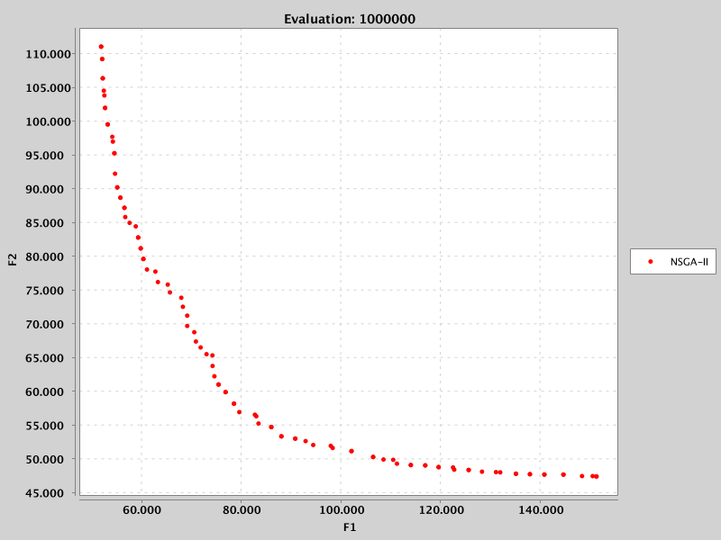
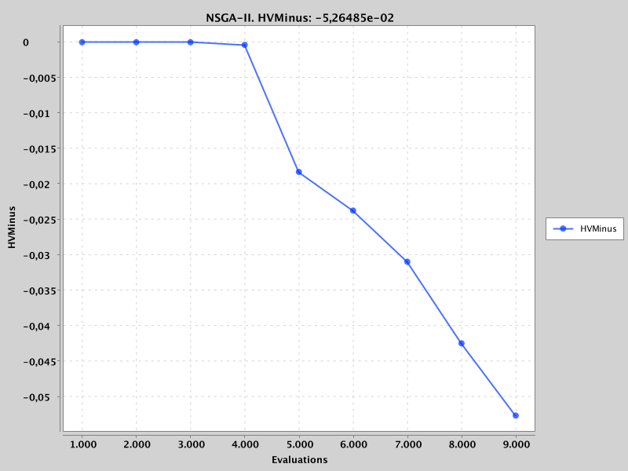
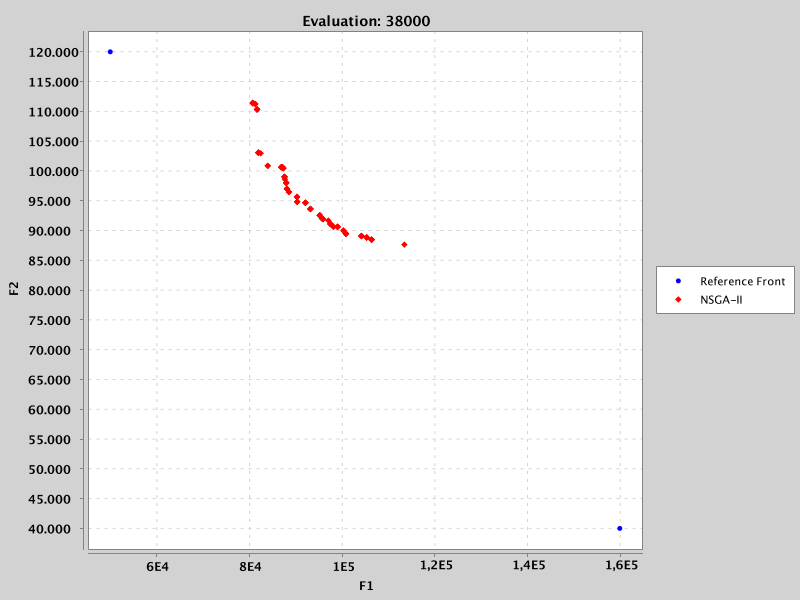

.. _reference_fronts:

.. _tutorial_problems_without_reference_front:

E9. Problems Without a Reference Front
=======================================

:Level: Intermediate
:Version: 1.0 (2026-10-05)
:Time: about 30 minutes, plus the optional runs of the examples
:Prerequisites: :doc:`E3. Meta-optimization workflow <meta_optimization_workflow>`,
   :doc:`E6. Training sets, indicators and budgets <training_sets_indicators_budgets>`;
   recommended: :doc:`E10. Binary and permutation encodings <binary_and_permutation_encodings>`

The quality indicators that the meta-optimizer minimizes compare the fronts found by the base-level
algorithm with a reference front. For the benchmark problems bundled with Evolver (ZDT, DTLZ, WFG,
...) that front is known, and it is in ``resources/referenceFronts/``. For real-world problems it is
usually unknown. This tutorial explains what can be done then, with the bi-objective travelling
salesman problem (TSP) as example: which indicators still work, how to estimate what they need, how
to train, and how to validate. It uses the TSP training and validation of tutorial E10.

Step 1: what each indicator needs
---------------------------------

The indicators need different information about the problem:

.. list-table::
   :header-rows: 1
   :widths: 30 70

   * - Indicator
     - Needs
   * - HV, and HV− (``HypervolumeMinus``, the hypervolume to be minimized)
     - A **reference point**, and bounds to normalize the objectives. Two points are enough: their
       minimum and maximum values give the bounds, and the reference point.
   * - EP, IGD+, NHV, Spread, ...
     - A **complete reference front**: they measure distances to its points, or compare with its
       hypervolume.

With only two points, the hypervolume is therefore the only indicator whose values are meaningful.
jMetal reads them from a file with the format of a reference front, and does not accept a single
point: the file must have at least two, whose extreme values define the bounds.

Step 2: three situations
------------------------

- **The exact front is known**: the benchmark problems, whose fronts are in
  ``resources/referenceFronts/`` (ZDT5's, for instance, is computed exactly, tutorial E10).
- **A good approximation is known**: the RE problems, real-world engineering problems whose
  reference fronts are the approximations published with the suite (``resources/referenceFronts/``,
  1500 points for each problem with three objectives). ``resources/extremePointsFronts/`` holds,
  for the RE and RWA problems, only the ideal and the nadir points of those fronts.
- **Nothing is known**: the TSP instances, and most problems of a user. ``resources/referenceFrontsTSP/``
  holds two extreme points for each of the bi-objective instances used in E10 (KroAB100, KroAC100,
  KroAD100 and KroAE100), and the rest of this tutorial is about that situation.

Step 3: estimating the extreme points
-------------------------------------

A way of finding a reference front is to run several algorithms many times, merge their fronts and
keep the non-dominated points, but it is costly and gives no guarantee of a good front. For the
hypervolume, two points that bound the region where the fronts lie are enough.

For ``KroAB100TSP``, whose objectives are the lengths of a route with the distances of ``kroA100``
and of ``kroB100``, a long run of NSGA-II gives a front from which to estimate them. The example
`NSGAIIBiObjectiveTSPExample <https://github.com/jMetal/Evolver/blob/develop/src/main/java/org/uma/evolver/example/baselevel/tuned/NSGAIIBiObjectiveTSPExample.java>`_
runs NSGA-II for 1,000,000 evaluations on it:

The extreme points of that front are (151374, 47399) and (51932, 111026). With a conservative margin,
the reference front of ``KroAB100TSP.csv`` is (160000, 40000) and (50000, 120000): the bounds are
[50000, 160000] for the first objective and [40000, 120000] for the second, and the reference point
is (160000, 120000).

The example
`NSGAIIBiObjectiveWithObserversTSPExample <https://github.com/jMetal/Evolver/blob/develop/src/main/java/org/uma/evolver/example/baselevel/features/NSGAIIBiObjectiveWithObserversTSPExample.java>`_
checks those points: it runs NSGA-II with observers that plot HV− and the front during the run.
The first figure shows the evolution of HV− during the first 9000 evaluations, and the second one
the front after 38000 evaluations, together with the two extreme points:

HV− is 0 for the fronts of the first 4000 evaluations, because none of their points dominates the
reference point, and then decreases as the front moves into the box defined by the two points.

Step 4: what goes wrong with bad extreme points
-----------------------------------------------

The points must bound the region where the fronts **can** lie, not only where the first fronts lie.
The validation of tutorial E10 shows what happens otherwise. The extreme points of the other three
instances are much closer to each other than those of KroAB100:

.. list-table:: Extreme points in ``resources/referenceFrontsTSP/``
   :header-rows: 1
   :widths: 30 35 35

   * - Instance
     - First objective
     - Second objective
   * - ``KroAB100TSP``
     - [50000, 160000]
     - [40000, 120000]
   * - ``KroAC100TSP``
     - [73406, 110809]
     - [70615, 111131]
   * - ``KroAD100TSP``
     - [72638, 120293]
     - [67940, 96537]
   * - ``KroAE100TSP``
     - [68316, 119162]
     - [73654, 113805]

The tuned NSGA-II of E10 finds routes of about 25000 for ``kroA100``, far below the lower bound of
those boxes, and so does the standard NSGA-II with 125000 evaluations in most runs. Their fronts
dominate the whole box, and the hypervolume saturates: measured with those points, both algorithms
had a median HV between 0.997 and 1.000 on KroAC100, KroAD100 and KroAE100, while on KroAB100,
whose box is larger, the values were 0.608 and 0.820. A saturated hypervolume cannot tell the
algorithms apart.

The lesson is that the **ideal point**, the lower bounds, must be below the best values that can be
reached, not just below the values of a first run. For the TSP there is a principled choice: the
length of the optimal route of each distance matrix, which TSPLIB publishes (21282 for ``kroA100``,
22141 for ``kroB100``, 20749 for ``kroC100``, 21294 for ``kroD100`` and 22068 for ``kroE100``). No
route of a bi-objective instance can be shorter in either objective. The **nadir point**, the upper
bounds and the reference point, must be above the values of the fronts of interest: a margin over
the worst extreme values of a long run, as for KroAB100.

Step 5: training with HV− and EP
--------------------------------

The meta-objectives must be minimized, so the training uses HV− instead of HV. HV− alone has a
drawback: at the start of a training, many configurations produce fronts that do not reach the
box, so their HV− is 0, a plateau on which the meta-optimizer cannot tell them apart. EP is added
as a **helper objective**: measured against the two extreme points its values have no meaning of
their own (they can even be negative, when a front goes beyond the points), but they still order
the configurations whose HV− is 0, and guide the meta-optimizer until HV− improves. This is the
role EP plays next to NHV in the trainings of tutorials E3 to E8.

The TSP training of tutorial E10 (``TutorialKroTspPermutationBaseLevel.yaml``) is configured that
way:

.. code-block:: yaml

   indicatorNames: [HypervolumeMinus, Epsilon]

and its ``VAR_CONF.txt`` shows the two effects: the chosen configuration has HV− = −0.717 and
EP = −0.031, a negative value that only reflects that its fronts go beyond the extreme points.

Step 6: validating without a reference front
--------------------------------------------

A validation has two options:

- **The hypervolume with fixed extreme points.** It is the only valid indicator, and its values are
  comparable between studies that use the same points. It needs good points (Step 4): with the
  points of KroAC100, KroAD100 and KroAE100 it saturates.
- **A reference front built from the study**: the non-dominated points of all the runs of all the
  algorithms of the study, one front per problem (jMetal's ``GenerateReferenceParetoFront``,
  between ``ExecuteAlgorithms`` and ``ComputeQualityIndicators``). It is a complete front, so EP,
  IGD+ and HV can all be computed, and the fronts are normalized with its own bounds, so the
  hypervolume does not saturate. The values are relative to the study: adding an algorithm changes
  the reference front, and so the values of all the others.

The validation of E10 uses the second option (``EncodingsTutorial.runPermutation``). Against the
reference front of the study, the tuned NSGA-II has a median HV between 0.72 and 0.75 on the four
instances and the standard one between 0.52 and 0.55, with significant differences on all of them,
including the two instances where the hypervolume with the extreme points saturated.

What to report
--------------

When a problem has no reference front, a study should state:

- how the extreme points, or the reference point, were obtained (runs, budgets, margins, known
  optima), and their values;
- which indicators were used for the training and for what (HV− as the objective, EP as a helper);
- for the validation, whether the indicators use fixed points (and that only the hypervolume is
  valid then) or a reference front built from the study (and which algorithms and runs built it).

Try it yourself
---------------

- Build better extreme points for KroAC100, KroAD100 and KroAE100, with the TSPLIB optima as the
  ideal point and a margin over a long run of NSGA-II as the nadir point, and validate the
  configuration of E10 with the hypervolume and those points: does it still saturate?
- Run ``NSGAIIBiObjectiveWithObserversTSPExample`` with the extreme points of ``KroAC100TSP.csv``
  instead (and ``KroAC100TSP`` as the problem): when does HV− stop changing?
- Add a third algorithm to the TSP validation of ``EncodingsTutorial`` (for instance MOEA/D for
  permutations) and compare the values of NSGA-II with those of E10.

What's next
-----------

- :doc:`E10 <binary_and_permutation_encodings>` tunes NSGA-II for the TSP with these indicators.
- :doc:`E8 <validating_a_configuration>` explains the statistical analysis of a validation.
