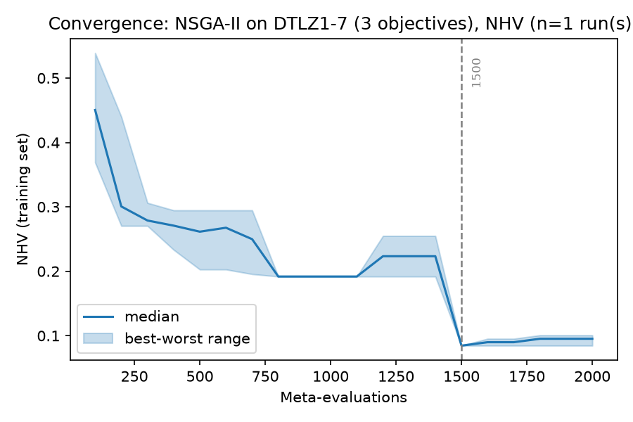
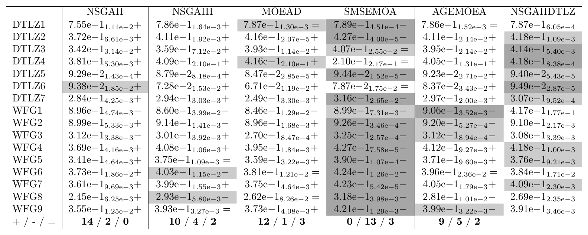
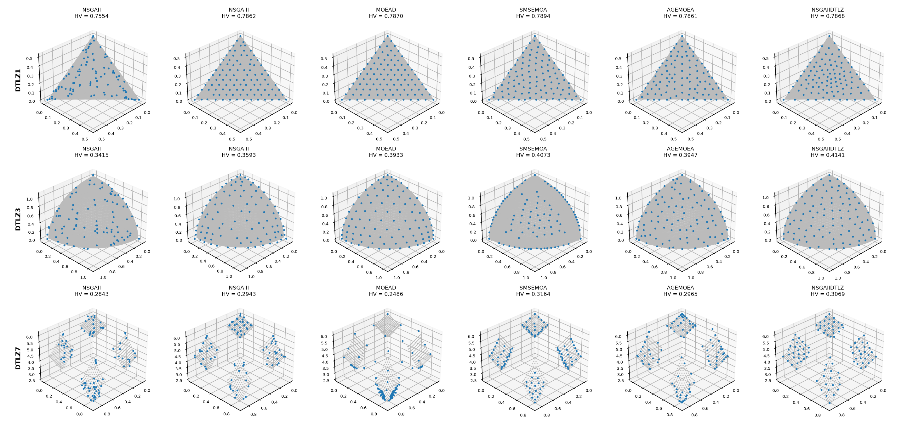

.. _tutorial_training_sets_indicators_budgets:

E7. Training Sets, Indicators and Budgets
=========================================

:Level: Intermediate
:Time: about 1 hour, of which the training takes about 35 minutes and the validation about 15
:Timings measured on: Apple M5 Pro (18 cores, 16 of them used by the training and the validation),
   64 GB of RAM, macOS 26.6.2, Java 21.0.12 (Oracle JDK)
:Prerequisites: :doc:`E2. Base-level algorithms <base_level_algorithms>`,
   :doc:`E3. Meta-optimization workflow <meta_optimization_workflow>`

Tutorial E3 tuned NSGA-II for a single problem, ZDT4. A configuration tuned that way is good for
ZDT4, but nothing tells us how it behaves on other problems. This tutorial designs a more realistic
training run and validates its result, deciding the four things that define a training:

- the **training set**: which problems the algorithm is tuned for;
- the **quality indicators**: the objectives of the meta-optimizer;
- the **budgets**: how many evaluations the base-level algorithm gets in each run, and how many
  configurations the meta-optimizer tries;
- the **independent runs** of each configuration.

The case study tunes NSGA-II for the DTLZ1-7 problems with three objectives, and then validates the
configuration found against the standard NSGA-II, NSGA-III, MOEA/D, SMS-EMOA and AGE-MOEA, on those
problems and on the WFG1-9 problems, which the training never saw.

The code of this tutorial is in two classes: the training,
`AsyncNSGAIIOptimizingNSGAIIForBenchmarkDTLZ <https://github.com/jMetal/Evolver/blob/develop/src/main/java/org/uma/evolver/example/training/dtlz/AsyncNSGAIIOptimizingNSGAIIForBenchmarkDTLZ.java>`_
(package ``org.uma.evolver.example.training.dtlz``), and the validation,
`TrainingSetsValidationTutorial <https://github.com/jMetal/Evolver/blob/develop/src/main/java/org/uma/evolver/example/tutorial/TrainingSetsValidationTutorial.java>`_
(package ``org.uma.evolver.example.tutorial``).

How a configuration is evaluated
--------------------------------

When the meta-optimizer evaluates a configuration, the base-level algorithm is run with it on every
problem of the training set, as many times as ``numberOfIndependentRuns`` says. For each run:

1. the non-dominated solutions of the result are taken as the front found;
2. the front is **normalized** with the minimum and maximum values of each objective in the
   reference front of the problem;
3. each quality indicator is computed on the normalized front, against the normalized reference
   front.

Then, for each problem, the value of each indicator is the **median** of its runs, and each
objective of the meta-optimizer is the **mean** of that value over the problems of the training
set. Normalizing is what makes that mean meaningful: the objectives of DTLZ1 range up to 0.5 and
those of DTLZ7 up to 6, and without it the problems with the largest values would dominate the
mean.

The cost of a training run follows from the same scheme: the number of configurations tried times
the number of problems, times the number of runs, times the evaluations of each run. Every choice
below affects it.

Step 1: the training set and the meta-optimizer
-----------------------------------------------

The training is described by the same two parts as in tutorial E3, here written as YAML text blocks
inside the class:

.. literalinclude:: ../../src/main/java/org/uma/evolver/example/training/dtlz/AsyncNSGAIIOptimizingNSGAIIForBenchmarkDTLZ.java
   :language: java
   :start-after: // [step-1-start]
   :end-before: // [step-1-end]
   :dedent: 2

The training set
~~~~~~~~~~~~~~~~

A configuration tuned for a single problem risks **overfitting** it: it may exploit features of
that problem that other problems do not share. A training set with several problems pushes the
meta-optimizer towards configurations that work on all of them. Some criteria to choose them:

- **Variety**: DTLZ1-7 have linear, concave, degenerate and disconnected fronts, and some of them
  (DTLZ1 and DTLZ3) have many local fronts.
- **The same number of objectives**: the indicator values of problems with two and three
  objectives are not comparable, so they should not be mixed in the mean. All of them have three
  objectives here.
- **A reference front for each problem**: ``resources/referenceFronts/`` has them for the
  benchmark families; their names give the number of objectives (``DTLZ1.3D.csv``). Problems
  without a reference front are the subject of tutorial E10.
- **Cost**: every problem added multiplies the cost of the training.

The problems are given as three lists of the same length: the problems (``trainingProblemNames``),
their reference fronts (``trainingReferenceFrontFileNames``) and the evaluations of each run on each
problem (``trainingEvaluations``). A problem can be given by a short name, as here, or by the fully
qualified name of any jMetal problem class, with constructor arguments if needed (see
:doc:`../utilities/cli_tools`).

The indicators
~~~~~~~~~~~~~~

``indicatorNames`` lists the objectives of the meta-optimizer, which minimizes them:

- **NHV**, the normalized hypervolume, is the main one, because it accounts for both the
  convergence and the diversity of the fronts.
- **EP**, the Epsilon indicator, helps early in the search, when many configurations get the worst
  NHV value but still differ in EP.

Other choices are possible: IGD+ (``InvertedGenerationalDistancePlus``) instead of NHV, or HV−
(``HypervolumeMinus``), which only needs a reference point instead of a reference front and is the
one to use when there is no reference front (tutorial E10). From Java, the number of evaluations
can also be an objective (``EvaluationsQualityIndicator``), to look for configurations that
converge fast. Two objectives are the usual choice: they give a front of configurations that is easy
to read and to choose from.

The budgets
~~~~~~~~~~~

The budget of the **validation** follows the literature: studies with the DTLZ and WFG problems
with three objectives usually give each algorithm 40000 or 50000 evaluations. The validation
below uses 50000.

The budget of the **training** is a decision of its own, and a key one in real applications.
Meta-optimizing is expensive: its cost grows linearly with the evaluations of each base-level run.
The training budget should be small enough for the training to be affordable, but large enough
for the configurations it finds to be competitive when they are validated with the full budget.
This case study trains with **10000 evaluations per problem**, a fifth of the validation budget,
which makes the training five times cheaper than training with 50000.

The risk of a small training budget is that it rewards configurations that converge fast but may
stall, or lose diversity, when they are given more evaluations. Only the validation with the full
budget tells whether the compromise worked; if it does not, the training is repeated with a larger
budget (for instance, 15000 evaluations).

From Java, the training budget can also vary: a ``RandomRangeEvaluationsStrategy`` draws the
evaluations of each run from a range, which favours configurations that work well for different
budgets. It is passed to the meta-optimization problem instead of the fixed budget:

.. code-block:: java

    EvaluationBudgetStrategy budget = new RandomRangeEvaluationsStrategy(5000, 15000);
    var problem =
        new MetaOptimizationProblem<>(
            baseAlgorithm, problems, referenceFrontFileNames, indicators, budget, 1);

The meta-optimizer tries 2000 configurations (``metaMaxEvaluations``), with a population of 50. In
total, the training runs NSGA-II 2000 × 7 = 14000 times, 140 million evaluations of the DTLZ
problems.

The meta-optimizer is the asynchronous version of NSGA-II (``AsyncNSGA-II``): the time it takes to
evaluate a configuration varies a lot from one configuration to another, and instead of waiting for
the slowest evaluation of each generation, it gives a new configuration to each core as soon as it
is free. ``numberOfCores`` is 16 here: set it to the number of cores of your machine.

Independent runs
~~~~~~~~~~~~~~~~

Each configuration is run once on each problem (``numberOfIndependentRuns: 1``). The indicator
values of a single run are noisy, and the meta-optimizer can be misled by a lucky run. The results
below show it: the final front of this training includes the **same configuration twice**, with NHV
values of 0.085 and 0.101. With 3 or 5 runs the median is more reliable, at 3 or 5 times the cost.
One run is a reasonable choice when the budget is tight and the training set has several problems,
since the mean over the problems already smooths the noise; the validation is what confirms the
result.

Step 2: running the training
----------------------------

.. literalinclude:: ../../src/main/java/org/uma/evolver/example/training/dtlz/AsyncNSGAIIOptimizingNSGAIIForBenchmarkDTLZ.java
   :language: java
   :start-after: // [step-2-start]
   :end-before: // [step-2-end]
   :dedent: 4

From the root of the repository:

.. code-block:: bash

    mvn -DskipTests package
    java -cp target/Evolver-<version>-jar-with-dependencies.jar \
        org.uma.evolver.example.training.dtlz.AsyncNSGAIIOptimizingNSGAIIForBenchmarkDTLZ

The training took about 35 minutes. The results are written to ``results/tutorial-e7/training``,
with the same files as in tutorial E3. Those files keep only the non-dominated configurations of
each checkpoint; ``WRITE_POPULATION`` also writes the whole population of the meta-optimizer to
``POPULATION_INDICATORS.csv`` and ``POPULATION_CONFIGURATIONS.csv`` (``writePopulation: true`` in a
request file). When the training finishes, the live plot described below stays open with the final
population: closing its window ends the program.

The same training can be run from the command line with the bundled request
``src/main/resources/cli/training/async-nsgaii-dtlz3d-request.yaml``, which uses 8 cores (see
:doc:`../utilities/cli_tools`).

Watching the training
~~~~~~~~~~~~~~~~~~~~~

``FRONT_PLOT_FREQUENCY`` opens a window that plots the configurations of the meta-optimizer's
population in the EP-NHV space, updated every 100 evaluations. These are three snapshots of this
run (the axes use the decimal separator of the system's language):

.. list-table::
   :widths: 33 33 33

   * - .. figure:: ../figures/tutorials/e7-meta-front-100.png
          :alt: Population of the meta-optimizer after 100 evaluations

          After 100 evaluations
     - .. figure:: ../figures/tutorials/e7-meta-front-1000.png
          :alt: Population of the meta-optimizer after 1000 evaluations

          After 1000 evaluations
     - .. figure:: ../figures/tutorials/e7-meta-front-1900.png
          :alt: Population of the meta-optimizer after 1900 evaluations

          After 1900 evaluations

After 100 evaluations, the configurations are scattered: EP goes up to 18 and NHV from 0.37 to
0.84. After 1000, the population has moved to NHV values between 0.19 and 0.34. After 1900, most of
it is around NHV = 0.2, and three configurations stand out, with NHV between 0.08 and 0.10: they are
the final front of the meta-optimizer.

The convergence plot of tutorial E3 shows the same from the output files:

.. code-block:: bash

    python scripts/plot_training_convergence.py results/tutorial-e7/training --primary NHV \
        --label "NSGA-II on DTLZ1-7 (3 objectives)"

NHV stalls at about 0.19 between meta-evaluations 800 and 1400, and drops to 0.085 at 1500, when
the meta-optimizer finds a different kind of configuration. With a budget of 1500 configurations,
this run would have ended on the plateau: the budget of the meta-optimizer matters as much as the
budget of the base level.

Step 3: choosing the configuration
----------------------------------

As in tutorials E3 and E4, the chosen configuration is the one with the lowest NHV on the final
front of the meta-optimizer, the last block of ``VAR_CONF.txt``. This command saves it to
``results/tutorial-e7/best-configuration.txt``, where the validation reads it:

.. code-block:: bash

    awk '/^# Evaluation/ {block = ""} / \| / {block = block $0 "\n"} END {printf "%s", block}' \
        results/tutorial-e7/training/VAR_CONF.txt \
      | sed 's/.*NHV=\([^ ]*\) | \(.*\)/\1 \2/' | sort -g | head -1 | cut -d' ' -f2- \
      > results/tutorial-e7/best-configuration.txt

In this run it has NHV = 0.085 and EP = 0.065 on the training set:

.. list-table:: Default and tuned configurations of NSGA-II (— = parameter not active)
   :header-rows: 1
   :widths: 40 30 30

   * - Parameter
     - Default
     - Tuned on DTLZ1-7
   * - ``algorithmResult``
     - ``population``
     - ``externalArchive``
   * - ``populationSizeWithArchive``
     - —
     - ``46``
   * - ``archiveType``
     - —
     - ``angleArchive``
   * - ``createInitialSolutions``
     - ``default``
     - ``cauchy``
   * - ``offspringPopulationSize``
     - ``100``
     - ``5``
   * - ``crossover``
     - ``SBX``
     - ``SDX``
   * - ``crossoverProbability``
     - ``0.9``
     - ``0.0825``
   * - ``crossoverRepairStrategy``
     - ``bounds``
     - ``bounds``
   * - ``sbxDistributionIndex`` / ``sdxCrossoverF``
     - ``20.0``
     - ``0.633``
   * - ``mutation``
     - ``polynomial``
     - ``linkedPolynomial``
   * - ``mutationProbabilityFactor``
     - ``1.0``
     - ``0.131``
   * - ``mutationRepairStrategy``
     - ``bounds``
     - ``round``
   * - ``polynomialMutationDistributionIndex`` / ``linkedPolynomialMutationDistributionIndex``
     - ``20.0``
     - ``104.0``
   * - ``selection``
     - ``tournament``
     - ``random``

The tuned configuration evolves a small population of 46 solutions, 5 offspring at a time, with
little variation: crossover is applied with probability 0.08, and the mutation probability is
0.131 / n per variable, with a high distribution index, which makes small steps. The diversity of
the result comes from the external archive, which keeps 100 solutions spread by the angles they
form in the objective space. It is a very exploitative configuration: the validation tells whether
it pays off with 50000 evaluations and on other problems.

Step 4: validation
------------------

The validation is a jMetal experiment (``ExperimentBuilder``) that runs six algorithms, with 50000
evaluations and a population of 100, on DTLZ1-7 (the training problems) and WFG1-9 (problems the
training never saw), all with three objectives:

- the standard NSGA-II, first, and the tuned NSGA-II (``NSGAIIDTLZ``), last;
- NSGA-III, MOEA/D, SMS-EMOA and AGE-MOEA, four algorithms designed for or commonly used with
  three or more objectives, with their default configurations
  (``src/main/resources/defaultConfigurations/``); MOEA/D reads its weight vectors from
  ``resources/weightVectors/W3D_100.dat``.

Each algorithm is run 15 times on each problem. This is enough for a tutorial; a real study should
use 30 or more runs.

.. literalinclude:: ../../src/main/java/org/uma/evolver/example/tutorial/TrainingSetsValidationTutorial.java
   :language: java
   :start-after: // [step-3-start]
   :end-before: // [step-3-end]
   :dedent: 4

From the root of the repository:

.. code-block:: bash

    java -cp target/Evolver-<version>-jar-with-dependencies.jar \
        org.uma.evolver.example.tutorial.TrainingSetsValidationTutorial

It took about 15 minutes. The fronts of every run are written to
``results/tutorial-e7/validation/data``, and the values of the indicators (EP, HV and IGD+) of every
run to ``results/tutorial-e7/validation/QualityIndicatorSummary.csv``.

The statistical tables are generated from that file with
`SAES <https://github.com/jMetal/SAES>`_, a Python library for the statistical analysis of empirical
studies (``pip install SAES``), with the script ``scripts/wilcoxon_pivot_tables.py``:

.. code-block:: bash

    python scripts/wilcoxon_pivot_tables.py \
        results/tutorial-e7/validation/QualityIndicatorSummary.csv \
        --pivot NSGAIIDTLZ --order NSGAII,NSGAIII,MOEAD,SMSEMOA,AGEMOEA,NSGAIIDTLZ \
        --output-dir results/tutorial-e7/tables --png

It writes a **Wilcoxon pivot table** per indicator, in LaTeX and as an image. Each cell has the
median and, as a subscript, the interquartile range of the 15 runs. The tuned configuration is the
**pivot**, in the last column: every other cell is compared with it using the Wilcoxon rank-sum
test (significance level 0.05), and marked ``+`` if the pivot is significantly better, ``-`` if it
is significantly worse, and ``=`` if the difference is not significant. The best and second-best
medians of each problem are shaded dark and light gray, and the last row counts the ``+``, ``-``
and ``=`` of each algorithm.

   Hypervolume (HV, higher is better), 50000 evaluations, 15 runs.

   IGD+ (lower is better), 50000 evaluations, 15 runs.

The tables compare the algorithms problem by problem. A **critical difference plot** compares them
over all the problems at once: each algorithm is placed by its average rank (the mean over the
problems of its Friedman rank, computed on the medians), and a bar joins the algorithms whose
average ranks differ by less than the critical difference of the Nemenyi test (``CD``, for a
significance level of 0.05), meaning that their differences are not significant. The script
``scripts/critical_difference_plots.py`` draws them with SAES as well:

.. code-block:: bash

    python scripts/critical_difference_plots.py \
        results/tutorial-e7/validation/QualityIndicatorSummary.csv \
        --indicators HV,IGD+ --output-dir results/tutorial-e7/tables

.. list-table::
   :widths: 50 50

   * - .. figure:: ../figures/tutorials/e7-cdplot-hv.png
          :alt: Critical difference plot of HV

          HV
     - .. figure:: ../figures/tutorials/e7-cdplot-igdplus.png
          :alt: Critical difference plot of IGD+

          IGD+

Reading the results
~~~~~~~~~~~~~~~~~~~

**Did the training budget work?** Yes. Trained with 10000 evaluations and run with 50000, the tuned
NSGA-II is significantly better than the standard one on 14 of the 16 problems in HV (13 in IGD+),
and worse only on 2. Training with a fifth of the validation budget found a competitive
configuration.

**On the training problems (DTLZ1-7)**, the tuned NSGA-II beats the standard NSGA-II and NSGA-III on
all seven, and MOEA/D and AGE-MOEA on six (the seventh, DTLZ1, is a tie with both). Against
SMS-EMOA, which selects its solutions by their contribution to the hypervolume, it ties on three
(DTLZ3, DTLZ4 and DTLZ6) and loses on four by small margins; on those three it has the best median
of all.

**On the problems it never saw (WFG1-9)**, the picture is mixed. The tuned NSGA-II is better than the
standard NSGA-II on 7 of the 9 problems and than MOEA/D on 6, but it loses to NSGA-III on 4, to
AGE-MOEA on 5 and to SMS-EMOA on all of them. On WFG1 it is clearly worse than every other algorithm
(HV = 0.42, against 0.85 to 0.91). WFG1 biases the distribution of its solutions and has a flat
region in its search space, features that no DTLZ problem has; a plausible explanation is that a
configuration with so little variation cannot overcome them, and nothing in the training set told
the meta-optimizer so.

**Over all the problems**, the critical difference plots rank the tuned NSGA-II second in HV, after
SMS-EMOA, and third in IGD+, after SMS-EMOA and AGE-MOEA. With 16 problems and six algorithms the
critical difference is large (2.149): in HV, the tuned NSGA-II is significantly better than the
standard NSGA-II and not significantly different from the rest, SMS-EMOA included; in IGD+, it is
not significantly different from any of them. The two analyses answer different questions: the
tables show significant differences on each problem, while the plots compare ranks over the whole
set of problems, which needs larger differences to be significant.

This is the main lesson about training sets: a configuration generalizes to problems that resemble
the ones it was trained on. To tune NSGA-II for both families, the training set should include
problems like WFG, at the price of a more expensive training.

Representative fronts
~~~~~~~~~~~~~~~~~~~~~

The tables say which differences are significant, not how large they are. The script
``scripts/plot_median_fronts.py`` draws, for each problem and algorithm, the front of the run with
the median HV, over the reference front (in gray):

.. code-block:: bash

    python scripts/plot_median_fronts.py results/tutorial-e7/validation \
        --problems DTLZ1,DTLZ3,DTLZ7 --algorithms NSGAII,NSGAIII,MOEAD,SMSEMOA,AGEMOEA,NSGAIIDTLZ \
        --reference-fronts resources/referenceFronts --reference-suffix .3D.csv \
        --output median-fronts.png

   Fronts with the median HV of each algorithm on DTLZ1, DTLZ3 and DTLZ7 (50000 evaluations).
   Each panel has its own axes.

- On **DTLZ1**, the tuned NSGA-II reaches the front and covers it as evenly as NSGA-III, MOEA/D,
  SMS-EMOA and AGE-MOEA, while the standard NSGA-II leaves gaps. SMS-EMOA has a significantly
  better HV, but the difference is in the third decimal (0.7894 against 0.7868): with 15 runs and
  small interquartile ranges, very small differences are significant.
- On **DTLZ3**, a problem with many local fronts, all of them reach the front with 50000
  evaluations, although the standard NSGA-II leaves gaps. The tuned NSGA-II has the highest HV
  (0.414, against 0.407 of SMS-EMOA); its points are spread over the whole front, while those of
  SMS-EMOA gather on its edges, which is how a selection based on the contribution to the
  hypervolume distributes them.
- On **DTLZ7**, with four disconnected regions, the tuned NSGA-II covers the four of them, as
  SMS-EMOA does, while the median run of MOEA/D concentrates its solutions in one region.

On the problems it was trained for, the fronts of the tuned configuration have the expected
quality; its weak point is the problems it was not trained for, such as WFG1.

Try it yourself
---------------

- Train with 15000 evaluations per problem (``trainingEvaluations``) and repeat the validation. Is
  the gain over the standard NSGA-II larger, and is it worth the extra cost?
- Add some WFG problems to the training set (for instance WFG1, WFG4 and WFG9, with
  ``WFGn.3D.csv`` as their reference fronts) and see whether the tuned configuration improves on
  WFG1.
- Train with ``numberOfIndependentRuns: 3``: does the final front still contain the same
  configuration with different values?
- Generate the table of EP as well (``WilcoxonPivot_EP.png``) and compare it with the other two.

What's next
-----------

- Analyzing the results of a training (E8) and designing and interpreting validation studies (E9)
  come in later tutorials.
- Tutorial E10 covers problems without a reference front, with HV− as meta-objective.
- :doc:`../concepts/meta_optimization_level_metaheuristics` describes the available meta-optimizers.
