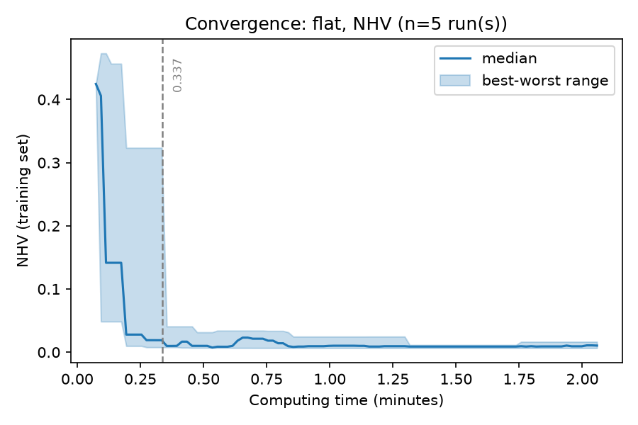
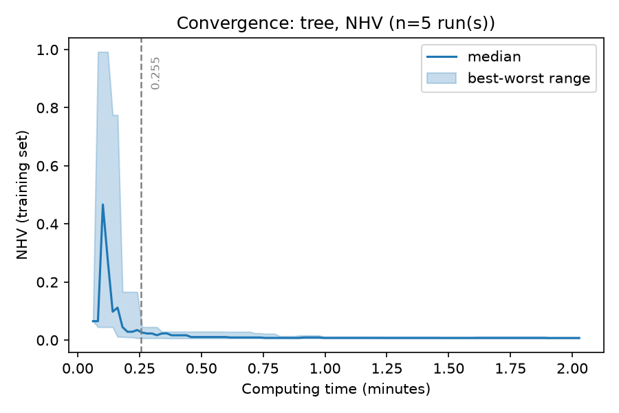

.. _tutorial_tree_versus_flat_encoding:

E14. Tree Versus Flat Encoding
==============================

:Level: Advanced
:Version: 1.0 (2026-10-06)
:Time: about 30 minutes, plus the trainings of Step 5 (optional, about 21 minutes)
:Timings measured on: Apple M5 Pro (18 cores, 14 of them used by the trainings), 64 GB of RAM,
   macOS 26.6.2, Java 21.0.12 (Oracle JDK), Python 3.11
:Prerequisites: :doc:`E5. Designing your own parameter space <designing_parameter_spaces>`,
   :doc:`E13. Choosing the meta-optimizer <choosing_the_meta_optimizer>`,
   :doc:`E11. Budgets: evaluations or time <budgets>`

The meta-optimizer searches configurations of the base-level algorithm, and it needs a way to
represent them. Evolver has two. The **flat encoding** turns every parameter of the space into a
real number in [0, 1], so a configuration is a vector of fixed length and any continuous optimizer
can search it. The **tree encoding** represents a configuration as a derivation tree of the grammar
that the parameter space defines, which holds only the parameters that are active in it.

The page :doc:`../concepts/solution_encoding` describes both encodings, their data structures and
their operators; this tutorial does not repeat it. It **measures** what that page states, on the
parameter space of NSGA-II: how many variables of the flat vector are active in a configuration, and
how many mutations change nothing. Then it runs a simple experiment, the training of tutorial E3
with each encoding and the same time, to see whether the difference shows in a training.

When the tree encoding pays off, precisely, is an open question that would need a systematic study
(several base-level algorithms, spaces, budgets and meta-optimizers). The experiment of this tutorial
is an illustration, not that study.

The code is the class
`TreeEncodingTutorial <https://github.com/jMetal/Evolver/blob/develop/src/main/java/org/uma/evolver/example/tutorial/TreeEncodingTutorial.java>`_
(package ``org.uma.evolver.example.tutorial``).

Step 1: the grammar of a parameter space
----------------------------------------

A parameter space is a grammar in disguise. Each categorical parameter is a choice between
productions, one per value; the parameters that a value activates are what that production
contains; and numeric parameters are terminals with a range. ``GrammarConverter.toBnf`` writes it
explicitly:

.. literalinclude:: ../../src/main/java/org/uma/evolver/example/tutorial/TreeEncodingTutorial.java
   :language: java
   :start-after: // [step-1-start]
   :end-before: // [step-1-end]
   :dedent: 4

For ``NSGAIIDouble.yaml`` (abridged):

.. code-block:: none

    <start> ::= <algorithmResult> <createInitialSolutions> <offspringPopulationSize> <variation> <selection>
    <algorithmResult> ::= "population" | "externalArchive" <populationSizeWithArchive> <archiveType>
    <populationSizeWithArchive> ::= INTEGER[10, 200]
    <archiveType> ::= "crowdingDistanceArchive" | "unboundedArchive" | ... | "knnDistanceArchive" <knnDistanceArchiveK> | "angleArchive"
    <variation> ::= "crossoverAndMutationVariation" <crossover> <mutation>
    <crossover> ::= "SBX" <crossoverProbability> <crossoverRepairStrategy> <sbxDistributionIndex>
                  | "blxAlpha" <crossoverProbability> <crossoverRepairStrategy> <blxAlphaCrossoverAlpha>
                  | "wholeArithmetic" <crossoverProbability> <crossoverRepairStrategy>
                  | ...
    <sbxDistributionIndex> ::= DOUBLE[5.0, 400.0]
    <selection> ::= "tournament" <selectionTournamentSize> | "random" | "boltzmann" <boltzmannTemperature> | ...

A configuration is a derivation of this grammar: one production chosen for every choice, and a value
for every terminal it reaches. With ``SBX`` as the crossover, ``sbxDistributionIndex`` is part of
the configuration and ``blxAlphaCrossoverAlpha`` is not. The tree encoding stores exactly that
derivation. The flat encoding stores a number for **every** parameter of the space, the 34 that
tutorial E5 counted for this space, and decides which ones matter when it decodes the vector.

Step 2: inactive variables
--------------------------

How many of those 34 numbers matter in a configuration? The program draws 10000 random
configurations with each encoding and counts:

.. literalinclude:: ../../src/main/java/org/uma/evolver/example/tutorial/TreeEncodingTutorial.java
   :language: java
   :start-after: // [step-2-start]
   :end-before: // [step-2-end]
   :dedent: 4

.. code-block:: none

    Flat encoding: 34 variables; active in a random configuration: mean 14.8, median 15, min 12, max 19
    Tree encoding: parameters in a random tree: mean 14.8, median 15, min 12, max 19

Both encodings describe the same configurations, so the active parameters are the same: about 15. The
difference is that the flat vector carries **19 more numbers on average that have no effect**: more
than half of the dimensions of the problem that the meta-optimizer solves are, in each configuration,
irrelevant. They are not useless for the search (a variable that is inactive now becomes active when a
categorical value changes, and keeps the value it had), but the meta-optimizer cannot know which ones
matter.

Step 3: neutral mutations
-------------------------

A mutation that changes nothing still costs a meta-evaluation: the configuration is run again on
the training problems. The program applies 10000 mutations of each encoding, with the settings of
the meta-optimizers of the tutorials (polynomial mutation with probability 1/34 per variable and
distribution index 20 for the flat encoding, ``TreeMutation`` with distribution index 5 for the tree),
and checks whether the decoded configuration changed:

.. literalinclude:: ../../src/main/java/org/uma/evolver/example/tutorial/TreeEncodingTutorial.java
   :language: java
   :start-after: // [step-3-start]
   :end-before: // [step-3-end]
   :dedent: 4

.. code-block:: none

    Flat mutations: 36.5 % changed no variable, 45.6 % changed only variables that are inactive or do not change the decoded value, 17.8 % changed the configuration
    Tree mutations: 0.0 % left the configuration unchanged

**82 % of the flat mutations leave the configuration as it was.** They fail for three reasons:

- **No variable is mutated** (36.5 %): with a probability of 1/34 per variable, none of the 34 is
  chosen with probability (1 − 1/34)\ :sup:`34` ≈ 0.36. This is the usual setting of polynomial
  mutation, not a peculiarity of the flat encoding.
- **The mutated variables are inactive** in that configuration (the 19 of Step 2).
- **The decoded value does not change**: a small step of a variable that encodes a categorical or
  an integer parameter rarely leaves its bin (0.40 and 0.42 both give the second of three values).

The tree mutation, instead, always picks one of the nodes of the configuration and changes it: it
never mutates an inactive parameter, a categorical node always takes a *different* value, and
integer nodes always move.

Two remarks put the figure in context. In a training the flat meta-optimizer also applies SBX
crossover, with probability 0.9, which usually changes several variables at once, so the share of
offspring identical to a parent is much smaller than 82 %; the measure is of the mutation alone. And
an offspring that changes the configuration is not necessarily a better one: the step sizes of
the two mutations are different, and the tree's distribution index (5) is provisional
(``docs/proposals/tree-mutation.md``).

Step 4: what changes in a training
----------------------------------

The base level does not change: the same base-level file serves both encodings. What changes is the
meta-optimizer configuration. The tree version of the meta-optimizer of E11 is
``TutorialTimeTreeNSGAIIMetaSearch.yaml``:

.. literalinclude:: ../../src/main/resources/metaOptimizerConfigurations/TutorialTimeTreeNSGAIIMetaSearch.yaml
   :language: yaml
   :caption: TutorialTimeTreeNSGAIIMetaSearch.yaml

``encoding: tree`` selects it. The crossover is always the subtree crossover and the mutation the tree
mutation, so the file gives only their probabilities and the distribution index, where the flat
file names the operators (SBX and polynomial mutation) and their parameters. Not every meta-optimizer
works with trees (tutorial E13): NSGA-II, AGE-MOEA, ``AsyncNSGA-II`` and ``RandomSearch`` do, SMPSO and
SPEA2 do not.

The output files are the same: ``INDICATORS.csv``, ``CONFIGURATIONS.csv`` and ``VAR_CONF.txt``, with the
configuration strings of the front. ``METADATA.txt`` says ``Encoding: Derivation Tree (GGGP)`` and
names the meta-optimizer ``TreeNSGA-II``.

Step 5: an experiment
---------------------

The experiment is the training of tutorial E3 (NSGA-II tuned for ZDT4, 12000 evaluations per
configuration, NHV and EP as meta-objectives) with NSGA-II as the meta-optimizer, once with each
encoding, both stopped after **2 minutes** of computing time on 14 cores: the flat one with the
meta-optimizer of E11 (``TutorialTimeNSGAIIMetaSearch.yaml``), the tree one with the file of Step 4. A
training is a stochastic search, so each one is repeated **5 times**, alternating the encodings so
that both get the same conditions of the machine:

.. literalinclude:: ../../src/main/java/org/uma/evolver/example/tutorial/TreeEncodingTutorial.java
   :language: java
   :start-after: // [step-4-start]
   :end-before: // [step-4-end]
   :dedent: 4

The ten trainings took 21 minutes. For each one, the program reads the meta-evaluations it performed
(``METADATA.txt``) and the best NHV of its final front (``INDICATORS.csv``):

.. list-table:: Trainings of 2 minutes, 5 per encoding
   :header-rows: 1
   :widths: 20 40 40

   * - Encoding
     - Meta-evaluations (median; range)
     - Best NHV of the final front (median; range)
   * - Flat
     - 1450; 1350 to 2300
     - 0.0075; 0.0064 to 0.0111
   * - Tree
     - 2000; 1450 to 3000
     - 0.0068; 0.0064 to 0.0077

The convergence of the NHV of the front over time, with the 5 trainings of each encoding pooled
(``scripts/plot_training_convergence.py results/tutorial/tree-vs-flat/flat --primary NHV --x time``, and the
same for ``tree``):

What the results say, and what they do not:

- **Both encodings reach the same quality.** The best trainings of each are equal (0.0064), and the
  medians (0.0075 and 0.0068) are not significantly different: the Wilcoxon rank-sum test gives
  p = 0.60. With 5 trainings per encoding only a large difference would be detected, so this is
  "no difference found", not "no difference".
- **The tree trainings are more regular.** Their worst value (0.0077) is close to their best; two of
  the flat trainings ended clearly worse (0.0104 and 0.0111). That is the kind of difference a
  larger experiment should look at, but with 5 trainings it is an observation, not a result.
- **Both converge early.** The dashed line marks when 95 % of the improvement had been reached:
  after about 15 seconds with the tree encoding and 20 with the flat one (0.26 and 0.34
  minutes, medians). The rest of the 2 minutes refines the front a little. On this problem, the
  training of E3 is easy for both.
- **The number of meta-evaluations varies more within each encoding than between them** (1350 to
  2300 flat, 1450 to 3000 tree; p = 0.12). The cost of a meta-evaluation depends on the
  configurations each training happens to explore, since some run faster than others, so the
  number of meta-evaluations is not a measure of the cost of the encoding.

The figures are illustrative: one base-level algorithm, one training problem, a training of 2
minutes, and the provisional distribution index of the tree mutation. Measuring when the tree
encoding pays off would need a study of its own: several algorithms and spaces (a space with more
conditional parameters has more inactive variables), longer trainings, more replications, and the
validation of the configurations found.

Step 6: when to use each
------------------------

With the measures of Steps 2 and 3 and the experiment above:

- **The flat encoding** works with every meta-optimizer (SMPSO and SPEA2 only work with it), its
  operators are the standard ones of continuous optimization, and it is the one used by most of the
  tutorials and examples. It is a reasonable default.
- **The tree encoding** never spends a mutation on an inactive parameter or on a value that decodes
  to the same configuration, and its search space is the configurations themselves. One would
  expect its advantage to grow with the share of inactive variables (spaces with many categorical
  choices, each with its own sub-parameters), but this tutorial has not measured it. In the experiment above it was as good as the flat one, and its trainings
  varied less, on a space where more than half of the variables are inactive.
- **When unsure**, run both with the same time, as this tutorial does, before committing to one for
  a long study: it costs two trainings, and it answers the question for *your* algorithm, space and
  training set.

Run it yourself
---------------

Run ``TreeEncodingTutorial`` from your IDE, or from the root of the Evolver repository. Without
arguments it runs Steps 1 to 3, in a few seconds; with ``train`` it also runs the trainings of
Step 5 and summarizes them; with ``summary`` it only summarizes trainings already run:

.. code-block:: bash

    java -cp target/Evolver-<version>-jar-with-dependencies.jar \
        org.uma.evolver.example.tutorial.TreeEncodingTutorial train

Set ``numberOfCores`` in both meta-optimizer files to what your machine has.

Try it yourself
---------------

- Measure Steps 2 and 3 for MOEA/D (``MOEADDouble.yaml``) or SMS-EMOA: which space has more inactive
  variables?
- Repeat Step 3 for the flat encoding with a mutation probability of 2/34 or 3/34 (in the code, the
  first argument of ``PolynomialMutation``; ``mutationProbabilityFactor`` 2 or 3 in a meta-optimizer
  file). How much does the share of neutral mutations drop?
- Run the experiment of Step 5 with a distribution index of 20 for the tree mutation
  (``mutationDistributionIndex: 20.0``), and with ``AGE-MOEA`` (``MetaAGEMOEATreeConfiguration.yaml``
  and its flat counterpart).
- Run the experiment with more time per training (10 minutes): does the difference between the
  encodings change?

What's next
-----------

- :doc:`../concepts/solution_encoding` is the reference on both encodings and their operators.
- :doc:`E13 <choosing_the_meta_optimizer>` lists the meta-optimizers that support each encoding.
- :doc:`E8 <validating_a_configuration>` explains how to validate the configurations a training
  finds, which is what would tell whether the configurations of each encoding generalize.
