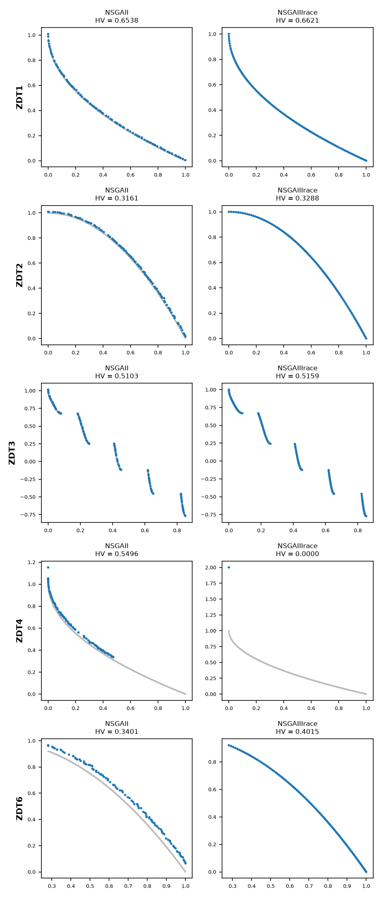

.. _irace_integration:

E14. Tuning with irace
======================

:Level: Advanced
:Version: 1.0 (2026-10-05)
:Time: about 1 hour, of which irace takes about 40 minutes
:Timings measured on: Apple M5 Pro (18 cores, 16 of them used by irace and the validation),
   64 GB of RAM, macOS 26.6.2, Java 21.0.12 (Oracle JDK), R 4.6.1, irace 4.4.3
:Prerequisites: :doc:`E1. Parameter spaces <parameter_spaces>`,
   :doc:`E2. Base-level algorithms <base_level_algorithms>`, and R installed

`irace <https://mlopez-ibanez.github.io/irace/>`_ is a widely used tool for automatic algorithm
configuration. This tutorial shows how to use it to tune one of Evolver's configurable algorithms,
NSGA-II, for the ZDT problems: from the generation of the files irace needs to the use of the
configuration it finds.

Evolver has its own way of tuning its algorithms, the meta-optimization of tutorials E3, E7 and E8.
This tutorial does not compare the two approaches: it only shows how to use irace with Evolver.
How they compare is an open question.

The code of this tutorial is the class
`IraceTutorial <https://github.com/jMetal/Evolver/blob/develop/src/main/java/org/uma/evolver/example/tutorial/IraceTutorial.java>`_,
in package ``org.uma.evolver.example.tutorial``, and the files in ``src/main/resources/irace/``.

What irace does, and what Evolver provides
------------------------------------------

irace tunes an algorithm by **iterated racing**. In each iteration, it samples a set of candidate
configurations, and runs them on the training instances one after another. After each block of
instances, a statistical test discards the configurations that are significantly worse than the
best ones, so that the budget concentrates on the promising ones. The surviving configurations,
the *elites*, bias the sampling of the next iteration. Every run of a configuration on an instance
is an **experiment**, and each experiment returns a single number, which irace minimizes.

irace does not know anything about the algorithm it tunes. It needs:

- a **parameter file**, describing the parameters, their types, ranges and conditions;
- a **target runner**, a program that receives a configuration and an instance, runs the algorithm
  and prints the value to minimize;
- the **training instances**, and a **scenario** file with the settings of irace.

Evolver provides the first two: it generates the parameter file from the same YAML parameter space
used everywhere else (tutorial E1), and its package ``org.uma.evolver.irace`` includes target
runners for NSGA-II.

Step 1: the parameter file
--------------------------

The generator ``IraceParameterDescriptionGenerator`` reads a parameter space and prints its
parameters in irace's format. It takes two arguments: the YAML file of the parameter space, here
``NSGAIIDouble.yaml``, and the parameter factory that reads it, which depends on the encoding of the
algorithm (``Double``, ``Binary``, ``Permutation``, or ``MOPSO`` for the parameter spaces of MOPSO):

.. code-block:: bash

    mvn -DskipTests package
    java -cp target/Evolver-<version>-jar-with-dependencies.jar \
        org.uma.evolver.irace.IraceParameterDescriptionGenerator \
        NSGAIIDouble.yaml Double > parameters-NSGAII.txt

This is an excerpt of the result (the file bundled in ``src/main/resources/irace/`` is the complete
one):

.. code-block:: none

    algorithmResult     "--algorithmResult "    c  (population, externalArchive)
    archiveType         "--archiveType "        c  (crowdingDistanceArchive, unboundedArchive, ...) | algorithmResult %in% c("externalArchive")
    crossover           "--crossover "          c  (SBX, blxAlpha, ..., SDX)  | variation %in% c("crossoverAndMutationVariation")
    crossoverProbability "--crossoverProbability " r (0.0 , 1.0)          | crossover %in% c("SBX", ...)
    sbxDistributionIndex "--sbxDistributionIndex " r (5.0 , 400.0)        | crossover %in% c("SBX")

Each line has the name of a parameter, the prefix irace writes before its value on the command
line, its type (``c`` categorical, ``i`` integer, ``r`` real) and its values or range. The
conditions after ``|`` translate the relations of the parameter space: ``sbxDistributionIndex`` is
only active when ``crossover`` is ``SBX``, as in the YAML file. The command-line prefixes are those
of Evolver's configuration strings, so a configuration sampled by irace is a valid configuration
string for ``DoubleNSGAII``. The same command works for any other parameter space, bundled or of
your own: for instance, ``MOEADPermutation.yaml Permutation`` or ``MOPSO.yaml MOPSO``.

Step 2: the target runner
-------------------------

For each experiment, irace runs a command like this one (the configuration is a sample of the
parameter space):

.. code-block:: bash

    java -cp Evolver-jar-with-dependencies.jar org.uma.evolver.irace.AutoNSGAIIIraceHVEP \
        --randomGeneratorSeed 1234 \
        --problemName org.uma.jmetal.problem.multiobjective.zdt.ZDT4 \
        --referenceFrontFileName ZDT4.csv --maximumNumberOfEvaluations 8000 --populationSize 100 \
        --algorithmResult population --crossover SBX --crossoverProbability 0.9 ...

``AutoNSGAIIIraceHVEP`` builds NSGA-II with the configuration, runs it on the problem with the given
budget and seed, and prints one number: **−HV + EP** of the front found, both computed on the front
normalized with the bounds of the reference front. Minimizing it means maximizing the hypervolume
and minimizing the Epsilon indicator.

Why both indicators, and not only the hypervolume (``AutoNSGAIIIraceHV`` prints −HV)? When a front
does not dominate the reference point of the hypervolume, its HV is 0, however close it is to the
reference front. On a hard problem with a small budget, such as ZDT4 with 8000 evaluations, this
happens to most configurations: the HV gives irace no information to tell them apart, while EP
still does. The same reason leads Evolver's meta-optimization to use EP as a helper objective
besides NHV (tutorial E3). We first ran this tutorial with the HV runner: the configuration irace
found worked well on ZDT1, ZDT3 and ZDT6, but its fronts on ZDT2 and ZDT4 had HV = 0 in most runs;
with −HV + EP, ZDT2 is solved (see step 6).

The runner applies the seed irace passes (``--randomGeneratorSeed``): irace runs all the
configurations with the same seeds on each instance, so that they are compared under the same
conditions, and any experiment can be reproduced.

Step 3: the instances and the scenario
--------------------------------------

The training instances are the ZDT problems. Each line of ``instances-list-ZDT.txt`` is an
instance, with the arguments the runner receives for it:

.. literalinclude:: ../../src/main/resources/irace/instances-list-ZDT.txt
   :language: none
   :caption: instances-list-ZDT.txt

The scenario file joins everything:

.. literalinclude:: ../../src/main/resources/irace/scenario-NSGAII.txt
   :language: r
   :caption: scenario-NSGAII.txt

- ``targetRunner``, ``targetRunnerLauncher`` and ``targetCmdline`` tell irace how to run an
  experiment: ``java -cp`` the Evolver JAR, the runner class, and irace's placeholders for the seed,
  the instance and the configuration.
- ``maxExperiments`` is the budget, in experiments. irace computes a minimum from the number of
  parameters and the test settings, and stops with an "Insufficient budget" error below it: 3640
  here. With 10000, irace sampled about 300 configurations in 8 iterations: the races discard most
  of them after a few blocks, and spend most of the budget on the best ones.
- ``blockSize = 5`` makes irace take the instances in blocks of five, one pass over the training
  set, so that configurations are always compared after running on all the problems.

Step 4: running irace
---------------------

irace is an R package: the script ``run.sh`` installs the bundled ``irace_4.4.3.tar.gz`` in a local
``R/`` directory and runs irace on a scenario. Prepare a working directory with the files of
``src/main/resources/irace/``, the Evolver JAR (with the generic name the scenario uses) and a link
to the reference fronts, and run it from there. From the root of the repository:

.. code-block:: bash

    mvn -DskipTests package
    mkdir -p results/tutorial-e14
    cp src/main/resources/irace/* results/tutorial-e14/
    ln -s "$(pwd)"/target/Evolver-*-jar-with-dependencies.jar \
        results/tutorial-e14/Evolver-jar-with-dependencies.jar
    ln -s "$(pwd)"/resources results/tutorial-e14/resources
    cd results/tutorial-e14
    N_CPUS=16 ./run.sh scenario-NSGAII.txt 1

The second argument of ``run.sh`` is the number of the run: it sets irace's seed and the execution
directory, ``execdir-1``. ``N_CPUS`` is the number of experiments run in parallel (8 by default).
Each experiment starts a Java virtual machine and takes a fraction of a second, and irace took about
40 minutes. It writes its progress and results to ``execdir-1/irace.stdout.txt``.

Step 5: the best configuration
------------------------------

``irace.stdout.txt`` shows, for each iteration, the race (one row per block of instances, with the
number of configurations still alive), and ends with the elite configurations. The last section
lists them as command lines, from best to worst:

.. code-block:: none

    # Best configurations as commandlines (first number is the configuration ID; ...):
    253 --algorithmResult externalArchive --populationSizeWithArchive 119
        --archiveType unboundedArchive --createInitialSolutions sobol --offspringPopulationSize 1
        --variation crossoverAndMutationVariation --crossover laplace --crossoverProbability 0.9115
        --crossoverRepairStrategy bounds --laplaceCrossoverScale 0.1019 --mutation powerLaw
        --mutationProbabilityFactor 0.5656 --mutationRepairStrategy bounds
        --powerLawMutationDelta 6.7027 --selection tournament --selectionTournamentSize 8
    272 --algorithmResult externalArchive --populationSizeWithArchive 65 ...

The first step of the class reads the first of them, removes the identifier that begins the line,
and saves it:

.. literalinclude:: ../../src/main/java/org/uma/evolver/example/tutorial/IraceTutorial.java
   :language: java
   :start-after: // [step-1-start]
   :end-before: // [step-1-end]
   :dedent: 4

The configuration found evolves a population of 119 solutions producing a single offspring per
generation (a steady-state NSGA-II), initialized with a Sobol sequence, with Laplace crossover and
power-law mutation, and returns an unbounded external archive of the non-dominated solutions found,
reduced to 100 at the end. The other elite configurations share this structure and differ in their
numerical parameters.

Step 6: applying the configuration
----------------------------------

A simple validation applies the configuration to the ZDT problems, with a larger budget than in the
tuning (15000 evaluations) and 15 runs per problem, together with the standard NSGA-II as a
reference:

.. literalinclude:: ../../src/main/java/org/uma/evolver/example/tutorial/IraceTutorial.java
   :language: java
   :start-after: // [step-2-start]
   :end-before: // [step-2-end]
   :dedent: 4

From the root of the repository:

.. code-block:: bash

    java -cp target/Evolver-<version>-jar-with-dependencies.jar \
        org.uma.evolver.example.tutorial.IraceTutorial
    python scripts/plot_median_fronts.py results/tutorial-e14/validation \
        --problems ZDT1,ZDT2,ZDT3,ZDT4,ZDT6 --algorithms NSGAII,NSGAIIIrace \
        --reference-fronts resources/referenceFronts --output median-fronts.png

The figure shows, for each problem, the front of the run with the median HV of each configuration,
over the reference front (in gray):

   Fronts with the median HV of the standard NSGA-II and of the configuration found by irace on
   the ZDT problems (15000 evaluations).

- On **ZDT1, ZDT2, ZDT3 and ZDT6**, the configuration found reaches the reference front and covers
  it evenly, with a higher HV than the standard NSGA-II; on ZDT6, where the standard NSGA-II does
  not reach the front, the difference is clear.
- On **ZDT4**, a problem with many local fronts, it fails in every run: its front collapses into a
  single point far from the reference front (HV = 0), while the standard NSGA-II reaches it. The
  other elite configurations of irace behave the same way.

This is not an error, but a consequence of how irace compares configurations: by default, it ranks
them on each instance and tests the differences of their ranks. A configuration that is the best on
four problems out of five ranks better than one that is good on all five, even if it fails on the
fifth, and ZDT4 is the problem on which the configurations sampled by irace struggle most with 8000
evaluations. It is a known behavior of tuning with a training set, reported in the literature: a
configuration is only as good as the training set, the budget and the aggregation of the instances
make it. Giving ZDT4 more weight (repeating it in the list of instances), a larger budget, or tuning
for it separately are ways to address it.

This is a check that the configuration works, not a statistical study: :doc:`E9 <validating_a_configuration>` covers how to
validate a configuration properly.

Try it yourself
---------------

- Run irace with the HV runner (``AutoNSGAIIIraceHV`` in ``targetCmdline``) and look at the fronts
  of the configuration it finds on ZDT2 and ZDT4.
- Repeat the ZDT4 line in ``instances-list-ZDT.txt`` (and adapt ``blockSize``), or give it a larger
  budget: does irace find a configuration that also works on ZDT4?
- Run irace several times (``./run.sh scenario-NSGAII.txt 2``, ``3``, …): do the replications find
  similar configurations?
- Tune MOEA/D instead: generate its parameter file with ``IraceParameterDescriptionGenerator
  MOEADDouble.yaml Double``, and write its target runner following ``AutoNSGAIIIraceHVEP`` (MOEA/D
  also needs the directory of its weight vectors).

What's next
-----------

- :doc:`E9 <validating_a_configuration>` covers the validation of a configuration.
- :doc:`E3 <meta_optimization_workflow>` and :doc:`E8 <analyzing_training_results>` show Evolver's
  own meta-optimization.
