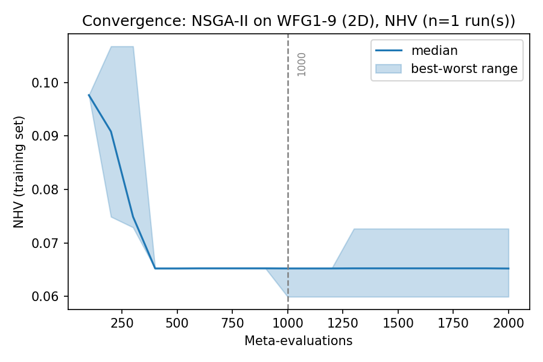
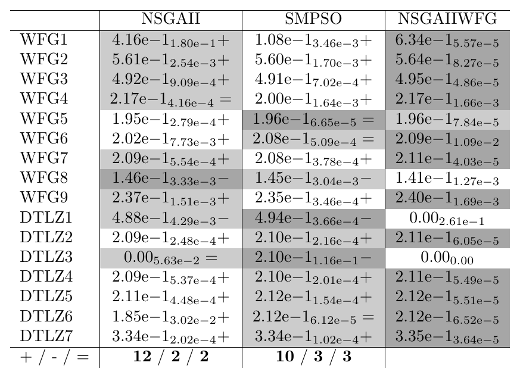
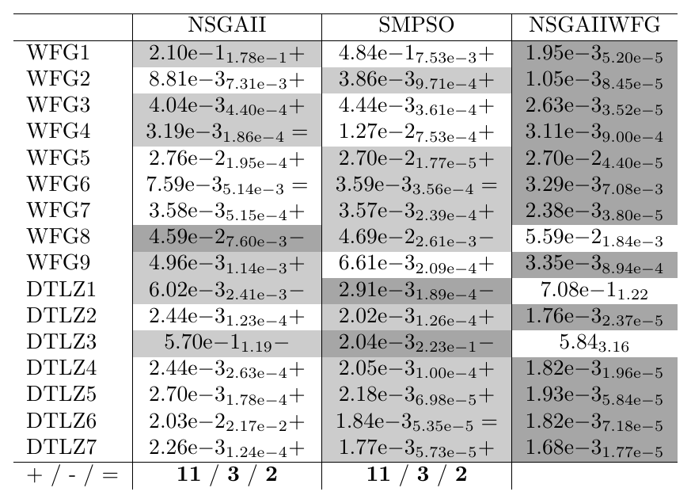
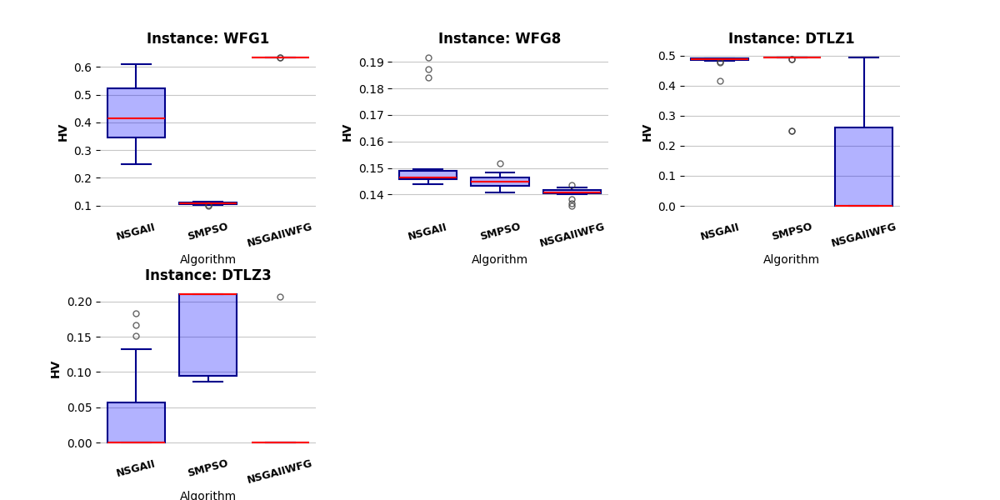
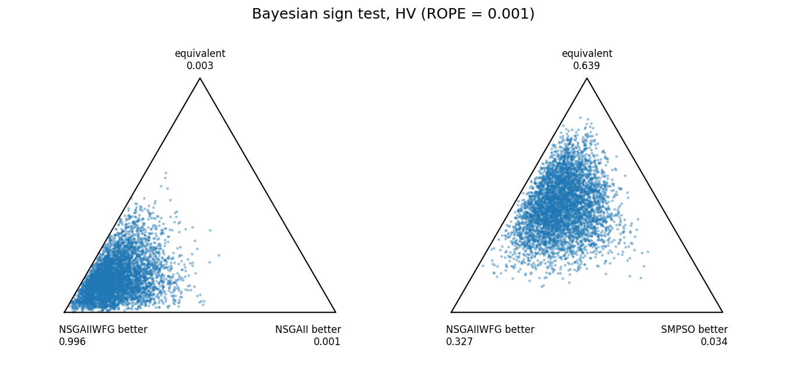
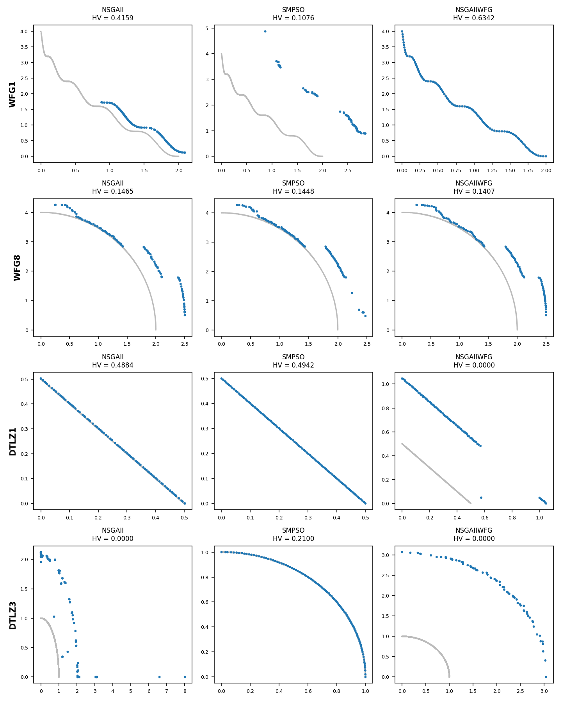

.. _tutorial_validating_a_configuration:

E8. Validating a Configuration
==============================

:Level: Intermediate
:Version: 1.0 (2026-10-05)
:Time: about 1 hour, of which the training (optional) takes about 17 minutes and the validation
   about 5
:Timings measured on: Apple M5 Pro (18 cores, 16 of them used by the training and the validation),
   64 GB of RAM, macOS 26.6.2, Java 21.0.12 (Oracle JDK), Python 3.11, SAES 1.5.0, SciPy 1.17
:Prerequisites: :doc:`E3. Meta-optimization workflow <meta_optimization_workflow>`,
   :doc:`E6. Training sets, indicators and budgets <training_sets_indicators_budgets>`,
   :doc:`E11. Budgets: evaluations or time <budgets>`

A training run ends with a configuration that was good on the training problems, in the runs of
the training. Whether it is good, and where, is the question of a **validation study**: new runs of
the configuration and of other algorithms, with the budget used in the literature, on problems seen
and not seen during the training, analyzed with statistical tests. Tutorials E6 and E7 ran
validation studies and showed their tables; this one explains how to design one, and what each
analysis tells and does not tell.

The example repeats, with Evolver, the case study of the first work on automatic configuration
with jMetal: A.J. Nebro, M. López-Ibáñez, C. Barba-González and J. García-Nieto, *Automatic
Configuration of NSGA-II with jMetal and irace*, GECCO 2019 Companion, pp. 1374-1381
(`doi:10.1145/3319619.3326832 <https://doi.org/10.1145/3319619.3326832>`_). There, irace tuned
NSGA-II for the bi-objective WFG problems, and the configuration found, *AutoNSGAII*, was compared
with the standard NSGA-II and SMPSO on WFG1-9 and DTLZ1-7. Here Evolver does the tuning, and the
question is whether the conclusions are the same.

The code of this tutorial is the class
`ValidationTutorial <https://github.com/jMetal/Evolver/blob/develop/src/main/java/org/uma/evolver/example/tutorial/ValidationTutorial.java>`_,
in package ``org.uma.evolver.example.tutorial``, and the analysis scripts in ``scripts/``.

What a validation answers
-------------------------

The values a training reports cannot support a claim about the configuration it found:

- **They are biased.** The configuration was chosen *because* its values were the best ones among
  thousands, so part of its advantage is luck: a configuration that had a lucky run is more likely
  to be chosen than an equally good one that had an unlucky run. With one run per configuration the
  effect can be large: in tutorial :doc:`E4 <../quick_start>`, some trainings chose a configuration
  that was no better than the default one.
- **They use the training budget**, which is smaller than the usual one (tutorial
  :doc:`E11 <budgets>`).
- **They only cover the training problems.**

A validation runs the configuration again, with new random seeds and the usual budget, on the
training problems and on others, many times, and compares it with reference algorithms. Its
results are measured with indicators that need not be the ones of the training, and analyzed with
statistical tests.

Step 1: the training (optional)
-------------------------------

The configuration of this tutorial is bundled with Evolver
(``src/main/resources/tunedConfigurations/NSGAIIWFG2D.txt``), so the rest of the tutorial can be
followed without running the training. It was found by this request:

.. literalinclude:: ../../src/main/resources/baseLevelConfigurations/TutorialWfg2DBaseLevel.yaml
   :language: yaml
   :caption: TutorialWfg2DBaseLevel.yaml

NSGA-II is tuned for WFG1-9 with two objectives, as in the paper, with NHV and EP as meta-objectives
and the asynchronous NSGA-II of tutorial E6 as meta-optimizer (2000 configurations,
``TutorialAsyncNSGAIIMetaSearch.yaml``). Two differences with the paper are deliberate:

- **The training budget is smaller than the validation budget**: 10000 evaluations per run, 40% of
  the 25000 of the validation. The paper trained with 25000, the budget it validated with; as
  explained in E11, the training budget is a design decision, and a smaller one makes the training
  cheaper. The validation checks whether a configuration tuned with fewer evaluations is still good
  with more.
- **The training is much shorter.** irace ran for "a few hours" on 24 cores, with 25000
  evaluations per run; here the meta-optimizer evaluates 2000 configurations, each one with a run of
  10000 evaluations per problem.

From the root of the repository:

.. code-block:: bash

    mvn -DskipTests package
    mkdir -p results/tutorial-validation
    cp src/main/resources/cli/training/tutorial-validation-request.yaml results/tutorial-validation/request.yaml
    java -cp target/Evolver-<version>-jar-with-dependencies.jar \
        org.uma.evolver.cli.training.TrainingRunnerMain results/tutorial-validation/request.yaml

It took about 17 minutes. NHV improves quickly in the first 400 configurations and reaches its
final value, 0.060, at meta-evaluation 1000:

The configuration with the lowest NHV of the final front is the bundled one. Its main features
resemble those of AutoNSGAII, found by irace in a different and smaller parameter space:

.. list-table:: The configuration found by irace in the paper and by Evolver (main parameters)
   :header-rows: 1
   :widths: 30 35 35

   * - Parameter
     - AutoNSGAII (irace, 2019)
     - Evolver
   * - ``algorithmResult``
     - ``externalArchive``
     - ``externalArchive`` (crowding distance)
   * - ``populationSizeWithArchive``
     - ``20``
     - ``197``
   * - ``offspringPopulationSize``
     - ``200``
     - ``5``
   * - ``createInitialSolutions``
     - random
     - ``latinHypercubeSampling``
   * - ``crossover``
     - BLX-alpha (probability 0.987)
     - ``blxAlphaBeta`` (probability 0.876)
   * - ``mutation``
     - polynomial (distribution index 158)
     - ``levyFlight``
   * - ``selectionTournamentSize``
     - ``9``
     - ``8``

Both keep an external archive, use a BLX crossover and a large tournament; they differ in the sizes
of the population and of the offspring, and in the mutation. If you run the training, save the
chosen configuration as in tutorial E6, and pass it to the validation (next step).

Step 2: designing the study
---------------------------

A validation study answers a question, and every choice follows from it. Here the question is the
paper's: *is the tuned NSGA-II better than the standard NSGA-II and than a state-of-the-art
algorithm, on the problems it was trained for and on others?*

- **Algorithms.** The tuned NSGA-II (``NSGAIIWFG``), the standard NSGA-II (``NSGAII``, the default
  configuration of ``NSGAIIDoubleDefault.txt``), the baseline the tuning should beat, and SMPSO
  (``SMPSO``, Evolver's MOPSO with ``SMSPSODefault.txt``), the reference of the state of the art in
  the paper.
- **Problems.** WFG1-9, the training problems, and DTLZ1-7, which the training never saw, all with
  two objectives (reference fronts ``WFGn.2D.csv`` and ``DTLZn.2D.csv``). Problems not seen during
  the training tell whether the configuration generalizes.
- **Budget.** 25000 evaluations and 100 solutions, as in the paper: the budget usual for these
  problems in the literature.
- **Runs.** 25 independent runs of each algorithm on each problem, as in the paper. The tests below
  need samples, not single values: 25 to 30 runs is the usual minimum, and more runs make smaller
  differences detectable.
- **Indicators.** EP (convergence), Spread (``SP``, diversity), HV and IGD+ (both), as in the
  paper. The training only used NHV and EP; validating with other indicators checks that the
  configuration is good, not only good at what it was tuned for.

``ValidationTutorial`` runs the study with jMetal's ``ExperimentBuilder``, as in tutorial E6:

.. literalinclude:: ../../src/main/java/org/uma/evolver/example/tutorial/ValidationTutorial.java
   :language: java
   :start-after: // [step-1-start]
   :end-before: // [step-1-end]
   :dedent: 4

From the root of the repository (pass the file of your own configuration as an argument to
validate it instead of the bundled one):

.. code-block:: bash

    java -cp target/Evolver-<version>-jar-with-dependencies.jar \
        org.uma.evolver.example.tutorial.ValidationTutorial

It took less than 5 minutes: 3 algorithms, 16 problems and 25 runs, 1200 runs in total. The values
of the four indicators for every run are in
``results/tutorial-validation/validation/QualityIndicatorSummary.csv``, the input of every analysis below.
They need the Python environment of ``scripts/README.md`` and SAES (``pip install SAES``).

Step 3: medians and interquartile ranges
----------------------------------------

The first view of the results is a table with a summary of the 25 runs of each algorithm on each
problem. The summary is the **median** and the **interquartile range** (IQR, the width of the
interval that holds the central half of the runs), not the mean and the standard deviation: the
values of a metaheuristic are rarely normally distributed, and a few runs stuck in a local front
move the mean far from the typical run, while the median is not affected by them.

``scripts/wilcoxon_pivot_tables.py`` writes this table, with the tuned configuration as the
**pivot**, in the last column:

.. code-block:: bash

    python scripts/wilcoxon_pivot_tables.py \
        results/tutorial-validation/validation/QualityIndicatorSummary.csv \
        --pivot NSGAIIWFG --order NSGAII,SMPSO,NSGAIIWFG \
        --output-dir results/tutorial-validation/tables --png

   Hypervolume (HV, higher is better), 25000 evaluations, 25 runs.

Each cell has the median and, as a subscript, the IQR. The best and second-best medians of each
problem are shaded dark and light gray: the tuned configuration has the best median on 12 of the 16
problems. The symbols are those of the Wilcoxon test (Step 5).

The results reproduce those of the paper:

- **On the training problems**, the tuned NSGA-II has the best median on seven of the nine WFG
  problems, and on WFG5 it is second, with the same rounded median as SMPSO (0.196). On WFG1, its HV is 0.634, against 0.416 of NSGA-II and 0.108 of SMPSO; the paper
  reported 0.634 for AutoNSGAII, 0.449 for NSGA-II and 0.116 for SMPSO.
- **On WFG8**, it is the worst of the three (0.141, against 0.146 and 0.145), as AutoNSGAII was.
- **On the problems it never saw**, it has the best median on five of the seven DTLZ problems, and
  fails completely on the other two: on **DTLZ1 and DTLZ3** its median HV is 0, meaning that its
  front does not even dominate the reference point of the hypervolume. Exactly the three problems
  where AutoNSGAII failed.

DTLZ1 and DTLZ3 are multimodal: they have many local fronts. The WFG problems are not, so nothing in
the training rewarded the ability to escape from a local front. The table of IGD+ tells the same
story:

   IGD+ (lower is better), 25000 evaluations, 25 runs.

Step 4: boxplots
----------------

A median and an IQR are two numbers; a **boxplot** shows the whole distribution of the runs: the
box spans the IQR, the line inside it is the median, the whiskers reach the most extreme runs
within 1.5 times the IQR, and the points beyond them are outliers. ``scripts/boxplots.py`` draws
them for the problems of interest:

.. code-block:: bash

    python scripts/boxplots.py results/tutorial-validation/validation/QualityIndicatorSummary.csv \
        --problems DTLZ1,DTLZ3,WFG1,WFG8 --algorithms NSGAII,SMPSO,NSGAIIWFG \
        --indicators HV --output-dir results/tutorial-validation/tables

   HV of the 25 runs on WFG1, WFG8, DTLZ1 and DTLZ3.

They show what the table hides:

- On **WFG1**, all the runs of the tuned NSGA-II reach the same HV (its box is a line), while those
  of the standard NSGA-II spread between 0.25 and 0.61: the tuned configuration is not only better,
  it is reliable.
- On **DTLZ1**, its box goes from 0 to 0.26 and its whisker reaches 0.49: some runs do find the
  front, but most of them stay in a local one. The median (0) does not tell that the configuration
  *can* solve the problem.
- On **DTLZ3**, every run but one has HV = 0; NSGA-II fails too in most runs, and only SMPSO
  solves it.
- On **WFG8**, the differences are small in absolute terms (0.14 to 0.15), but the boxes barely
  overlap.

Boxplots are not needed for every problem: they are worth it where the table raises a question.

Step 5: the Wilcoxon rank-sum test, problem by problem
------------------------------------------------------

A difference between two medians may be due to chance: another 25 runs would give other medians.
The **Wilcoxon rank-sum test** (also called the Mann-Whitney U test) tells whether the difference
between two samples is larger than chance would explain. It ranks the 50 values of both samples
together and checks whether the ranks of one of them are consistently higher; its null hypothesis
is that both samples come from the same distribution. It does not assume a normal distribution,
which is why it is preferred for metaheuristics.

The *rank-sum* version is the right one here because the samples are **independent**: run 3 of
NSGA-II has nothing to do with run 3 of SMPSO. The *signed-rank* version is for **paired**
samples, for instance two algorithms compared on the same set of problems.

In the tables, each cell is compared with the pivot at a significance level of 0.05, and marked
``+`` if the pivot is significantly better, ``-`` if it is significantly worse, and ``=`` if the
difference is not significant. The last row counts them:

.. list-table:: Wilcoxon results of the tuned NSGA-II against each algorithm (+ / - / =)
   :header-rows: 1
   :widths: 30 35 35

   * - Indicator
     - against NSGA-II
     - against SMPSO
   * - EP
     - 13 / 3 / 0
     - 11 / 3 / 2
   * - Spread
     - 15 / 0 / 1
     - 13 / 2 / 1
   * - HV
     - 12 / 2 / 2
     - 10 / 3 / 3
   * - IGD+
     - 11 / 3 / 2
     - 11 / 3 / 2

The tuned configuration is significantly better on most problems with all four indicators,
including Spread, which the training did not use. The ``-`` are DTLZ1, DTLZ3 and WFG8.

The test has two limits to keep in mind:

- **Significant is not the same as large.** On WFG5, the HV of the tuned NSGA-II is 0.1963 and that
  of the standard NSGA-II 0.1948: the difference is significant, because the runs of both
  algorithms are very consistent, but it is in the third decimal.
- **Many tests produce false positives.** Each test has a 5% probability of a ``+`` or ``-`` when
  the algorithms are equivalent. These tables make 16 × 2 × 4 = 128 tests: if all the algorithms
  were equivalent, about six of them would still be significant. A single significant cell proves
  little; a pattern over many problems is what matters, and Steps 7 and 8 analyze all the problems
  at once.

Step 6: effect size
-------------------

The **Vargha-Delaney A12** statistic measures the size of a difference between two samples: the
probability that a run of the pivot is better than a run of the other algorithm (ties count one
half). A12 = 0.5 means no difference, 1 that every run of the pivot is better than every run of the
other, and 0 the opposite. The usual thresholds are 0.56, 0.64 and 0.71 for a small, medium and
large effect (0.44, 0.36 and 0.29 when the pivot is worse). ``scripts/effect_size_tables.py``
computes it:

.. code-block:: bash

    python scripts/effect_size_tables.py \
        results/tutorial-validation/validation/QualityIndicatorSummary.csv \
        --pivot NSGAIIWFG --algorithms NSGAII,SMPSO,NSGAIIWFG --indicators HV,IGD+ \
        --output-dir results/tutorial-validation/tables

.. code-block:: none

    A12 of NSGAIIWFG against each algorithm, HV:
                    NSGAII            SMPSO
    WFG1        1.00 large       1.00 large
    WFG2        1.00 large       1.00 large
    WFG3        1.00 large       1.00 large
    WFG4   0.51 negligible       1.00 large
    WFG5        1.00 large  0.52 negligible
    WFG6        0.72 large  0.53 negligible
    WFG7        1.00 large       1.00 large
    WFG8        0.00 large       0.03 large
    WFG9        0.92 large       1.00 large
    DTLZ1       0.09 large       0.07 large
    DTLZ2       1.00 large       1.00 large
    DTLZ3      0.33 medium       0.01 large
    DTLZ4       1.00 large       1.00 large
    DTLZ5       1.00 large       1.00 large
    DTLZ6       1.00 large       0.62 small
    DTLZ7       1.00 large       0.99 large

Most effects are large in either direction, and the negligible ones are those where the Wilcoxon
test found no difference (WFG4 against NSGA-II, WFG5 and WFG6 against SMPSO). DTLZ6 against SMPSO
is a small effect.

A12 measures how *often* one algorithm is better, not *by how much*: on WFG5, A12 = 1.00 against
NSGA-II although the difference is in the third decimal, because every run of the tuned
configuration beats every run of NSGA-II. Whether a difference matters in practice has to be judged
from the values themselves, and the Bayesian analysis of Step 9 makes that judgement explicit.

Step 7: all the problems at once, the Friedman test and Holm's procedure
-------------------------------------------------------------------------

The previous steps compare the algorithms one problem at a time. The **Friedman test** compares
them over the whole set of problems: on each problem, the algorithms are ranked by their median
(1 for the best), and the test checks whether their average ranks differ more than chance would
explain. If they do, a **post-hoc procedure** compares a control algorithm, here the tuned
configuration, with each of the others. Since that makes several comparisons, **Holm's procedure**
adjusts their p-values, so that the probability of *any* false positive among them stays below the
significance level: it sorts the p-values, multiplies the smallest by the number of comparisons,
the next one by that number minus one, and so on. ``scripts/friedman_holm_tables.py`` computes
both:

.. code-block:: bash

    python scripts/friedman_holm_tables.py \
        results/tutorial-validation/validation/QualityIndicatorSummary.csv \
        --control NSGAIIWFG --algorithms NSGAII,SMPSO,NSGAIIWFG --indicators HV,IGD+ \
        --output-dir results/tutorial-validation/tables

.. code-block:: none

    HV (16 problems, 3 algorithms)
    Average ranks: NSGAIIWFG 1.41, SMPSO 2.19, NSGAII 2.41
    Friedman statistic 8.984, p-value 0.0112
    NSGAIIWFG against each algorithm (Holm's adjusted p-values):
    Algorithm  AverageRank   PValue  HolmPValue
        SMPSO        2.188  0.02713     0.02713
       NSGAII        2.406 0.004678    0.009355

    IGD+ (16 problems, 3 algorithms)
    Average ranks: NSGAIIWFG 1.38, SMPSO 2.12, NSGAII 2.50
    Friedman statistic 10.500, p-value 0.00525
    NSGAIIWFG against each algorithm (Holm's adjusted p-values):
    Algorithm  AverageRank   PValue  HolmPValue
        SMPSO        2.125  0.03389     0.03389
       NSGAII          2.5 0.001463    0.002925

The tuned NSGA-II has the best average rank with both indicators, the Friedman test rejects that
the three algorithms are equivalent (p = 0.011 and 0.005), and the adjusted p-values of the tuned
configuration against NSGA-II (0.009 and 0.003) and against SMPSO (0.027 and 0.034) are all below
0.05: over the 16 problems, it is significantly better than both.

Step 8: the critical difference plot
------------------------------------

The **critical difference plot** (Demšar, 2006) shows the same average ranks on an axis, and joins
with a bar the algorithms whose ranks differ by less than the **critical difference** (CD) of the
Nemenyi test, meaning that their difference is not significant. ``scripts/critical_difference_plots.py``
draws it:

.. code-block:: bash

    python scripts/critical_difference_plots.py \
        results/tutorial-validation/validation/QualityIndicatorSummary.csv \
        --indicators HV,IGD+ --output-dir results/tutorial-validation/tables

.. list-table::
   :widths: 50 50

   * - .. figure:: ../figures/tutorials/validation-cdplot-hv.png
          :alt: Critical difference plot of HV

          HV
     - .. figure:: ../figures/tutorials/validation-cdplot-igdplus.png
          :alt: Critical difference plot of IGD+

          IGD+

With three algorithms and 16 problems, CD = 0.918. The tuned NSGA-II and NSGA-II are more than a
CD apart (1.00 in HV and 1.12 in IGD+), so their difference is significant; the tuned NSGA-II and
SMPSO are not (0.78 and 0.75), and a bar joins them.

The two analyses disagree on SMPSO because they answer different questions. Nemenyi compares
**every pair** of algorithms, and must protect itself against all those comparisons, which makes it
conservative; Holm's procedure with a control only makes the comparisons with the tuned
configuration, which is the question of this study, and so detects smaller differences. The plot is
the best summary of a study with many algorithms; when the question is about one of them, the
control-based procedure is the more powerful one. In tutorial E6, with six algorithms, the CD was
2.149, and most differences were not significant in the plot.

Step 9: a Bayesian analysis
---------------------------

A p-value answers a question that is not quite the one we ask: "how surprising would these results
be if the algorithms were equivalent?". The **Bayesian sign test** (Benavoli et al., 2017) answers
the one we care about: "what is the probability that the tuned configuration is better than the
other algorithm, that it is worse, or that they are **practically equivalent**?".

Practical equivalence is defined by a **region of practical equivalence** (ROPE): a difference of
medians on a problem smaller than the ROPE counts as a tie, because it does not matter in practice.
The ROPE is a decision of the analyst, in the units of the indicator, and must be stated with the
results. ``scripts/bayesian_plots.py`` runs the test on the medians of the 16 problems:

.. code-block:: bash

    python scripts/bayesian_plots.py \
        results/tutorial-validation/validation/QualityIndicatorSummary.csv \
        --pivot NSGAIIWFG --algorithms NSGAII,SMPSO,NSGAIIWFG --indicators HV --rope 0.001 \
        --output-dir results/tutorial-validation/tables

   Each point is a sample of the posterior distribution of the three probabilities; the closer the
   cloud is to a corner, the more probable that outcome.

With a ROPE of 0.001 in HV:

- **Against NSGA-II**, the probability that the tuned configuration is better is 0.996: the cloud
  is in its corner.
- **Against SMPSO**, the result is inconclusive: 0.327 better, 0.639 practically equivalent, 0.034
  worse. The tuned configuration wins clearly on 6 problems, loses on 3 and ties on 7; the test does
  not find enough evidence to declare it better, although it is very unlikely to be worse.

The ROPE matters: with 0.01, most differences in HV are smaller than the ROPE, and the test declares
the tuned configuration practically equivalent to both algorithms (probabilities 0.999 and
0.998). A
difference of 0.01 in HV is large for these problems, whose HV values are between 0.1 and 0.6, so
0.001 is the more sensible choice, but it is a choice.

This is the most demanding of the analyses: it is not yet common in the literature, and it requires
deciding what difference matters. In exchange, it states the conclusion in the terms a reader
wants.

Step 10: interpreting and reporting
-----------------------------------

**The conclusions.** The configuration found by Evolver, trained with 10000 evaluations, is better
than the standard NSGA-II with 25000, by every analysis: the reduced training budget was enough.
Against SMPSO, the evidence is weaker: it wins on most problems and the Friedman test with Holm's
procedure finds it significantly better, but the critical difference plot and the Bayesian analysis
do not confirm it. The honest summary is "better than SMPSO on most problems, and not worse
overall". Its advantage is clear on the training problems, except WFG8, and it carries over to the
DTLZ problems it did not see, except the two multimodal ones, DTLZ1 and DTLZ3, where most of its
runs stay in a local front. The median fronts show it:

.. code-block:: bash

    python scripts/plot_median_fronts.py results/tutorial-validation/validation \
        --problems WFG1,WFG8,DTLZ1,DTLZ3 --algorithms NSGAII,SMPSO,NSGAIIWFG \
        --reference-fronts resources/referenceFronts --reference-suffix .2D.csv \
        --output median-fronts.png

   Fronts with the median HV of each algorithm, over the reference front (in gray). Each panel has
   its own axes.

On WFG1, only the tuned configuration covers the whole front; on DTLZ1 and DTLZ3, its median fronts
are parallel to the reference front but far from it, in a local front. The same conclusions as the
paper's, reached with a different tuner, a larger parameter space and a fraction of its budget:
the configuration is as good as the problems it was trained on are representative.

**What to report.** A validation study should state:

- the question, and the algorithms that answer it (a baseline and the state of the art);
- the problems, separating those seen during the training from the others;
- the budget, and the number of independent runs;
- the indicators, not only the meta-objectives of the training;
- a table of medians and IQRs with the Wilcoxon test against the tuned configuration;
- an analysis over all the problems: the Friedman test with a post-hoc procedure, or a critical
  difference plot;
- when they help, boxplots, effect sizes, a Bayesian analysis (with its ROPE) and representative
  fronts.

**One training is one sample.** This study validates one configuration, found by one training. The
meta-optimizer is a metaheuristic too, and another training could find a different configuration
(tutorial :doc:`E3 <meta_optimization_workflow>`). A study about the tuning method itself, rather
than about one configuration, repeats the training several times and validates the configurations
of each one.

Try it yourself
---------------

- Repeat the second experiment of the paper: train with DTLZ1, DTLZ3 and WFG8 only, and validate
  the new configuration together with the three algorithms of this study. Does it solve DTLZ1 and
  DTLZ3, and at what price on the other problems?
- Validate with 10000 evaluations, the training budget (``MAX_EVALUATIONS`` in
  ``ValidationTutorial``): is the advantage of the tuned configuration larger or smaller than with
  25000?
- Run 50 independent runs instead of 25: do any ``=`` become ``+`` or ``-``?
- Use SMPSO as the pivot and the control: which problems does it win, and why?
- Run the Bayesian analysis of IGD+ with ROPEs of 0.0005 and 0.001, and compare the conclusions.

What's next
-----------

- :doc:`E9 <problems_without_reference_front>` covers problems without a reference front, with HV− as meta-objective.
- Tutorial E13 compares meta-optimizers.
- :doc:`E7 <analyzing_training_results>` validates every configuration of a final front, to choose
  among them.
